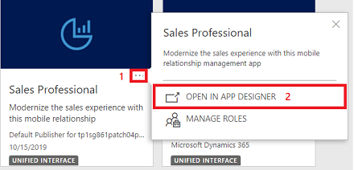
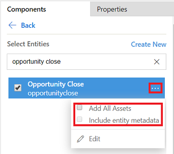
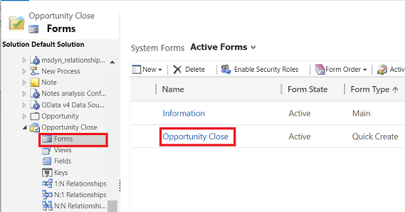

# Customize the Opportunity Close form (Sales Professional)

Enable sales managers to draw key insights based on the information the sales representatives fill in while closing an opportunity.

System administrators or customizers can add the Opportunity Close entity to the Sales Professional app, and use the **Opportunity Close** quick create form to add custom fields, so that sales representatives can capture important details about why an opportunity was closed. Sales managers can use this data to know which products are doing well and develop a better strategy.

> [!NOTE]
> Before you customize the Opportunity Close form, you must enable the customization of Opportunity Close form. More information: [Enable customization of the Opportunity Close form](enable-opportunity-close-customization-sales-professional.md)

## What customizations are possible?

-   Customization of Opportunity Close entity to add custom fields, including of type Lookup. 

    > [!IMPORTANT]
    > - You can’t delete the out-of-the-box fields or customize or delete the out-of-the-box entity relationships.
    > - Creating an Opportunity Close record (for example, from a related entity record or the Quick create menu) closes the related opportunity.
    
-   Customization of Opportunity Close Quick Create form to capture details such as Profit Margin, Winning Product and so on,  when closing an opportunity.

-   Customization of form to add client-side validations. For example, when an opportunity is closed as Won, the Profit margin (custom field) is mandatory.

-   Customization of Opportunity Close Information form to view details of the closed opportunity

-   Customization of views

To capture any additional custom information during opportunity close, custom attributes (fields) must be added to Opportunity Close entity and their forms. If this additional information is to be made available on other entities, then the data must be maintained in both entities. After an **Opportunity Close** record is created, the data for custom attributes that must be available in other entity records must be updated in the other entity records. Example: If **Opportunity Close** form needs to capture the ‘Purchase process’, which belongs to the Opportunity entity, the attribute ‘Purchase process’ must be maintained in both **Opportunity Close** and **Opportunity** entities, and the data between the two entities must be synchronized. You can write a client-side code (form scripting or web resources) or server-side plugin to keep the data in sync between the two entities. 

> [!NOTE]
> - You may see data consistency issues if the attribute value in Opportunity Close isn't synchronized with the main entity when an Opportunity is closed or if the attribute is updated in the main entity after the Opportunity was closed.
> - To learn how to enable the opportunity customization experience, see [Enable customization of the Opportunity Close form](enable-opportunity-close-customization-sales-professional.md)

## Add Opportunity Close entity to the Sales Professional app module

1.  In your app, select the **Settings** icon, and then select **Advanced Settings**.

    > [!div class="mx-imgBorder"]
    > 

2.  On the navigation bar, select **Settings**, and then under **Application**, select **My Apps**.

3.	On the Sales Professional tile, select the **More options** icon , and then select **Open in App designer**.

    > [!div class="mx-imgBorder"]
    > 

    The app designer opens.

4.	Select Add, and then under **Artifacts**, select **Entities**.

5.	In the **Search Entities** box, type Opportunity Close, select the **Opportunity Close** entity. 

    > [!div class="mx-imgBorder"]
    > 

6. Select the **See more options for the entity** icon, and then select the **Add all assets** and **Include entity metadata** check boxes.

7. Select **Publish**, and then select **Save and Close**. 

## Create custom fields for the Opportunity Close entity

To enable sales representatives to capture relevant data about an opportunity close, create fields as required by your organization for the **Opportunity Close** entity. For example, if your organization would like to know the profit margin for all the won opportunities, create a new field called **Profit Margin**.

To create fields,

1.  In your app, select the **Settings** icon, and then select **Advanced Settings**.

    > [!div class="mx-imgBorder"]
    > 

    The **Business Management** page opens.

2.  On the navigation bar, select **Settings**, and then select **Customizations**.

    > [!div class="mx-imgBorder"]
    > 

3.  On the **Customization** page, select **Customize the System**.

4.  In the solution explorer, under **Components**, expand **Entities**, and then expand **Opportunity Close**.

5.  Under the **Opportunity Close** node, select **Fields**.

6.  To add a new field, on the **Actions** toolbar, select **New**, and enter a **Display Name** to generate the **Name**. For more information on the data to enter, see [Create and edit fields (attributes)](../customize/create-edit-fields.md)

## Add newly created custom fields to the Opportunity Close form

After you’ve created the fields that are required by your organization, add those fields to the **Opportunity Close** form, so sales representatives can capture data in those fields at the time of closing opportunities.

1.  In the solution explorer, under **Components**, expand **Entities**, and then expand **Opportunity Close**.

2.  Under **Opportunity Close** node, select **Forms**.

    > [!div class="mx-imgBorder"]
    >

3.  Open the **Opportunity Close** form of type **Quick Create**.

4.  Add or remove any fields, as required on the **Opportunity Close** form.

5.  Select **Save and Close**.

    > [!IMPORTANT]
    > The Opportunity entity has the following statuses, which aren’t customizable: Open, Won, Lost. However, you can add multiple status reasons corresponding to the Won and Lost statuses. It is important to ensure that the custom status reasons added for Opportunity are also present in a special attribute of Opportunity Close entity with schema name "OpportunityStatusCode". If you add custom values to a Status Reason field against a state (Won/Lost) in the Opportunity entity, you must add the same custom value to the special attribute OpportunityStatusCode on the Opportunity Close entity manually and vice versa. This displays the correct customized values with right defaults preselected for each opportunity Win and Loss state.
    
    > [!NOTE]
    > There are two fields on Opportunity Close entity with display name as "Status Reason" but with schema names as statuscode and opportunitystatuscode. It is important to note that custom status reasons should be added to the opportunitystatuscode attribute and not to the statuscode attribute.

6.  Open the **Information** form of type **Main**, and make the same changes that you did in Step 4.

    The sales representatives or managers can view the **Opportunity Close** record after an opportunity is closed 
either from the Opportunity timeline or from the **Related Activities** grid, which uses the **Information** form. For these newly-added or removed fields to reflect on the **Information** form, the changes must be made to the **Information** form, too.

### See also
[Create or edit opportunities](manage-opportunities-sales-professional.md#close-an-opportunity)  
[Enable customization of the Opportunity Close form](enable-opportunity-close-customization-sales-professional.md)
