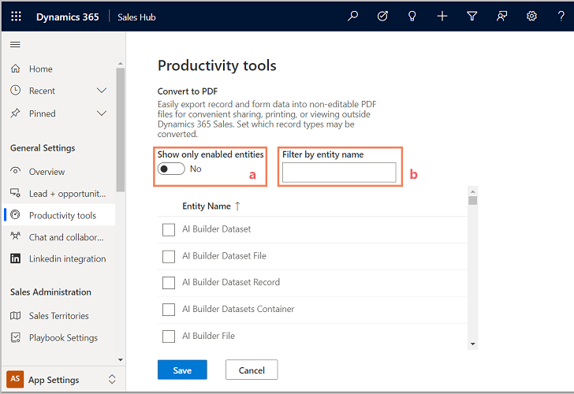

# Enable or disable PDF generation from sales records

The PDF generation capability allows your users to generate PDF files directly from sales records. The capability to create PDF files is supported on the following entities: Accounts, Contacts, Leads, Opportunities, Quotes, Orders, and Invoices. You can select the entities on which you want to enable PDF generation.

> [!IMPORTANT]
> With the 2020 release wave 2, the PDF generation capability is enhanced to support all custom entities. The PDF enhancements are limited to the web experience and aren't available in the mobile app. If you haven't opted in, or you're using Sales Professional on the mobile app, you'll see the old experience.

1. In the site map, under **Setup**, select **Sales settings**.

2. Under **Advanced settings**, select **PDF generation**.

3. On the **Convert to PDF** page, select the entities for which you want to enable the PDF generation capability.

    > [!div class="mx-imgBorder"]
    > 

    1. To see only the entities on which PDF generation is currently enabled, set the **Show only enabled entities** option to **Yes**.  
    2. To filter the list of entities and find a specific entity on which you want to enable PDF generation, use the **Filter by entity name** field. For example, to enable PDF generation on the Opportunity entity, enter **opp** and you'll see the entity name list filtered to show the entity names starting with *opp*.  

5. Select **Save**.

After you enable PDF generation, sellers will be able to generate a PDF, download it to their local computer, save it to Dynamics 365 as Notes or save it to SharePoint. 

> [!IMPORTANT]
> - The **Save to SharePoint** button is available to users when SharePoint integration is enabled for your organization and the **Document management** check box is selected on the entity page. If they don't see the button, make sure that SharePoint integration and document management are enabled. For more information about the **Document Management** check box, see [Enable or disable entity options](/powerapps/maker/common-data-service/edit-entities#enable-or-disable-entity-options).
> - The **Save to Dynamics** button is available to users when **Notes** is enabled for the primary entity. If they don't see the button, make sure the **Notes (includes Attachment)** check box is selected on the entity page in the **Customization** area. By default, notes are enabled on all out-of-the-box entities. For more information about the **Notes** check box, see [Entity options that can only be enabled](/powerapps/maker/common-data-service/edit-entities#entity-options-that-can-only-be-enabled). 

## Enable or disable PDF generation if you're using Dynamics 365 for phones on a mobile device

If you're using Dynamics 365 for phones on a mobile device, you can enable the capability to create PDF files only on the following entities: Accounts, Contacts, Leads, Opportunities, Quotes, Orders, and Invoices.

1. In the site map, under **Setup**, select **Sales settings**.

2. Under **Advanced settings**, select **PDF generation**.

3. To enable or disable PDF generation, on the **Generate PDF file** page, under **Select whether PDF files can be created, saved, and emailed based on Dynamics 365 Sales entity records**, set the entity toggle to **Enabled** or **Disabled**. For example, if you want to enable PDF generation on **Opportunity** records, set the Opportunity toggle to **Enabled**. 

    

4. Select **Save**.   

### See also

[Create PDF files from sales records](create-quote-pdf-sales-professional.md)

[!INCLUDE[footer-include](../includes/footer-banner.md)]