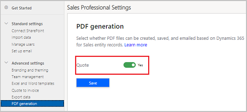

# Enable or disable PDF generation

To allow your users to generate PDF documents directly from a quote, you must enable PDF generation.

> [!IMPORTANT]
> The create quote PDF capability and the option to enable PDF generation is introduced in version 9.1.1904.1025. 

1.	In the site map, under **Setup**, select **Sales settings**.

2.	Under **Advanced settings**, select **PDF generation**.

3.	On the **Generate PDF file** page, under **Select whether PDF files can be created, saved, and emailed based on Dynamics 365 Sales entity records**, set the **Quote** toggle to **Yes**. This option is set to **Yes** by default.

    

4.  Select **Save**.   

### See also

[Generate a PDF document from a quote record](create-quote-pdf-sales-professional.md)
