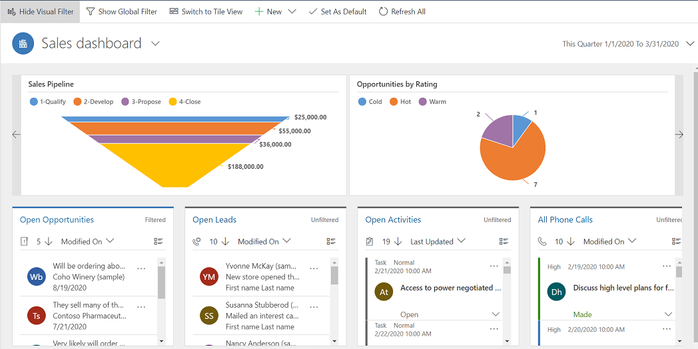
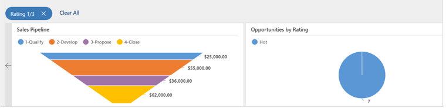
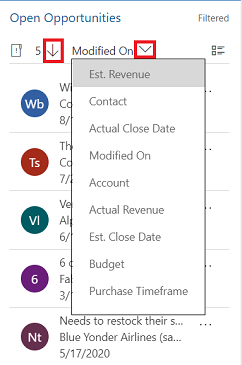

# Gain insights with dashboards in Dynamics 365 Sales Professional

Dashboards in Dynamics 365 Sales Professional provide an overview of actionable business data that's viewable across the organization. Use dashboards to see important data at a glance.

Dashboards use views, lists, and charts to bring data that's meaningful to you to one place.

## Where to find dashboards

To open dashboards, select **Dashboards** in the site map.

## Dashboards in Sales Professional

Sales Professional comes with the following prebuilt dashboards that you can use to quickly get insights on your sales data and team performance.

### Sales Manager Summary dashboard

This dashboard shows data that helps sales managers get important insights on how their sales team is doing. The sales pipeline shows open opportunities in different stages. 

The **Deals Won vs. Deals Lost** chart shows the number of opportunities won or lost by an owner. The dashboard also includes charts that show important financial data, such as estimated versus actual revenue by month.

> [!div class="mx-imgBorder"]
> 

### Sales Professional Summary dashboard

This dashboard shows daily work-related sales numbers, such as the activities you're working on, your sales pipeline, and your open opportunities and leads.

> [!div class="mx-imgBorder"]
> 

### Sales dashboard

The interactive Sales dashboard helps you review information from various entities and act on it. You can use visual and global filters in the dashboard to quickly get to what's most important.

The Sales dashboard is a multi-stream dashboard, where each stream shows a view of an entity. 
 
> [!div class="mx-imgBorder"]
> 

#### Take quick action on a record in the stream

You can take entity-specific actions right from the stream. For example, in the **Open Leads** stream, select **More options**. From the **More options** menu, you can quickly qualify a lead or assign it to other users.

> [!div class="mx-imgBorder"]
> 

#### Perform bulk actions

You can select multiple records and take action on all of them at once. Select **Select multiple records to perform bulk actions** , select multiple records by selecting the check boxes next to the records, and then select **More Commands** (**...**) to show the actions that can be performed on the selected records.
 
> [!div class="mx-imgBorder"]
> 

#### Visual filters in the Sales dashboard

When you select **Show Visual Filter** in a multi-stream dashboard, you see a row of visual filters at the top with the data streams below. 

Visual filters provide a snapshot of key metrics, such as opportunities by account or by rating, or opportunities in different stages of a sales pipeline. 

> [!div class="mx-imgBorder"]
> 
 
Use visual filters to display the information that interests you most. For example, when you select the **Hot** area of the **Opportunities by Rating** chart, the dashboard and the streams are refreshed to show only the opportunities that have a **Hot** rating.

> [!div class="mx-imgBorder"]
> 
 
You'll see the filter applied at the top of the charts. 
 
> [!div class="mx-imgBorder"]
> 

To remove a specific filter, select the **Close** icon for the applied filter.

> [!div class="mx-imgBorder"]
> 
 
To remove all applied filters, select **Clear All**.

#### Global filters in the Sales dashboard

To drill down further into your data, use the global filter. For example, you can apply the global filter to see only those opportunities whose estimated close date is set to a date in the current week. 

To apply a global filter, select **Show Global Filter** on the command bar.

 
After you choose a filter, select **Apply filter** . You can also save this filter for the future by selecting **Save as a reusable filter** .

#### Set the sort order

You can easily switch the sort order in the stream by selecting the field on which you want the data to be sorted. 
 
> [!div class="mx-imgBorder"]
> 

## Open a different dashboard

You can use the view selector to select the dashboard of your choice. Select the view selector, and then select the dashboard you want to open from the drop-down list.

## Set a dashboard as the default

To see a specific dashboard every time you sign in to Sales Professional, set it as the default. To do this, open the dashboard, and then select **Set as Default** in the site map.

## Entity dashboards

In addition to the dashboards described earlier, some dashboards display information specific to entities. These are available for Account, Contact, Lead, Opportunity, Quote, and Invoice entities. Remember, an entity is the same as a record type.

To see an entity dashboard, go to the list of records for the entity, and then select **Open Dashboards** on the command bar. For example, when you select **Open Dashboard** in the list of opportunities, the following dashboard specific to the Opportunity entity is displayed.

You can use the global or visual filters to show only the data that's important to you.

### See also

[Overview of Dynamics 365 Sales Professional](sales-professional-overview.md) 
[Learn the basics](learn-basics-sales-professional.md)  

[!INCLUDE[footer-include](../includes/footer-banner.md)]