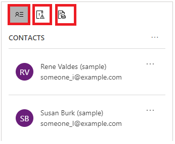
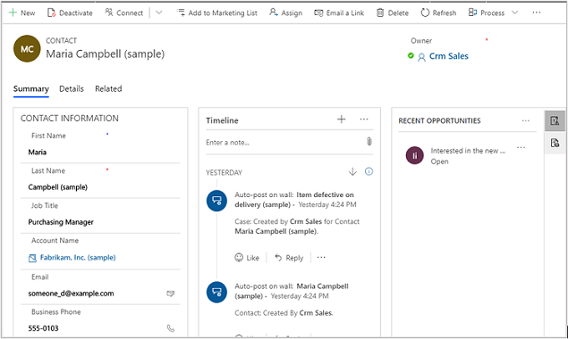

# Manage your customers

In Dynamics 365 Sales Professional, accounts and contacts records types are used to store information about your customers.

Accounts are organizations you do business with, and contacts are individual people with whom you have a relationship. A contact may or may not be associated with an account.

Accounts and contacts share a one-to-many relationship, which means that a single account can have multiple contacts.

You can add accounts or contacts manually or use the Import wizard in your Sales app to get all your customer data into the system.

## Create or edit an account

1.  In the site map, select **Accounts**.

2.  To create a new account, select **New**.

    -OR-

    To edit an existing account, open the account.

3.  Fill in or change the information. Don’t know what to enter in a field? Hover over the field name to see a tooltip.

    Required fields are marked with a red asterisk (*). Here are some important fields in the account record:

    

    **Summary tab.** Use the summary tab to store all of the primary information about the account. This is the tab you’ll use the most.

    The left pane includes fields like:

    - **Primary Contact.** The main person you are working with at this account.

    - **Account Name.** The name of the organization you do business with. This name is used in searches, reports, and lookup fields related to accounts.

    - **Parent Account**. The parent organization of an account. The parent
    account must also be added as an account first to be able to choose it as a parent account. 
    
    The middle pane, which is called a timeline, records all the activities related to the account or the communication with the account.

    The right pane shows everything that’s happening with the account. In other words, it shows records related to the account.

    The **Timeline** pane shows all the activities in the account.

    

    The last pane has three tabs that show the contacts of the account, the recent opportunities with the account, and the recent invoices generated for them.

    

    **Details tab (Company Profile).** This is used to track important profile information about an account, like the organization's industry, number of employees, or annual revenue.

4.  Select **Save**.

## Create or edit a contact

Typically, contacts are associated with an account. However, in some cases, contacts won’t have an associated account.

Account and contact forms are very similar, as they store similar information about customers.

To create or edit a contact:

1.  In the site map, select **Contacts**.

2.  To create a new contact, select **New**.

    -OR-

    To edit an existing contact, open the contact record.

3.  Fill in or change the information. Don’t know what to enter in a field? Hover over the field name to see a tooltip.

    Here are some important fields of a contact record:

    

    The **Summary** tab stores all the primary information about the contact.

    The left pane includes important details like the following:

    -   **Full Name.** This is a combination of First Name and Last Name. 

    -   **Account Name.** This points to the account record that this contact is associated with.

    -   **Contact Info.** Fields like Email, Business Phone, and Mobile Phone store contact details.

    The rest of the sections are similar to those of an account form.

4.  Select **Save** in the lower-right corner.

### See also

[Develop sales from lead to cash in Dynamics 365 Sales Professional](develop-sales-lead-to-cash-sales-professional.md)  
[Overview of Dynamics 365 Sales Professional](sales-professional-overview.md)

[!INCLUDE[footer-include](../includes/footer-banner.md)]