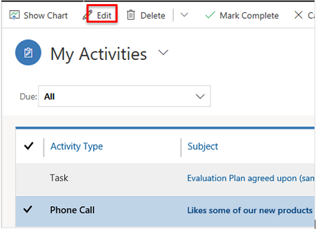

# Manage tasks, appointments, email, or phone calls in Dynamics 365 for Sales Professional

Keep track of all your customer communications with activities in Dynamics 365 for Sales Professional. For example, you can send email, make phone calls, set
up appointments, and assign yourself tasks as you work a sale. These actions are all considered types of activities.

The system automatically timestamps every activity and shows who created it. You and other people on your team can scroll through the activities to see the
history as you work with a customer.

To get the most out of your Sales app, it’s important for everyone in the organization to track all their customer interactions by adding an activity for
every email, phone call, task, or appointment. That way, a customer’s history is complete.

## Find your activities

Select the Site Map icon Icon to open the menu, and then select one of the following:

-   Task

-   Appointment

-   Email

-   Phone Call

## Filter the list of activities

You can filter the list of activities to see only the ones you’re interested in. For example, filter the list to see closed tasks, or to see emails that you
sent.

1.  Go to the activity list. For example, to see the emails that you sent, in the site map, select **Activities**, and then in the **View** list, select **My Sent Email**.

2.  Select the down arrow next to the view name at the top of the page, and select the **My Sent Emails** view.

## Add a new activity for a customer

Most often, you’ll want to add an activity associated with a contact, opportunity, account, or other type of record to help you keep track of all the
communication history you have with a customer. (You can also add an activity for yourself.)

As your organization’s relationship with a customer develops over time, you and other people on your team can look through the activity feed as you work with
the customer, and see the history of your interactions.

1.  Open the record you want to add the activity to.

2.  In the Timeline section, select **+** and select the type of activity you want to add.

## Add an activity for yourself

Add a task or note for yourself when you want a reminder to do something personal, like schedule a doctor’s appointment or attend a sporting event.

Otherwise, to keep a history of your interactions with a customer, you should add new activities that are associated with a customer’s record, so those
activities become part of the history that other people on your team can view.

1.  Select the Site Map icon Site map icon, and then select **<Activity Type>**. For example, select **Tasks**.

    

2.  On the nav bar, select **\<Activity Type\>**. For example, **Tasks**.

    

    
3.  Fill in the fields, and then select **Save**.

## Mark an activity complete

After you call someone, complete a task, send an email, or go to an appointment,
you can mark the activity for that action as completed.

1.  Open the activity.

2.  On the command bar, select **Mark Complete**.

### See Also

Overview of Dynamics 365 for Sales Professional  
[Manage your customers](#manage-your-customers)
