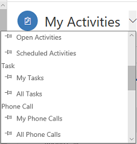
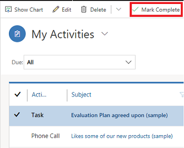

# Manage tasks, appointments, email, or phone calls in Dynamics 365 Sales Professional

Keep track of all your customer communications with activities in Dynamics 365 Sales Professional. For example, you can send email, make phone calls, set up appointments, and assign yourself tasks as you work a sale. These actions are all considered types of activities.

The system automatically time stamps every activity and shows who created it. You and other people on your team can scroll through the activities to see the history as you work with a customer.

To get the most out of your Sales app, it's important for everyone in the organization to track all their customer interactions by adding an activity for
every email, phone call, task, or appointment. That way, a customer's history is complete.

## Find your activities

1. In the site map, select **Activities**. 

    > [!div class="mx-imgBorder"]
    > 

2. From the view list, select a view to see activities for one of the following activity types:

    -  Task

    -   Appointment

    -   Email

    -   Phone Call

      > [!div class="mx-imgBorder"]
      > 

## See activities in List, Calendar, or Kanban view

You can see the activities in three different views:
-  **List.** Shows a list of all activities. 

    > [!div class="mx-imgBorder"] 
    > 

-  **Calendar.** Shows a calendar with a list of the day's scheduled activities and the associated deals. 

    > [!div class="mx-imgBorder"] 
    > 

-  **Kanban.** Shows a visual representation of your sales activities in their different states. This lets you see the status of every activity in your pipeline and drag them to move from one status to another (for example, Open, Completed, Canceled, Scheduled). More information: [Work with activities in the Kanban view](activity-kanban-view-sp.md)

    > [!div class="mx-imgBorder"]  
    >  

To switch to a different view:

1. In the site map, select **Activities**.

2. On the command bar, select the **More commands** icon , and then select **Show As**, and then the view type such as, **Kanban**, **Calendar Control**, or **Read Only Grid**.

    > [!div class="mx-imgBorder"]  
    >  

## Change your activities view

You can use views to see the activities you want. For example, you can use the **My Activities** view to see activities assigned to you and **My Team Members' Activities** view to see your team's activities. 

> [!div class="mx-imgBorder"] 
> 

## Filter the list of activities

You can filter the list of activities to see only the ones you're interested in. For example, you can further limit the activities you are seeing in a view by using the activity type filter. The activity type filter allows you to filter activities based on the type, such as email, task, phone call, and so on.

> [!div class="mx-imgBorder"] 
> 

You can also use the **Due** filter to see the activities that are due in a specified time, such as activities that are due today or earlier or activities that are due in the next seven days or earlier.

> [!div class="mx-imgBorder"] 
> 

## Create or edit a new activity

You can create independent activities that aren't associated with any customer or sales record. To do so, in the site map, select **Activities** and then on the command bar, select **Email** or **Phone Call** or **Task**, depending on which activity you want to create.

Or, to edit an existing activity record, open the activity by selecting its title.

> [!NOTE]
> With the April 2020 release of Dynamics 365 Sales, when you create or edit a new activity, the record opens in a Main form dialog. A Main form dialog is a Main form opening in a dialog (a pop-up window). Main form dialogs allow you to stay in context while working on one record with the ability to open a second or third record in dialog experience. This makes it easier to edit the records.

## Add a new activity for a customer

Most often, you'll want to add an activity associated with a contact, opportunity, account, or other type of record to help you keep track of all the communication history you have with a customer. (You can also add an activity for yourself.)

As your organization's relationship with a customer develops over time, you and other people on your team can look through the activity feed as you work with the customer and see the history of your interactions.

1.  Open the record you want to add the activity to.

2.  In the **Timeline** section, select **+**, and select the type of activity you want to add.

## Add an activity for yourself

Add a task or note for yourself when you want a reminder to do something personal, like schedule a doctor's appointment or attend a sporting event.

Otherwise, to keep a history of your interactions with a customer, you should add new activities that are associated with a customer's record so that they become part of the history that other people on your team can view.

1.  In the site map, select **Activities**. 

2.  On the command bar, select an activity type—for example, **Task**.

    > [!div class="mx-imgBorder"]
    > 
    
3.  Fill in the fields, and then select **Save**.

## Mark an activity complete

After you call someone, complete a task, send an email, or go to an appointment,
you can mark the activity for that action as completed.

1.  Open the activity.

2.  On the command bar, select **Mark Complete**.

    > [!div class="mx-imgBorder"]
    > 

### See also

[Overview of Dynamics 365 Sales Professional](sales-professional-overview.md) 
[Manage your customers](manage-accounts-contacts.md)  
[Work with activities in the Kanban view](activity-kanban-view-sp.md)  

[!INCLUDE[footer-include](../includes/footer-banner.md)]