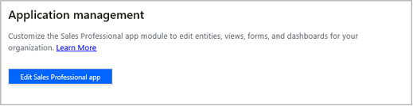

# Customize the Dynamics 365 Sales Professional app

> [!IMPORTANT]
> This capability is introduced in the Dynamics 365 Sales Professional app version 9.1.0.0.

The Dynamics 365 Sales Professional application is a modular app built to provide capabilities tailored for sales professionals and sales managers. As and administrator or customizer, you can easily customize the entities, dashboards, forms, views, charts, and business processes included in the Sales Professional application using the app designer, without having to write any code.

1.	In the site map, select **Sales Settings**.

2.	Under **Customization**, select **Application management**.

    

3.	Select **Edit Sales Professional app** to open the app designer.

    
 
    The Sales Professional app opens in the app designer in a new tab. 

    
 
You can now edit the app using the app designer. To learn about how to use the app designer to edit the app module: [Design custom business apps by using the app designer](../customize/design-custom-business-apps-using-app-designer.md).

### See also

[Admin settings overview](admin-settings-overview.md)    
[Overview of Dynamics 365 Sales Professional](sales-professional-overview.md)

[!INCLUDE[footer-include](../includes/footer-banner.md)]