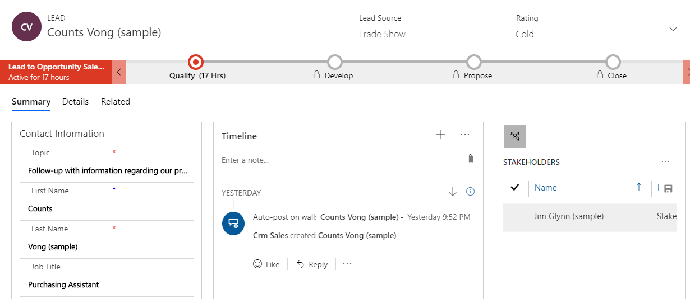
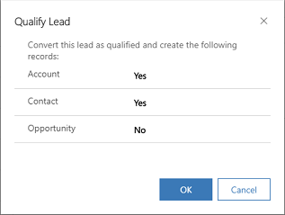
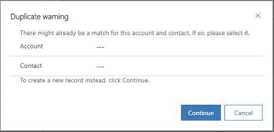

# Create and manage leads in Dynamics 365 Sales Professional

In Dynamics 365 Sales Professional, leads are potential sales. In other words, a lead is a potential customer who must be qualified or disqualified as a sales opportunity. When a lead is qualified, it can be converted to an opportunity, account, or contact.

You can collect leads from many different sources. For example, you can generate sales leads from marketing campaigns, inquiries from your website, or mailing lists.

When you create a lead, there are system-required fields to fill out. But other data, such as e-mail addresses, the source of the lead, and specific product interests, can also help your sales staff in following up with the customers.

## Create a lead

1.  In the site map, select **Leads**.

2.  Select **New**.

    The Lead form opens.

    > [!div class="mx-imgBorder"]
    > 

3.  If you’re creating the lead for new customers, enter name, contact details, and company name in the **Summary** tab of the Lead form.

    -OR-

    If you’re creating the lead for an existing account or contact, in the **Qualify** stage of the process bar, select the existing account or contact.

    - When you select an existing account while creating a lead record, the company name is automatically populated.

    - When you select an existing contact while creating a lead record, the following information is automatically populated in the **Lead** form: First Name, Last Name, Job Title, Business Phone, Mobile Phone and Email.
    
    > [!NOTE]
    > - Auto-population happens only when creating a new lead and when the corresponding fields in the Lead form are empty. If fields are auto-populated or data is manually entered, the auto population doesn't override the existing values.
    > - On new (unsaved) lead records, the Existing Contact and Existing Account fields allow you to choose any records. Once you save the lead record, these fields are filtered to show only the records that meet the duplicate detection rules to avoid duplicates.

4.  In the **Timeline** section, add any notes and activities (for example, phone calls or emails) related to this lead.

5.  In the **Stakeholders** section, select **More Commands** , and then select **New Connection** to add a contact as a stakeholder. A *stakeholder* is a key contact at the account who will be involved in decision-making.

    In the **Lookup Records** dialog box, enter a name or select the Lookup icon to choose from a list of suggestions. When you've entered the name you want, select **Add**. To create a new contact, select **New**. By default, the contact you add is assigned the Stakeholder role. Select the role corresponding to the contact to choose a different role such as **Decision Maker** or **Technical Buyer**.

    > [!IMPORTANT]
    > The **New Connection** button on Connection sub-grids are supported only for the out-of-box “Stakeholders” views on the Lead entity. For any other Connection sub-grid or “Stakeholders” sub-grids that are based on custom views, the “+ New” button doesn't appear on the sub-grid. In such case, navigate to the Connection Associated view for the record and use the **Connect** button to create a new connection. 

6.  In the **Details** tab, enter information about your lead’s industry and preferred contact method.

7.  Select the **Save** button in the lower-right corner of the screen.

## Qualify and convert a lead to an opportunity

If your lead has potential to become a sale, you can qualify the lead to an opportunity. When you qualify a lead, a new record to represent the lead as an opportunity is created. Any notes on a lead record do not transfer to the opportunity record. The notes remain with the originating lead record.

Your system administrator defines what happens to a lead when it is qualified:
- If your system administrator has set **Create Account, Contact, and Opportunity records by default upon qualifying a lead** to **No**, you’ll be prompted to choose what records to create when the lead is qualified (account, contact, or opportunity).
- If they’ve set **Create Account, Contact, and Opportunity records by default upon qualifying a lead** to **Yes**, an account, contact, and opportunity record is created when the lead is qualified.

1.  Go to **Leads**.

2.  In the list of leads, open the lead you want to qualify and convert.

3.  In the **Qualify** section of the sales process bar, type in all applicable information.

4.  Select **Qualify** at the top of the **Lead** screen.

    You must also select the currency in which to calculate the opportunity.

    If you see a prompt to select which records to create when the lead is qualified, select **Yes** for the records that you want to create, and then select **OK**.

    > [!div class="mx-imgBorder"]
    > 

    If you don’t see a prompt, qualifying a lead will automatically create an account, contact, and opportunity record.

5.  Select the **Save** button at the lower-right corner of the screen.

You are moved to the next stage in the business process based on the organization-level setting configured by your system administrator.  

> [!NOTE]
> If an opportunity isn’t created when qualifying a lead, the business process flow doesn’t progress to the next although the lead status becomes qualified.

## Qualify multiple leads

To qualify multiple leads at once, go to the list of lead records. Select the check boxes next to all the leads that you want to qualify, and then select **Qualify** at the top of the screen.

### What happens when duplicates are found while qualifying leads?

When qualifying a lead, if a duplicate account or contact is detected while creating new records, a “Duplicate warning ” dialog box is shown to you.

> [!div class="mx-imgBorder"]
> 

In the **Account** and **Contact** fields, select the matching account and contact record and select **Continue**. To ignore the duplicate warning and create new records, leave the Account and Contact fields blank, and select **Continue**.

The **Account** and **Contact** lookup fields are filtered with matched results and shown along with additional information to precisely identify the record to which the lead should be linked. For example, when you click the **Contact** lookup search icon, you’ll see only matched contact records. 

### What happens to notes and attachments when leads are qualified?

When salespeople work on a lead, they use notes to store key information on the things they have researched about the lead. This could be information like new contacts at the site, current value of the contract, vendor information and so on. When a lead is qualified, these notes are displayed in the Opportunity record so that the information is not lost.

## Disqualify a lead

When you decide that a lead will not turn into an opportunity, you can
disqualify it and still have an audit trail for your sales process. You can reactivate the record, including any attachments and notes, without having to re-enter all the data if the lead contacts you in the future. Deleting the record also removes any attachments and notes.

To disqualify, select the lead, and on the command bar, select  **Disqualify**.

### See also

[Develop sales from lead to cash in Dynamics 365 Sales Professional](develop-sales-lead-to-cash-sales-professional.md)  
[Overview of Dynamics 365 Sales Professional](sales-professional-overview.md)

[!INCLUDE[footer-include](../includes/footer-banner.md)]