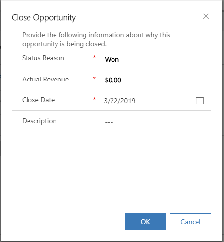

# Create or edit opportunities in Dynamics 365 Sales Professional

In Dynamics 365 Sales Professional, an opportunity is a potential sale, like a lead, but with an opportunity you can forecast revenue, set a potential close date, and factor in a probability for the sale. You can also track contact information and information about the salesperson working on the opportunity.
You must link a new opportunity to an existing account or contact.

If you’re following the sales process from start to finish, you qualify a lead to turn it into an opportunity.

You can create a new opportunity or convert one from a qualified lead without re-entering the data. When you convert a qualified lead to an opportunity, you can access the lead record, which includes activities, from the corresponding opportunity form. The preferred way is to create an opportunity from a lead. More information: [Develop sales from lead to cash](develop-sales-lead-to-cash-sales-professional.md).

To create or edit an opportunity:

1. In the site map, select **Opportunity**.

2. If you’ve qualified a lead to an opportunity, open the opportunity from the list.

    -OR-

    To create a new opportunity, on the command bar, select **New**.

 3. In the opportunity form, make sure that your potential customer’s important details are captured. Most of the fields will be automatically populated from the lead record:

    -   **Topic**. Interest in the opportunity, such as specific product details.

    -   **Contact**. The contact associated with this opportunity.

    -   **Account**. The account associated with this opportunity.

    -   **Purchase timeframe**. The timeframe of when the account or contact is likely to purchase.

    -   **Budget Amount**. Indicates the lead's potential available budget.

    -   **Probability**. Indicates the likelihood of a sale occurring.

    -   **Purchase Process**. Indicates whether the purchase process involves an individual or a committee.

    -   **Est. Close Date**. An estimated date by which the opportunity is expected to close.

    -   **Est. Revenue**. Opportunities with products added to them have their estimated revenue value calculated based on the base price, volume discounts, manual discounts, taxes, and other pricing modifications. When opportunities are saved, Dynamics 365 Sales Professional recalculates the estimated revenue value based on any changes to the products or product quantities associated with the opportunity.

        > [!div class="mx-imgBorder"]
        > 

4.  In the **Stakeholders** section, select **More Commands** , and then select **New Connection** to add a contact as a stakeholder. A *stakeholder* is a key contact at the account who will be involved in decision-making.

    In the **Lookup Records** dialog box, enter a name or select the Lookup icon to choose from a list of suggestions. When you've entered the name you want, select **Add**. To create a new contact, select **New**. By default, the contact you add is assigned the Stakeholder role. Select the role corresponding to the contact to choose a different role such as **Decision Maker** or **Technical Buyer**.

5.  In the last pane, select the **Sales team**  icon to open the **Sales team** tab. Select the **More Commands** button , and then select **New Connection** to add a member of the sales team (from your organization).

    > [!NOTE]
    > The “+ New” button on Connection sub-grids are supported only for the out-of-box “Stakeholders” and "Sales Team" views on the Opportunity entity. For any other Connection sub-grid or “Stakeholders” or "Sales Team" sub-grids that are based on custom views, the “+ New” button doesn't appear on the sub-grid. In such case, navigate to the Connection Associated view for the record and use the **Connect** button to create a new connection. 

6.  To save your changes, on the command bar, select **Save**.

7.  Add products to your opportunity. For more information, see [Add products to an opportunity](add-products-opportunity-sp.md).

8.  Follow the process bar to move the opportunity to the next stage. In the **Develop Opportunity** stage, enter data for these fields:

    -   **Customer Need**. Enter what interests the opportunity, such as specific product requirements.

    -   **Proposed Solution**. Enter the plan for what your organization can offer the account, such as product details.

    -   **Identify Sales Team**. Select the check box to indicate that you’ve included information about who in your organization will be involved in pursuing the opportunity.

    -   **Develop Proposal**. Select the check box to indicate that you’ve included notes on how the account will be approached (optional).

       > [!div class="mx-imgBorder"]
       > 

9.  In the **Develop Opportunity** stage, select **Next**.

    The next step is to create and send a quote to your customer. 

## Recalculate an opportunity

When you add a product to an opportunity, the opportunity's estimated revenue value is calculated based on the price, discounts, taxes, and other pricing modifications for the product.

To change the estimated revenue value of an opportunity based on any changes to the associated products or product quantities, recalculate the opportunity.

1.  In the list of opportunities, open the opportunity for which you want to recalculate the estimated revenue.

2.  Go to the **Product Line Items** tab, and modify the list of products
    associated with the opportunity.

3.  In the right section, verify that the Revenue field is set to **System Calculated**.

4.  Select **Save**.

5.  On the command bar, select **Recalculate Opportunity**.

6.  Select **Save** or **Save and Close**.

## Close an opportunity

Whether you win a sale or close an opportunity, you probably want to close it. You will have the option to reopen the opportunity later if it becomes a viable sale.

1.  In the list of opportunities, open the opportunity you want to close.

2.  On the command bar, select **Close as Won** or **Close as Lost**.

    > [!div class="mx-imgBorder"]
    > 

    1. When you close the opportunity as **Won**, in the **Close Opportunity** pane, do the following, and select **OK**:

        - In **Actual Revenue**, Verify the amount, and make changes, if necessary.

        - In **Description**, enter details about what contributed to winning this opportunity. 

    2. When you close the opportunity as **Lost**, in the **Close Opportunity** pane, do the following, and select **OK**:

        -  In **Competitor**, select a competitor you lost this opportunity to.

        -  In **Description**, add more details around why the opportunity was lost.

    > [!IMPORTANT]
    > If your system administrator has enabled custom fields on the **Opportunity Close** form, you may be required to fill in data in other fields as defined by your organization. 

### See also

[Develop sales from lead to cash in Dynamics 365 Sales Professional](develop-sales-lead-to-cash-sales-professional.md)  
[Overview of Dynamics 365 Sales Professional](sales-professional-overview.md)  
[Manage tasks, appointments, email, or phone calls in Dynamics 365 Sales Professional](manage-activities.md)

[!INCLUDE[footer-include](../includes/footer-banner.md)]