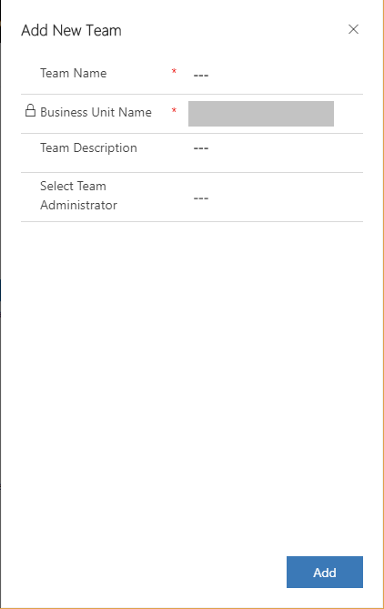

# Add or manage teams in Dynamics 365 Sales Professional

> [!IMPORTANT]
> This capability is introduced in the Dynamics 365 Sales Professional app version 9.1.0.0.

In Dynamics 365 Sales Professional, a team is a group of users who share and collaborate on business records. A user can be associated with multiple teams.

1.  In the site map, select **Sales Settings**.

2.  Under **Advanced Settings**, select **Team management**.

3.  Select **Create a team**.

4.  Enter the following details, and then select **Add**.

    -   **Team Name**

    -   **Business Unit Name**: This defaults to your organization name.

    -   **Team Description**: Enter a description of what the team has been created for.

    -   **Select Team Administrator**: Select the person who will do the team administration, such as adding members to or removing members from the team.

      > [!div class="mx-imgBorder"]
      > 

## Add members to the team

1.  On the **Team Management** page, select the team you want to add members to, and then on the command bar, select **Add Members**.

2.  Select the members, and then select **Add**.

## Remove members from the team

1.  On the **Team Management** page, select the team you want to remove the members from, and then on the command bar, select **Remove Members**.

2.  Select the members you want to remove, and then select **Remove**.

## Manage Roles

When a team is assigned a role, the team members are assigned the set of
privileges associated with that role.

1.  Select **Advanced Settings** > **Team Management**.

2.  Select a team you want to assign a role to, and then on the command bar, select **Manage Roles**.

3.  In the **Manage Roles** dialog box, select the security role you want for the team, and then select **OK**.

### See also

[Add or manage users in Dynamics 365 Sales Professional](manage-users.md)  
[Admin settings overview](admin-settings-overview.md)

[!INCLUDE[footer-include](../includes/footer-banner.md)]