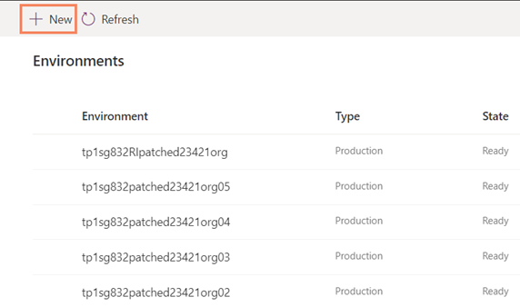
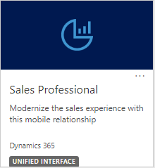

# Provision your Dynamics 365 Sales Professional environment

[!INCLUDE[cc-data-platform-banner](../includes/cc-data-platform-banner.md)]

Congratulations on the purchase of the Sales Professional application. 

Before you can start using the Sales Professional application you need to:

1.	Provision a new Dynamics 365 environment (instance)
2.	Install the Sales Professional solution on a Dynamics 365 environment (instance).

> [!NOTE]
> You must be a global administrator of your Microsoft 365 org (tenant) to perform both the above actions.

## Provision a new Dynamics 365 environment

You need a Dynamics 365 environment to install the Sales Professional application. If you already have a Dynamics environment, say from using another Dynamics 365 application that you are already using, and you want to install the Sales Professional app on that environment, see the steps in the [Install the Sales Professional solution on a Dynamics 365 environment](#install-app) section.

To provision a new Dynamics 365 environment:

1.	Go to [Microsoft 365 admin center](https://admin.microsoft.com/AdminPortal/Home#/homepage), and in the navigation pane, select **Show All**. 

    > [!div class="mx-imgBorder"]
    > 

2. In the navigation pane, under **Admin centers**, select **All admin centers**.

    > [!div class="mx-imgBorder"]
    > 

3. Select **Dynamics 365**.

    > [!div class="mx-imgBorder"]
    > 

    The Power Platform admin center opens.

4.	If you already have a Dynamics 365 environment and want to install Sales Professional in this environment, follow the steps in [Install the Sales Professional solution on a Dynamics 365 environment](#install-app).

    If you don't have any Dynamics environment yet, you'll need to create a new one. On the **Environments** page, select **New**.

    > [!div class="mx-imgBorder"] 
    > 

5. Enter the following, and then select **Next**.
   
   |Setting  |Description  |
   |---------|---------|
   |Name     | The name of your environment.        |
   |Type     | Choose production, trial, or sandbox.        |
   |Region     | Choose a region for the environment.        |
   |Purpose     | A description of the environment.         |
   |Create a database for this environment? | Select **Yes**. |

   > [!div class="mx-imgBorder"] 
   > 

6. Enter or review the following, and then select **Save**.

   |Setting  |Description  |
   |---------|---------|
   |Language     | The default language for this environment. More information: [Common Data Service language collations](/power-platform/admin/language-collations)     |
   |Currency     | The base currency used for reporting.         |
   |Enable Dynamics 365 apps | Select **Yes**. If this is set to **No**, a Common Data Service environment will be created and you won't be able to install Sales Professional on this environment. |
   |Security group | Select a security group to restrict access to this environment. |
   |Automatically deploy these apps | Select **Sales Pro** to install the Sales Professional app during the environment creation. Alternately, follow the steps in [Install the Sales Professional solution on a Dynamics 365 environment](#install-app) | 

   > [!div class="mx-imgBorder"] 
   > 

For more details on managing your Dynamics 365 environments, see [Create and manage environments in the Power Platform admin center](/power-platform/admin/create-environment).

## Install the Sales Professional solution on a Dynamics 365 environment

To install the Sales Professional solution on a Dynamics 365 environment

1.	Sign in to the Power Platform admin center at [https://admin.powerplatform.microsoft.com](https://admin.powerplatform.microsoft.com) as an admin (Dynamics 365 admin, Global admin, or Power Platform admin).

2. In the navigation pane, select **Environments**. 

3.	Open the environment in which you want to install the Sales Professional app, and select **Dynamics 365 apps**.

   > [!div class="mx-imgBorder"] 
   > 

4.	On the command bar, select **Install app**.

   > [!div class="mx-imgBorder"] 
   > 

5. In the **Install Dynamics 365 apps** panel, select 'Dynamics 365 Sales, Professional', and select **Next**.

6. Agree to the terms of service, and then select **Install**.

7.	After the installation, go to Dynamics 365 home. 

8.	In the list of application, select **Sales Professional**. 
 
    

    > [!IMPORTANT]
    > You can't install the Sales Professional app on Common Data Service environments. When you try to install Dynamics 365 Sales, Professional on a Common Data Service environment, you'll be asked to select a different environment. 

### See also
[Overview of Dynamics 365 Sales Professional](sales-professional-overview.md)  
[Overview of admin settings](admin-settings-overview.md)  
[User Guide (Dynamics 365 Sales Professional)](user-guide.md)  

[!INCLUDE[footer-include](../includes/footer-banner.md)]
