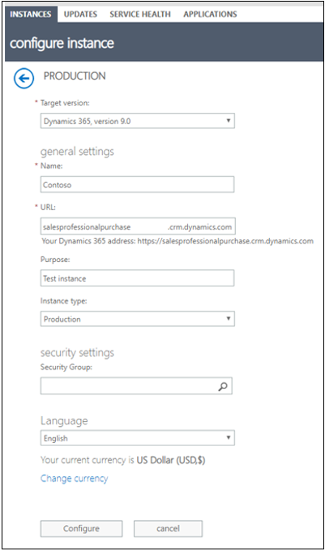
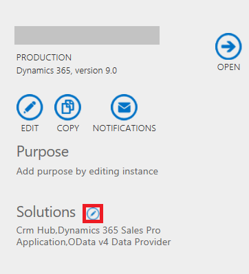
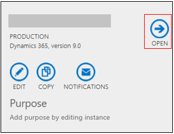

# Provision your Dynamics 365 Sales Professional environment
Congratulations on the purchase of the Sales Professional application. 

Before you can start using the Sales Professional application you need to

1.	Provision a new Dynamics 365 environment (instance)
2.	Install the Sales Professional solution on a Dynamics 365 environment (instance).

> [!NOTE]
> You must be a global administrator of your Microsoft 365 org (tenant) to perform both the above actions.

## Provision a new Dynamics 365 environment

You need a Dynamics 365 environment to install the Sales Professional application. If you already have a Dynamics environment, say from using another Dynamics 365 application that you are already using, and you want to install the Sales Professional app on that environment, see the steps in the Install the Sales Professional solution on a Dynamics 365 environment section.

To provision a new Dynamics 365 environment

1.	In the Microsoft 365 admin center, select **Admin Centers** > **Dynamics 365**.

    

2.	If you have a Dynamics 365 environment already, but are eligible for a new Dynamics 365 environment, you will be taken to the Dynamics 365 admin center showing an environment to configure. Select **Configure**.

    

    If you do not have any Dynamics environment yet, you will be taken to configure your Dynamics 365 environment automatically.

    
 
3.	Review the information in **Target version**, **Name**, **Instance type**, **Security Group**, **Language**, and **Currency**. Provide a URL and purpose for the environment. Select **Configure**.
 
    The Dynamics 365 environment will be provisioned and you will be returned to the Dynamics 365 administration center where you can review the environment you just created.

    

For more details on managing your Dynamics 365 environments, see [Manage Dynamics 365 apps (online)](../admin/manage-online-instances.md) and [Add an environment to your subscription](../admin/add-instance-subscription.md).

## Install the Sales Professional solution on a Dynamics 365 environment

To install the Sales Professional solution on a Dynamics 365 environment

1.	In the Microsoft 365 admin center, select **Admin Centers** > **Dynamics 365**.

    
    
    The Dynamics 365 Administration Center opens.

2.	On the **Instances** tab, select your Dynamics 365 environment, and on the environment tile, select the**Manage your solutions**  icon.

    
 
3.	On the **Manage your solutions** page, select **Dynamics 365 Sales Pro Application**, and on the tile, select **Install**.
    
    You can review the status of the installation by refreshing the Manage your solutions page and reviewing the status column on the page.

    

4.	After the installation, return to the environment tile and select **Open**.
                   
    Alternatively, go to Dynamics 365 home. 

5.	In the list of application, select **Sales Professional**. 
 
    

### See also
[Overview of Dynamics 365 Sales Professional](sales-professional-overview.md)  
[Overview of admin settings](admin-settings-overview.md)  
[User Guide (Dynamics 365 Sales Professional)](user-guide.md)  
