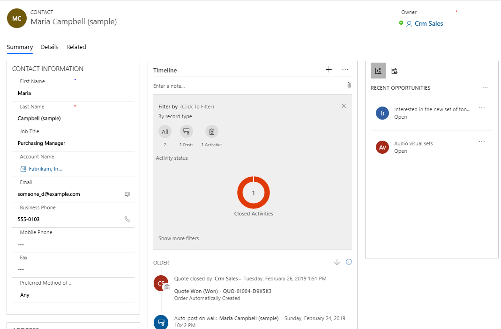
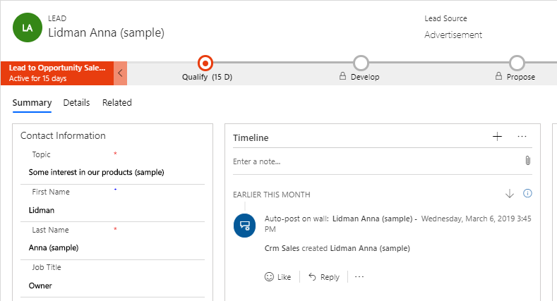
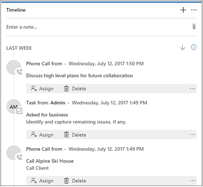
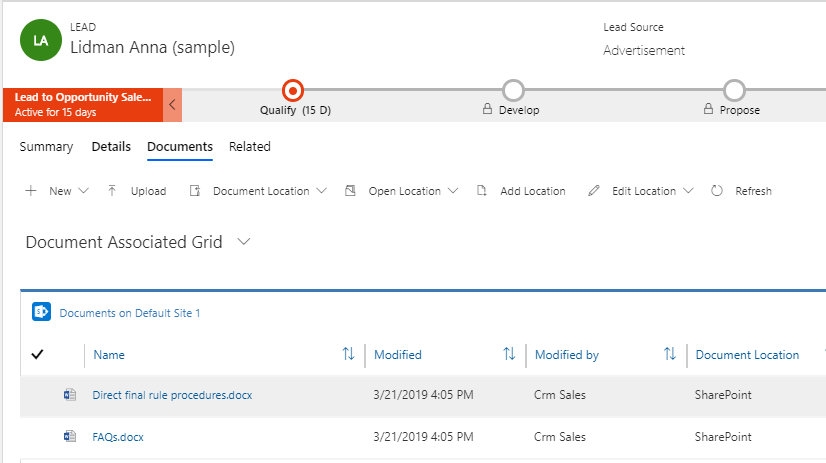
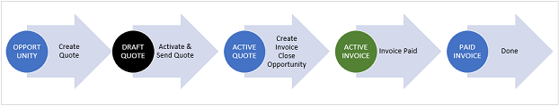

# Overview of Dynamics 365 Sales Professional

Welcome to Dynamics 365 Sales Professional. If you don't need a full-fledged enterprise app for your organization, the new Dynamics 365 Sales Professional app is for you.

This offering, available online only and built on the new Unified Interface framework, contains a targeted set of sales capabilities to get your organization up and running quickly.

It is designed from the ground up with accessibility in mind, and uses responsive web design principles to provide an optimal viewing and interaction experience for any screen size, device, or orientation. For example, subgrids morph into lists for smaller screen sizes.

[!INCLUDE[cc-app-definition-sales](../includes/cc-app-definition-sales.md)]

<iframe src="https://www.microsoft.com/videoplayer/embed/RE2OJXb" frameborder="0" allowfullscreen=""></iframe>

Dynamics 365 Sales Professional comes with a **Get Started** page that shows you the core things you need to set up to have your users get started, such as connecting email, sharing documents, and importing data. 

> [!div class="mx-imgBorder"]
> 

Plus, sellers will find a streamlined lead-to-cash process, easier account, contact, and opportunity management, and dashboards that make it faster to
visualize useful information at a glance.

## Get productive quickly

The app is designed to make getting up to speed simple and painless, whether you’re handling your day-to-day sales transactions or setting up the app for
your team. 

What’s the fastest way to get productive? 

Here are a couple options:

-   **Dive in and try out the sample data.** If you learn best through hands-on exploration, the app comes with sample data to help you see how
    data is presented and organized, and to give you something to experiment with as you get oriented.

    Start exploring, and play around with the sample data until you’re ready to work with your real customer data.

-   **Do a quick read that covers the basics.** The user guide and learning modules contain all the essentials you need to know to navigate the app,
    find and enter customer data, glean actionable insights from interactive dashboards, and more. And it’s short. (We know you’re busy.)

No matter how you decide to get started, soon you’ll be up and running—working your deals and building profitable relationships along the way, as you turn your
customers into lifelong fans of your products.

Ready to get started? Here are the feature highlights.

## Feature highlights

Here are some highlights of Dynamics 365 Sales Professional:

-   **Visual insights.** The out-of-the-box dashboards and charts have almost everything that you need to get insight into your business.

    More information: [Gain insights with dashboards in Dynamics 365 Sales Professional](gain-insights-dashboards-sales-professional.md).

    > [!div class="mx-imgBorder"]
    > 

-   **Customer 360&deg; view.** Once in the app, quickly get an overview of what’s happening with a customer, such as communications with them, progress of individual deals, and much more, all in one place.

    > [!div class="mx-imgBorder"]
    > 

-   **Business process flow.** The guided process flows on the **Lead and Opportunity** form tell you exactly what to do next. You can quickly find out the steps you must take to increase the likelihood of a successful sale and an increased sales count. The process bar can be docked to the right side of the screen for an omnipresent experience while you work on the opportunity.

    > [!div class="mx-imgBorder"]
    > 

-   **Activities timeline.** All the appointments you schedule while you work on an opportunity, the emails that you send or the phone calls you make are
    available in one place, giving you all the context you need to do your job.

    > [!div class="mx-imgBorder"]
    > 

-   **Store and view documents in the context of records.** Do you have presentations or documents for an opportunity all over the place? Store them
    all in one place, so anyone who’s working on the opportunity can view them!

    More information: [Manage your SharePoint documents and document locations in Dynamics 365 Sales Professional](develop-sales-lead-to-cash-sales-professional.md).

    

-   **Simplified opportunity-to-invoice process.** It is easy to move a customer through the Sales funnel. Just generate a quote right from the opportunity
    you’re working on, and activate it. Use the same quote to quickly generate an invoice and mark the deal as won. You can also email the quotes and
    invoices to your customer in just one click.

    More information: [Develop sales from lead to cash in Dynamics 365 Sales Professional](develop-sales-lead-to-cash-sales-professional.md).

    > [!div class="mx-imgBorder"]
    > 

-   **Document templates.** The Word and Excel templates ensure that the documents that you’re sending out to your customers align with you company’s
    brand.

    More information: [Create standardized documents with document templates in Dynamics 365 Sales Professional](use-document-templates-sales-professional.md).

    > [!div class="mx-imgBorder"]
    > 

-   **Sales data anywhere and everywhere.** Get all your customer and sales data right on your mobile device or tablet. Whether you are visiting a customer or
    on the road, you can quickly pull out your device to update the opportunity with information. What’s more—you get the same consistent experience
    regardless of the device you use.

### See also

[Learn the basics](learn-basics-sales-professional.md)  
[Admin settings overview](admin-settings-overview.md)  
[What's new in Dynamics 365 Sales Professional](whats-new.md)

[!INCLUDE[footer-include](../includes/footer-banner.md)]