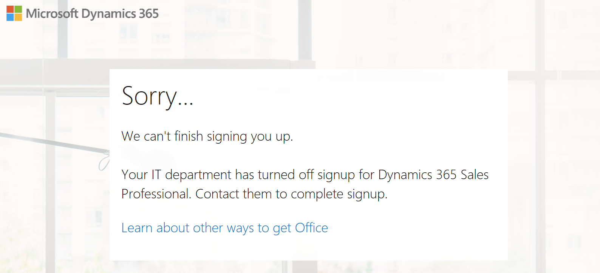

# Dynamics 365 Sales Professional troubleshooting guide

Use the following troubleshooting topics to quickly find information to solve your users' issues.

## Trial sign-up

### I'm not able to sign up for a Sales Professional trial

**Reason:**

If your Microsoft 365 tenant administrator has disabled trial sign-up for your organization, you'll see the error message, "Your IT department has turned off signup for Dynamics 365 Sales Professional Trial. Contact them to complete signup."

There are two ways that the tenant administrator can prevent users from performing self-service sign-up:  
- Prevent email sign-ups for the tenant by using the *AdHocSubscriptionsNotAllowed* parameter
- Prevent new users to be created within the tenant (NewUsersNotAllowed).  

> [!div class="mx-imgBorder"]
> 

**Workaround:**

Please contact your IT department and work with them to help you sign up. 

### I see the error while signing up: "Something went wrong building your Sales Pro experience. Do you want to try again?"

> [!div class="mx-imgBorder"]
> 

**Reason:**

There are several possible reasons for this error:

- You've already signed up for the Sales Professional application for your tenant, and are trying to sign up again by using other credentials for the same tenant before the expiry of the first trial instance.

- You aren't using the complete sign-up URL, but are using the reply URL present in the sign-up URL. For example, you're using https://salesprotrial.dynamics.microsoft.com instead of https://signup.microsoft.com/Signup?sku=9c7bff7a-3715-4da7-88d3-07f57f8d0fb6&RU=https://salesprotrial.dynamics.microsoft.com.

- The Sales Professional trial license that's assigned to you as part of the sign-up process isn't synced with Azure Active Directory.

**Workaround:**

Try the following steps to resolve this issue:

1. Clear your browser cache, and close the browser.

2. Wait for at least five minutes, and then open the browser in private browsing mode.

3. Use the full [sign-up URL](https://signup.microsoft.com/Signup?sku=9c7bff7a-3715-4da7-88d3-07f57f8d0fb6&RU=https://salesprotrial.dynamics.microsoft.com).

### See also

[Sign up for a free trial of Dynamics 365 Sales Professional](try-dynamics365-sales-professional.md)

[!INCLUDE[footer-include](../includes/footer-banner.md)]