# Sign up for free trial of Dynamics 365 Sales Professional

With Microsoft Dynamics 365 Sales Professional, you can streamline your sales processes, shorten sales cycles and integrate seamlessly with Microsoft Office 365 and LinkedIn, so you can - close deals and achieve your quota faster.

Sales Professional trials are fully functional, but limited to 30 days. Each Sales Professional trial comes pre-installed on a dedicated trial instance. You can't install a Sales Professional trial on an existing instance.

Dynamics 365 Sales Professional is a cloud-based application that runs on a Microsoft 365 tenant*. Your tenant hosts your cloud applications (including Office 365 and Dynamics 365), provides user and license management, and much more. The procedure for setting up your trial depends on whether you already have a *managed* tenant (which is a tenant where Azure Active Directory (Azure
AD) is available), an unmanaged tenant, or no tenant at all.

-   *If you already have a managed tenant, you can sign up for the Dynamics Sales Professional trial by following the instructions in the section [Installation steps when you belong to an existing Microsoft 365 tenant](#installation-steps-when-you-belong-to-an-existing-microsoft-365-tenant).

- If you don’t have a Microsoft 365 tenant, you can sign up for the Dynamics Sales Professional trial by following the instructions in the section [Installation steps when you don't belong to an existing tenant](#installation-steps-when-you-dont-belong-to-an-existing-microsoft-365-tenant).

-   *If you already have an unmanaged tenant and prefer to continue using it*, then you must first convert it to a managed. For more information, see [Take over an unmanaged directory as administrator in Azure Active Directory](https://go.microsoft.com/fwlink/p/?linkid=866761). Then continue with the steps in the section [Installation steps when you belong to an existing Microsoft 365 tenant](#installation-steps-when-you-belong-to-an-existing-microsoft-365-tenant).

## Installation steps when you belong to an existing Microsoft 365 tenant

1.  Go to the [Dynamics 365 Sales Professional](https://dynamics.microsoft.com/sales/professional/) marketing page.

2.  To sign up for a 30-day free trial, select **Free trial**.

    [!div class="mx-imgBorder"]
    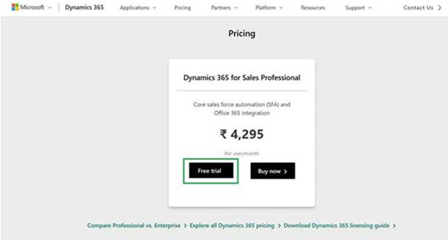

3.  In the **Step up to Sales Professional** page, enter your work email address, and select **Sign up**.

    [!div class="mx-imgBorder"]
    

4.  Based on the email address, if you are found to belong to an existing Microsoft 365 tenant, you’re asked to read and agree to the terms and conditions and privacy policy.

    [!div class="mx-imgBorder"]
    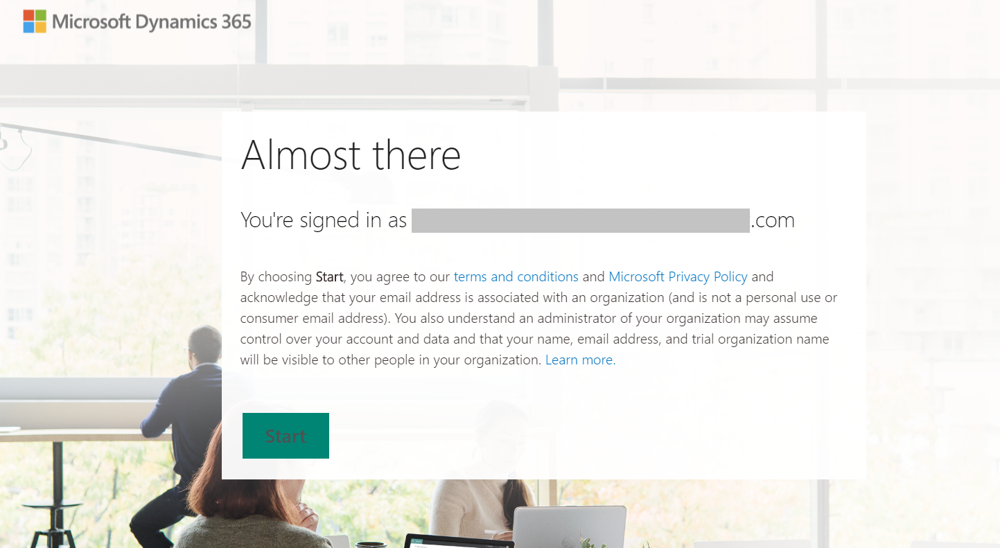

    > [!IMPORTANT]
    > If you don't belong to an existing Microsoft 365 tenant, follow the steps outlined in [Installation steps when you don't belong to an existing tenant](#installation-steps-when-you-dont-belong-to-an-existing-microsoft-365-tenant).

5.  Select **Start**.

6.  In the **Permissions requested** page, give consent to allow the app to the permissions it requires on your tenant. Select **Accept**.

    [!div class="mx-imgBorder"]
    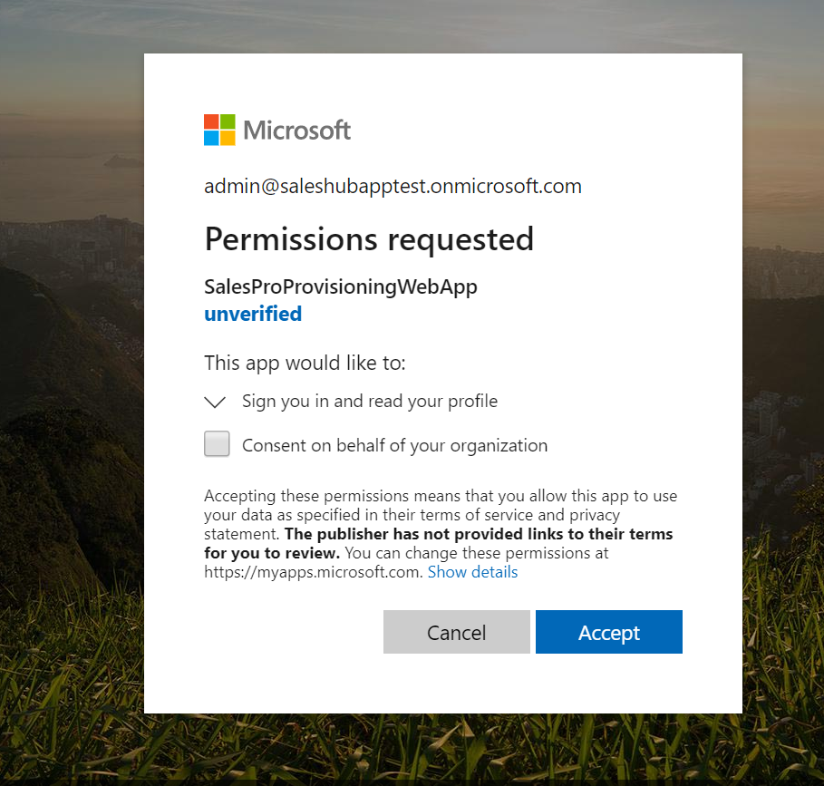

7.  While the app is being set up for you, you’ll see the features and capabilities that the app offers:

    [!div class="mx-imgBorder"]
    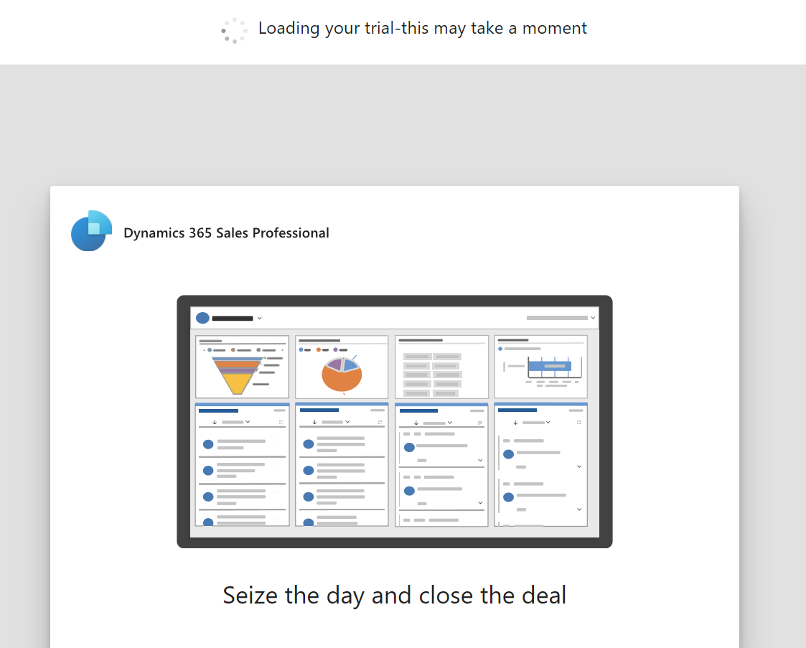

8.  When the app is ready, you’ll see the message “Your trial is ready! We hope you enjoy using Sales Professional”. Select **Let’s go**.

    [!div class="mx-imgBorder"]
    

    If you don’t select **Let’s go**, you’re redirected to the Dynamics 365 apps page in a few seconds, from where you can launch the Sales Professional app.

    [!div class="mx-imgBorder"]
    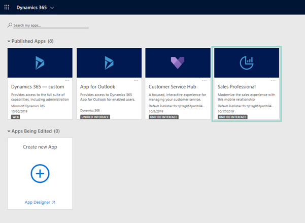

    On launching the app, you'll see an interactive dashboard which provides a view of the Sales pipeline, Leads, Opportunities, Activities, Sales Leaderboard based on pre-loaded sample data. To see the visual filters as illustrated below, click “Show Visual Filter” in the dashboard command ribbon.

    [!div class="mx-imgBorder"]
    

## Installation steps when you don't belong to an existing Microsoft 365 tenant 

1.  Go to the [Dynamics 365 Sales Professional](https://dynamics.microsoft.com/sales/professional/) marketing page.

2.  To sign up for a 30-day free trial, select **Free trial**.

    [!div class="mx-imgBorder"]
    

3.  In the **Step up to Sales Professional** page, enter your work email address, and select **Sign up**.

    [!div class="mx-imgBorder"]
    

    Because your email address doesn't belong to an existing Microsoft 365 tenant, you can sign up for Sales Professional trial by creating a new managed tenant for your organization and becoming an Administrator of the tenant.  

    [!div class="mx-imgBorder"]
    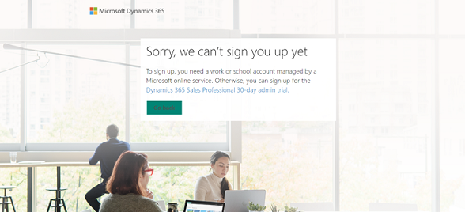
 
4. To get started, select **Dynamics 365 Sales Professional 30-day admin trial**. 

5. On the trial sign up page, select your Country or region, enter your first name, last name, work email address, business phone number, organization name, organization size, and select **Next**. 

    [!div class="mx-imgBorder"]
    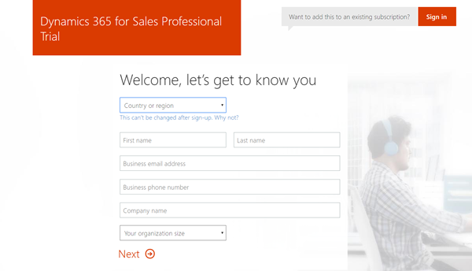

6. To create an account, enter your username, organization name, and password, and review the terms and conditions and Microsoft Privacy Statement. Then, select **Create my account**. 

    [!div class="mx-imgBorder"]
    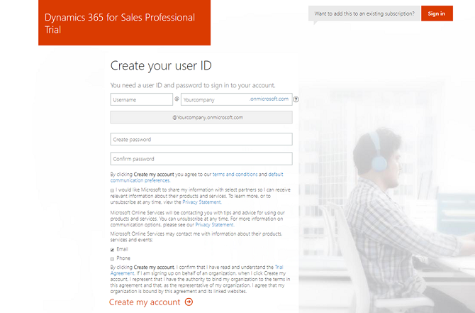

7. Select **Text me** or **Call me** and enter your phone number for verification. 

    [!div class="mx-imgBorder"]
    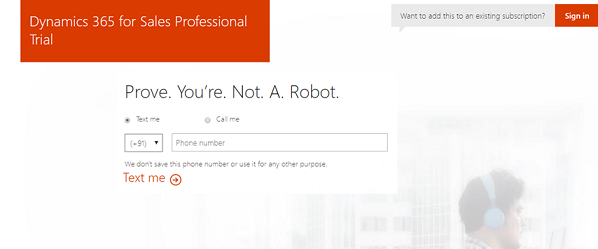

8. Enter the verification code that you received on your phone and select **Next**. 

    [!div class="mx-imgBorder"]
    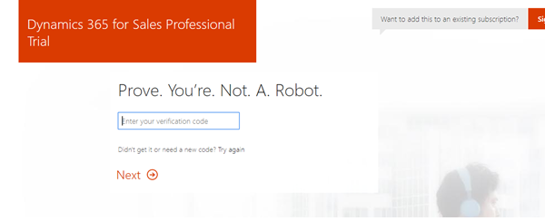

9. While your tenant and user account is being created, you'll see the sign-in page URL and your user ID. Make a note of these as you will need these later to sign in to your trial.  

    [!div class="mx-imgBorder"]
    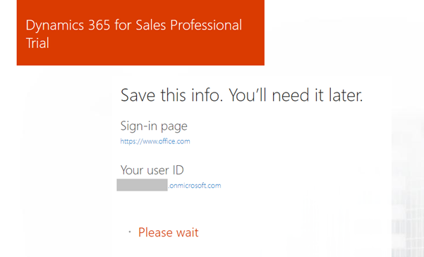

10. After your account is set up, select **You’re ready to go…**.  

    [!div class="mx-imgBorder"]
    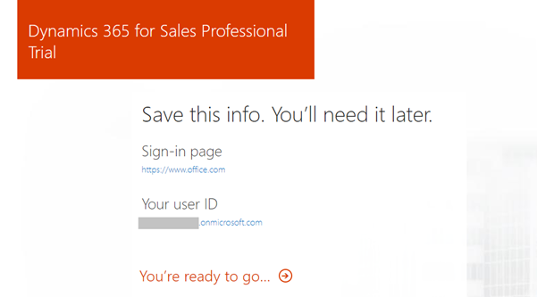

11. You’ll be redirected to Microsoft 365 admin center. Select **Get started**. 

    [!div class="mx-imgBorder"]
    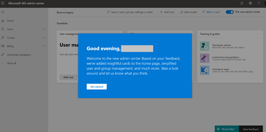

12. Go to **All admin centers** > **Dynamics 365**. 

    [!div class="mx-imgBorder"]
    

13. Select the **None of these. Don’t customize my organization** check box and select **Complete Setup**. 

    [!div class="mx-imgBorder"]
    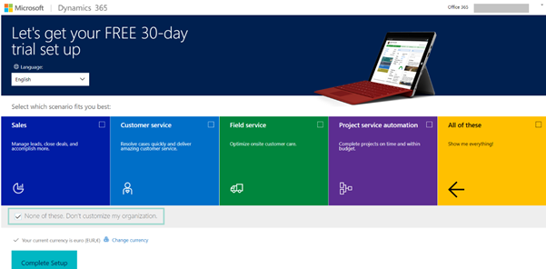

14. After the setup is complete, go to Dynamics 365 Admin Center, and on the **Instances** tab, select the **Dynamics 365 Sales Professional** solution, and select **Install**. Accept the Terms of Service to start the installation.  

    [!div class="mx-imgBorder"]
    

15. When the installation is complete, sign in to Sales Professional to start your trial.  

    [!div class="mx-imgBorder"]
    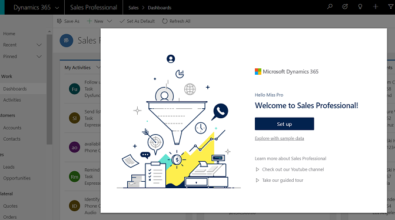

> [!IMPORTANT]
> You won’t get any email notification on signing up for the trial or when the trial is about to end. When the trial ends, trial instance and the data in the trial instance will be deleted.

### See also

[Help resources for Dynamics 365 Sales Professional](help-hub.md)