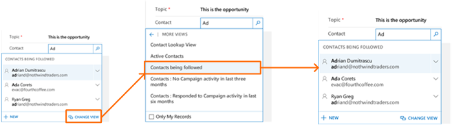

# Use the lookup field on forms

Lookup helps you to choose records from a related entity (recordset) quickly in Dynamics 365. When you select a related entity and enter search criteria, such as a name or email address, lookup automatically begins to resolve the partial text and displays any matching records. If no records are displayed after you have typed the full text of your search criteria, a message is displayed specifying that there are no records. For example, you might search for the name **Adrian Dumitrascu**. When you type **ad**, possible matching records are automatically populated and displayed.

>[!NOTE] 
>An administrator can define the criteria that lookup uses for resolving partial search text.

Also, you can create a new record by selecting the **New** button. You must have sufficient permissions to view the **New** button and create a
record. When you select the lookup field, the five most recently used records are displayed along with five favorite records. Which records are displayed
depends on your view history and the favorites you’ve pinned. 

For example, if you have only three records in your history, lookup will display those three,
along with seven of your favorite records. If you have not pinned any favorites, only the most recently viewed records will be displayed.

>[!NOTE] 
>The number of favorites or recently visited records depends on the device and application type that you are using. 

## Types of lookups

Lookups are classified into the following: 

- **Simple lookup:** Select a single record in a field from a single entity. 

- **PartyList-type fields:** Use to select multiple records from multiple entities in a lookup. Use partylist-type fields to select multiple records. This allows you to add each record by performing a new search, multiple times. Every time you select a record, you will be able to perform a new search for another record.
  
- **Regarding-type fields:** Use to select a single record from multiple entities in a lookup. 

[More information on fields and field data types](../customize/types-of-fields.md)

### Browsing lookup

To browse a lookup, select the **Lookup icon** . The full list of items will be presented within the drop-down list.

### Searching a lookup

To search a lookup, select the lookup textbox and type your search criteria. If recent records are enabled for your lookup, they will be displayed before typing.

### Create a new record if you don’t find an existing record

If you do not find a record, select **New** in the lookup area to create a new record.

### Replace an existing record from a lookup field

You can replace an existing record while using simple and regarding-type lookups. Search for a record. Then select the record, and replace it with a new record.

### Change a view in a lookup field 

Selecting **Change View** lets you determine:
 - How you want to view records such as **Contacts Being Followed**, **Contacts Lookup View**, or **Active Contacts**.
 - What you want to view in the records, such as name, email, or telephone number. For example, if you want to view only the contacts that you follow, select
    **Change View** \> **Contacts being followed**. Only the contacts that you are following will be displayed, as illustrated here. 

    

>[!IMPORTANT] 
>The **Change View** option will not be visible if your administrator hasn't configured the option to appear in your views.

### Choose from multiple records

When lookup has more records in a field than can fit in the available display area, the display area is collapsed—that is, the records that do fit the display area are shown next to the number of records that are not shown. To view all records, select the number. The following images show the difference between collapsed and non-collapsed fields.

**Collapsed:**

**Non-collapsed:**

### See also

[Overview of Dynamics 365 Sales Professional](sales-professional-overview.md)
