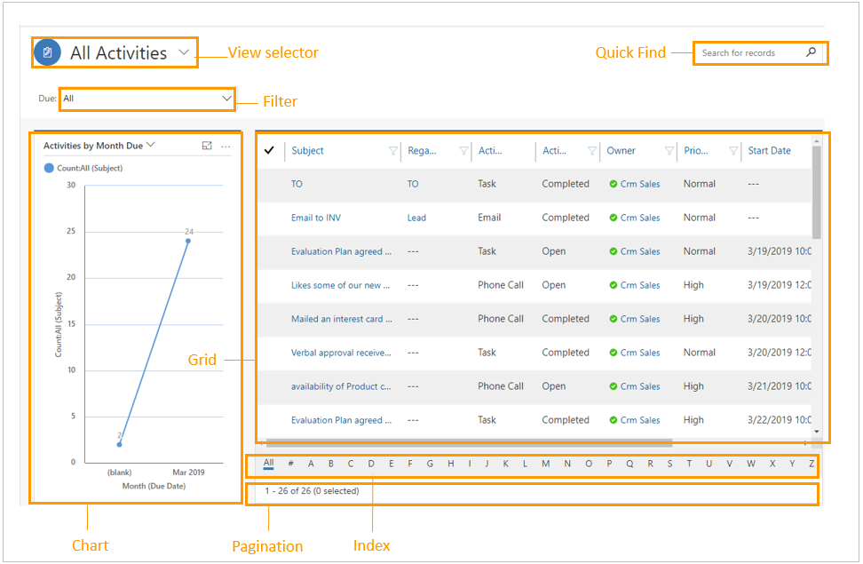

# Work with views (lists)

Use grids (views) and lists to browse and manage various data sets in Dynamics 365 Sales Professional to improve your productivity.

You can perform some common interactions in a view, such as: 

- Switching views, for example switching from My Open Opportunities to Opportunities Closing Next Month.

- Finding a specific record by using Quick Find. 

- Filtering data by using charts. 

- Creating a new record. 

- Exporting views to a Microsoft Excel workbook.

The following image shows how a view is displayed:

A typical view page contains these components: 

- **Command bar:** You can perform actions on records by using commands such as Refresh and Delete. 

- **View selector:** When you select a view such as Accounts, My Activities, or Contacts, records in the grid change based on the view you’ve selected.

    More information: [Create and edit views](../customize/create-edit-views.md).

    > [!NOTE]
    > To configure a view as the default, select the pin icon next to the view.

-   **Quick Find:** Get quick results by entering simple queries. Quick Find displays all active records that match your query.

-   **Filters:** Filter data to display only what you’re interested in. For example, in the Activities view, you can filter data by due date by selecting a filter from the **Due** drop-down list.

-   **Charts:** Use charts to display data for quick, high-level visual analysis. Charts wrap huge amounts of data in one easy-to-understand visual snapshot. 

-   **Column headings and sorting:** In a grid, column headings display the names of columns that were defined in the layout. For example, when you select contacts, the names of each column, such as Full Name, Email, and Company Name, are displayed in each column heading, depending on the layout.

    - The **Select All** check box appears next to the first column heading. When you select the check box, all the rows on the current page in the grid are
    selected.

    - You can also sort records by selecting the column heading. When the records are sorted, an arrow in the column heading indicates the sort direction.

    - You can sort multiple columns at once: Select the heading of the column that you want to sort first, select the Shift key, and then select the heading of the other column to further sort the records. For example, if you want to sort contact records first by company and then by name, select the Name column heading, select and hold the Shift key, and then select the Company column heading.

-   **Index:** You can select a character in the index to filter records in the grid or list that start with that character. For example, to display records that start with the letter *U*, select *U* on the index, and records that start with *U* are displayed. When the page is resized to a list, the index appears as a button. Select the button to view the complete list of characters.

-   **Pagination:** The pagination section shows the number of pages that the records span. The number of pages varies depending on the number of records per page. For example, if you have 50 records and the view shows 25 records per page, the page count in the pagination section is 2.

    >[!NOTE]
    >- You can define the number of records that you want to view on a page. When you reach the end of the records on the current page, the grid automatically shows the next page of records and starts scrolling again from there. The pagination control will change to show the current page number.
    >- You can navigate across pages by using the left and right arrows.

The view page is responsive. As the size of the container decreases—for example, on phones and smaller viewports—the view is transformed into a list. A list can be rendered in a compact manner that is suitable for viewing at a smaller width. For example, in a list, the index is displayed as a button. By default, a list displays an image or initials for each record. In addition, the command bar is minimized to a **More Actions** (**…**) icon.

You can perform different actions such as sort, delete, and refresh on items in lists by using the command bar as you do in grids. To open the command bar, select **More Actions** (**…**) in the header pane of the view selector.

>[!NOTE] 
>If you want to perform any action on an individual item, select the **More Actions** (**…**) icon that corresponds to the item.

### See also

[Overview of Dynamics 365 Sales Professional](sales-professional-overview.md)

[!INCLUDE[footer-include](../includes/footer-banner.md)]