# Add condition steps to sequences 

Use adaptive sequences in sales accelerator to define conditions steps that determines the path of a sequence.

## License and role requirements
| Requirement type | You must have |
|-----------------------|---------|
| **License** | Dynamics 365 Sales Enterprise, Dynamics 365 Sales Premium, or [Microsoft Relationship Sales](https://dynamics.microsoft.com/en-in/sales/relationship-sales/)  More information: [Dynamics 365 Sales pricing](https://dynamics.microsoft.com/sales/pricing/) |
| **Security roles** | System Administrator or Sequence Manager    More information: [Predefined security roles for Sales](security-roles-for-sales.md)|

## Configure adaptive sequence steps

Use *adaptive sequences* to define conditions for the steps in a sequence. These conditions determine the course of action the sequence will take after the condition is either met or not. After the result of a condition is determined&mdash;for example, whether a user opened an email (**Yes**) or didn't (**No**)&mdash;the sequence proceeds as you designed it. Conditions are available for the following activities:

- [Email](#define-conditions-for-email-activity)
- [Phone call](#define-conditions-for-phone-call-activity)
- [Field value](#define-conditions-for-field-values)
- [Business process stage](#define-conditions-for-business-process-stage)

## Prerequisite

Conditions in the adaptive sequences work as defined only when **Sales Insights Adaptive sequence timeout flow** process is enabled. To enable the process, follow these steps:     
1. Go to [Power Automate](https://flow.microsoft.com) and change the environment to your organization.   
2. Select **Solutions** and then select **Default Solution**.

    >[!div class="mx-imgBorder"]
    >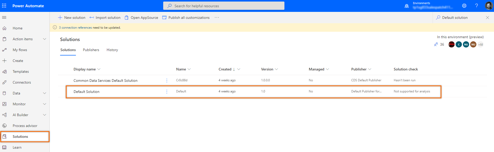        

1. On the **Default Solution** page, select the view as **All** and search for **Sales Insights Adaptive sequence timeout flow** process.   
    >[!div class="mx-imgBorder"]
    >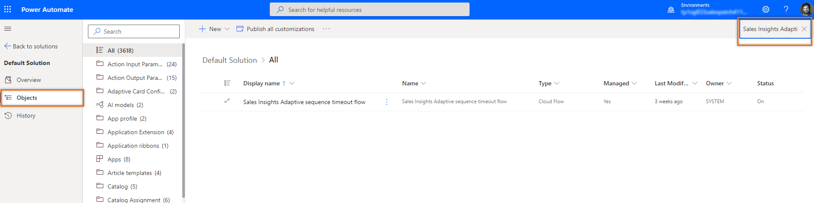    

1. On the **Sales Insights Adaptive sequence timeout flow** page, select **Turn on**.   
    >[!div class="mx-imgBorder"]
    >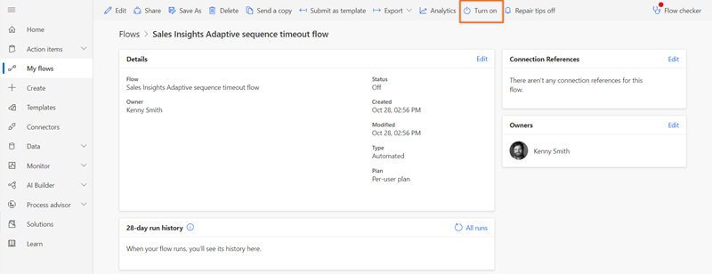    

    The process is enabled.

## Define conditions for an email activity

When you add an email activity to a sequence and select **Add** (**+**), the **Add an action or other element** dialog box displays. Select the **Conditions** tab, where you determine the next course of action in the sequence.

When the seller skips an email activity that includes a condition, the flow follows the **No** path.

>[!IMPORTANT]
>- You need to [configure the email engagement feature](configure-email-engagement.md) in your organization before you start using conditions for the email activity. The interactions that customers have with emails are displayed in the condition list.
>- [Enable sequence activities](customize-sales-accelerator-sellers.md#sequence-activities) to create conditions for email activities.

The following table lists the interactions that are available in email conditions.

| Interaction | Description |
|-------------|-------------|
| Email open | If a customer opens the email, the flow follows the **Yes** path. If not, the **No** path is followed. |
| Recipient reply | If a customer replies to the email, the flow follows the **Yes** path. If not, the **No** path is followed. |
| Link opened | If a customer opens a link that's included in the email, the flow follows the **Yes** path. If not, the **No** path is followed. |
| Attachment downloaded | If a customer downloads an attachment that's linked to your email, the flow follows the **Yes** path. If not, the **No** path is followed. |
| Advanced email conditions | Define condition to choose whether only one email result must occur or all email results must occur in order to advance to the next step. More information: [Advanced email conditions](#advanced-email-conditions)|

Let's define a flow so that if a customer opens your email, the next step is to schedule a phone call, and if the customer doesn't open your email, the next step is to send a reminder email.

1.	Select **Add** (**+**) after the email activity.   
    >[!div class="mx-imgBorder"]
    >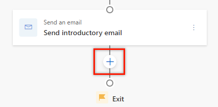    
2.	In the **Add an action or other element** dialog box, select the **Conditions** tab.
    A list of interactions that are defined in the email engagement feature is displayed.      
    >[!div class="mx-imgBorder"]
    >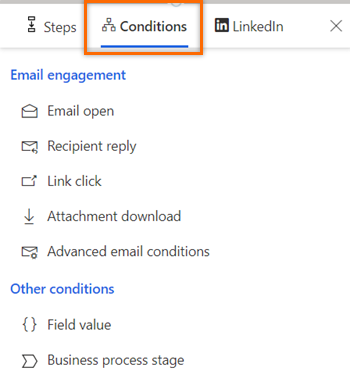    
3.	Select **Email open**.     
4.	On the **Email open** pane, configure the time limit for satisfying the condition before proceeding to the next step. 
    In the following example, we configure the wait time as one day. This establishes the following:     
    - If the customer opens the email within the day, the **Yes** path is initiated and the sequence moves to the next step after a day has passed.   
    If you don't want to wait a day to move to the next step in the **Yes** path, select the **If the action is completed within the time limit, the sequence will move to the yes path** checkbox.
    - If the customer doesn't open the email within the time limit, the **No** path is executed.   
    >[!div class="mx-imgBorder"]
    >     
5.	Close the email open pane.    
    The condition is created.     
6.	To schedule a phone call activity in the **Yes** path to talk with the customer, do the following:    
    1.	Select **Add** (**+**), and then under the **Steps** tab, select **Make a phone call**.     
        >[!div class="mx-imgBorder"]
        >     
    2.	Configure the phone call activity, and then close the pane.     
        The phone call activity is created.      
7.	To send a follow-up email in the **No** path when the customer doesn't respond within the time limit of one day, do the following:     
    1.	Select **Add** (**+**), and then under the **Steps** tab, select **Send an email**.    
        >[!div class="mx-imgBorder"]
        >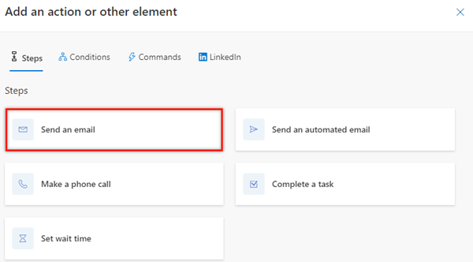     
    2.	Configure the email activity, and then close the pane.     
        The email activity is created.

    >[!div class="mx-imgBorder"]
    >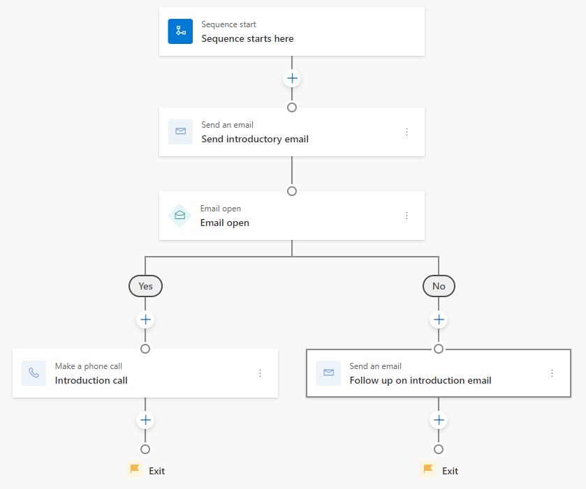     

>[!NOTE]
>You can't delete a step that's followed by a condition. To delete such a step, remove the condition and then delete the step. 

### Advanced email conditions

The **Advanced email conditions** step lets you define next course of action when a set of actions—or any of the selected actions—is performed by the customer on the email step. 

>[!IMPORTANT]
>- You need to [configure the email engagement feature](configure-email-engagement.md) in your organization before you start using conditions for the email activity. The interactions that customers have with emails are displayed in the condition list.
>- [Enable sequence activities](customize-sales-accelerator-sellers.md#sequence-activities) to create conditions for email activities.

Let's define a flow where you want to trigger the next step when a customer opens the email and downloads the attachment. 

1. After adding the **Email** activity, select **+** (**Add**).    
2. On the **Add an action or other element** dialog box, go to the **Conditions** tab and select **Advanced email conditions**.

    >[!div class="mx-imgBorder"]
    >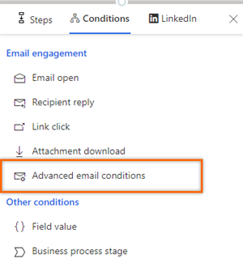    

3. In the **Advanced email conditions** pane, select the **All of them** option. In this example, we're defining the condition to go to **Yes** path when a customer opens the email and downloads the attachment. 

    > [!NOTE]
    > Select the **One of them** option if you want to trigger the **Yes** path when only one of the selected actions is performed.

    >[!div class="mx-imgBorder"]
    >

4. From the **Select results** dropdown list, select the **Email open** and **Attachment downloaded** checkboxes.

    When a customer performs both of these actions on the email, the **Yes** path is initiated. 

    > [!NOTE]
    > If you've selected the **One of them** option, the **Yes** path will be initiated when the email is opened or the attachment is downloaded.

    >[!div class="mx-imgBorder"]
    >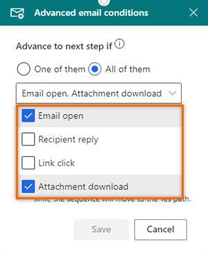

5.  Select the duration in days and hours after which you want to initiate the **Yes** path when a customer performs the selected actions. If the customer doesn't perform these actions within the time limit, the **No** path is initiated.

    If you don't want to wait and move to the next step in the **Yes** path after a customer performs the selected actions, select the **If the action is completed within the time limit, the sequence will move to the Yes path.** checkbox.

    >[!div class="mx-imgBorder"]
    >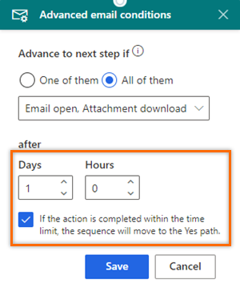

6. Close the **Advanced email conditions** pane.     
    The advanced email conditions step is created.     
    You can continue to create the steps in the **Yes** and **No** paths, according to your requirements.
    

## Define conditions for a phone call activity

When you add phone call activity to the sequence and select **Add** (**+**), the **Add an action or other element** dialog box displays. Select the **Conditions** tab, where you determine the next course of action in the sequence. The actions that can be performed on a phone call activity are displayed in the **Advanced call conditions** step. However, these actions vary from organization to organization depending on their requirements, and are added by the administrator.     
The **Advanced call conditions** step lets you select multiple results, when only one result must occur to advance to the **Yes** path.

When the seller skips a phone call activity that includes a condition, the flow follows the **No** path.

>[!NOTE]
>To learn about adding custom status for your organization, see [Define status reason transitions for the Case or custom tables](/powerapps/maker/data-platform/define-status-reason-transitions?context=/dynamics365/context/sales-context).

Let's define a flow where you want to initiate the **Yes** path when the customer makes or receives a call.    
 
1.	Select **Add** (**+**) after the phone call activity.    
    >[!div class="mx-imgBorder"]
    >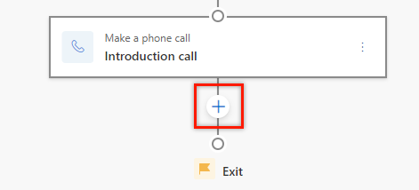     
2.	In the **Add an action or other element** dialog box, go to the **Conditions** tab and then select **Advanced phone conditions**.     
    
    >[!div class="mx-imgBorder"]
    >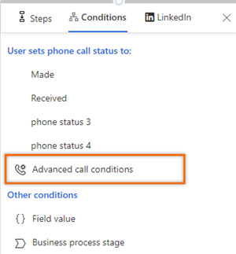 

3.	In the **Advanced phone conditions** pane, from the **Select results** dropdown list, select the **Made** and **Received** options. 
    When any of the selected activities is completed, the **Yes** path will be initiated. 

    >[!div class="mx-imgBorder"]
    >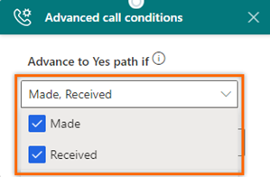

4.	Close the **Advanced phone conditions** pane.        
    The advanced call conditions step is created.    
    
    >[!div class="mx-imgBorder"]
    >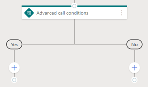

    You can continue to create the steps in the **Yes** and **No** paths, according to your requirements.
    

## Define conditions based on a field value

When you add a condition based on a field value, you determine the next course of action for the sequence according to the value given in the field. The available field values&mdash;including related entities&mdash;are based on the type of record you've selected for the sequence.

In the the **Add an action or other element** dialog box, go to the **Conditions** tab, choose a field, and create a condition. The sequence follows the **Yes** path when the condition is true and the **No** path when the condition is false.

In the following example, let's set the sequence to follow the **Yes** path when a lead's company name is **Contoso**.

1.	Select **Add** (**+**) after an activity.    

2.	In the **Add an action or other element** dialog box, go to the **Conditions** tab and then select **Field value**.     
    
    >[!div class="mx-imgBorder"]
    >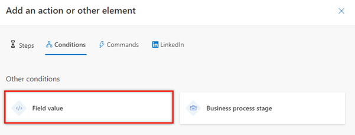
 
3.	In the **Field value** pane, under the **Advance to Yes path if** section, select **Company Name**, and then set the condition as **Equals** to **Contoso**.

    >[!div class="mx-imgBorder"]
    >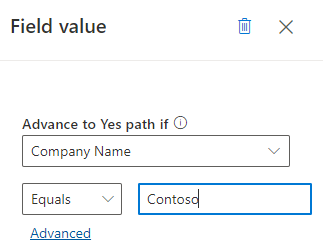    
        
    >[!NOTE]
    >- When you select **Advanced**, the **Field values** pane opens on the right to define more conditions for the step. You can define conditions based on row, group, and related entities.    
    >- Lookup type fields such as **Created by** and **Owner** are only displayed when you select **Advanced**.
    >- If the connected record doesn't include the configured field, an error is displayed in the **Up next** widget. The following image shows an example of the error: 
    >    

4.	Close the **Field value** pane.    
    The field value condition step is created.

    You can continue to create the steps in the **Yes** and **No** paths, according to your requirements.

## Define conditions based on a business process stage

When you add a condition based on the stage of a business process, you determine the path of a sequence based on which stage the business process is in. The business process flows are listed based on the type of record you've selected for the sequence.

In the the **Add an action or other element** dialog box, go to the **Conditions** tab, choose a **Business process stage**, and create a condition. The sequence follows the **Yes** path when the condition is true and the **No** path when the condition is false.

>[!NOTE]
>Verify that business process flows are defined for the record type you've selected in the sequence.

In the following example, let's set the sequence to the **Yes** path when the **Lead to Opportunity Sales Process** flow is in either the **Propose** or **Develop** stage.

1.	Select **Add** (**+**) after an activity.    

2.	In the **Add an action or other element** dialog box, go to the **Conditions** tab and then select **Business process stage**.

    >[!div class="mx-imgBorder"]
    >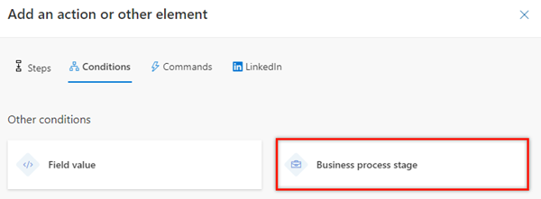
 
3.	In the **Business process stage** pane, under the **Advance to Yes path if BPF is** section, select **Lead to Opportunity Sales Process**. In the **and stage is** box, select **Propose** and **Develop**.

    >[!div class="mx-imgBorder"]
    >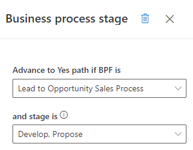    

4.	Close the **Business process stage** pane.    
    The business process flow condition step is created.      
    You can continue to create the steps in the **Yes** and **No** paths, according to your requirements.

[!INCLUDE[cant-find-option](../includes/cant-find-option.md)]

### See also

[Create and activate a sequence](create-and-activate-a-sequence.md)      
[Add steps to sequence](steps-sequence.md)  
[Add command steps to sequences](command-sequence.md)     
[Add LinkedIn activities to sequence](linkedin-activities-sequence.md)
