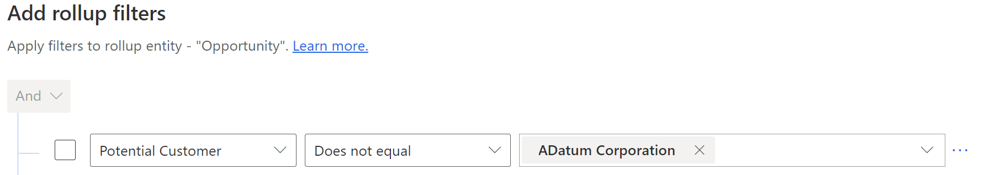
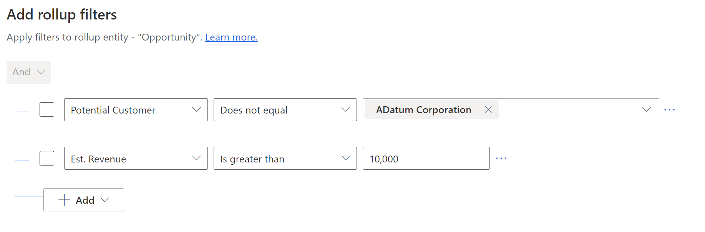

# Apply additional filters 

Add filters to refine the opportunities and hierarchies that participate in calculating the forecast values.

## License and role requirements
| Requirement type | You must have |
|-----------------------|---------|
| **License** | Dynamics 365 Sales Premium or Dynamics 365 Sales Enterprise   More information: [Dynamics 365 Sales pricing](https://dynamics.microsoft.com/sales/pricing/) |
| **Security roles** | System Administrator or Forecast Manager  More information: [Predefined security roles for Sales](security-roles-for-sales.md)|

## Filter hierarchy records in the forecast

You can filter your forecast to include only those hierarchies that meet the specified conditions. For example, Kenny Smith is the Sales head for APAC and EMEA. He wants to view the forecast data of his org in the APAC territory. As an administrator, you can create an org chart forecast and set the hierarchy filter to include only the APAC forecast data. 

The following screenshot illustrates a sample forecast hierarchy: 

:::image type="content" source="media/forecast-hierarchy.PNG" alt-text="A sample forecast hierarchy with a manager and her team.":::

**To filter hierarchy records in a forecast**

1.  Select the **Filter Data** step of the forecast configuration and go to the **Add hierarchy filters** section.

    > [!NOTE]
    > To apply the filter on an existing forecast, clone the forecast configuration, apply the filter, and then activate it. You can then deactivate the old forecast configuration.
    
2.  Select the conditions to filter the hierarchy that you want to include in the forecast. For our example, let's select **Territory** is equal to APAC. This will include forecast records of sellers from APAC.

     :::image type="content" source="media/hierarchy-filters.png" alt-text="Screenshot of the filter hierarchy step.":::

    > [!NOTE]
    > If a parent record is filtered out of the hierarchy, the rollup value of the child records will show up under the parent record. However, the opportunities that were directly owned by the parent record won't be displayed in the forecast. Let's suppose that Dustin Ochs is a Sales Manager in Kenny's org who manages two sellers. Henry is in Europe, but manages sellers in APAC. When Kenny looks at the forecast for APAC, the opportunities of Dustin's reports will roll up under Henry's name, but the forecast won't show the opportunities owned by Henry. 

3.  Select the **General** step to preview the forecast configuration with the filtered hierarchy.

    :::image type="content" source="media/hierarchy-filters-preview.png" alt-text="Screenshot of the forecast hierarchy preview.":::

    If a parent record is suffixed with **(group)** in the preview, it means that the parent record is filtered out of the hierarchy but its child records are included in the hierarchy. As an example, see Dustin's record in the above screenshot.  

4.  Ensure that the forecast hierarchy looks correct before you activate the forecast. After the forecast is activated, you can't edit the filter.

## Add additional filters on opportunities to calculate forecast values

Using the rollup filters, you can filter opportunities that participate in calculating the forecast values. To filter the opportunities, create the filter conditions based on the opportunity and its related entity attributes.

For example, you know that opportunities related to **Adatum Corporation** and the revenue of more than or equal to **$10,000** can't be closed for the current quarter. To filter such opportunities in the forecast, follow these steps:

1.	In the **Filter Data** step of the forecast configuration, go to the **Add rollup filters** section.
 
2.	Select **Add** > **Add row**. 
 
3.	In the selection boxes, select the attribute as **Potential Customer**, the condition as **Does Not Equals**, and the company to be considered as **Adatum Corporation**.
 
    > [!div class="mx-imgBorder"]
    > 

    With this condition, the opportunities related to **Adatum Corporation** will be removed from the forecast. In the next step, you'll add a condition to filter revenue that's more than or equal to **$10,000**.

4.	Select **Add** > **Add row**.

5.	In the selection boxes, select the attribute as **Est. Revenue**, the condition as **Is greater than**, and revenue to be considered as **10000**.

    > [!div class="mx-imgBorder"]
    > 
 
Now the conditions are created for the query. When the forecast is activated, the query will be executed to filter the forecast for the added conditions.

[!INCLUDE[cant-find-option](../includes/cant-find-option.md)]

<table>
<tr><td>

> [!div class="nextstepaction"] 
> [Previous step: Choose layout and columns](choose-layout-and-columns-forecast.md)
</td><td>

> [!div class="nextstepaction"] 
> [Next step: Configure and manage drill-down entities](configure-manage-drill-downs.md)
</td></tr>
</table>

### See also

[Configure forecasts in your organization](configure-forecast.md) 
[View a forecast](view-forecasts.md)

[!INCLUDE[footer-include](../includes/footer-banner.md)]
