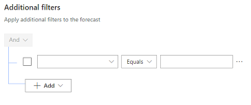

# Apply additional filters 

Add additional filters to refine the opportunities and hierarchies that participate in calculating the forecast values.

## License and role requirements

| &nbsp; | &nbsp; |
|-----------------------|---------|
| **License** | Dynamics 365 Sales Premium or Dynamics 365 Sales Enterprise   More information: [Dynamics 365 Sales pricing](https://dynamics.microsoft.com/sales/pricing/) |
| **Security roles** | System Administrator or Forecast Manager  Go to [Predefined security roles for Sales](security-roles-for-sales.md)|
|||

## Filter opportunities in the forecast 

Using additional filters, you can filter the opportunities that participate in calculating the forecast values. To filter the opportunities, you create filters based on conditions by using the attributes that belong to the Opportunity entity, including related entity attributes.

For example, you know that opportunities related to **Adatum Corporation** and revenue more than or equal to **$10,000** can't be closed for the current quarter. To filter such opportunities in the forecast, follow these steps to create a query for this condition.

1.	In the **Additional filters** section, select **+ Add filters**.
 
2.	Select **+ Add** > **Add row**. 

    > [!div class="mx-imgBorder"]
    > 
 
3.	In the selection boxes, select the attribute as **Potential Customer**, the condition as **Does Not Equals**, and the company to be considered as **Adatum Corporation**.
 
    > [!div class="mx-imgBorder"]
    > 

    With this condition, the opportunities related to **Adatum Corporation** will be removed from the forecast. In the next step, you'll add a condition to filter revenue that's more than or equal to **$10,000**.

4.	Select **+ Add** > **Add row**.

5.	In the selection boxes, select the attribute as **Est. Revenue**, the condition as **Is greater than**, and revenue to be considered as **10000**.

    > [!div class="mx-imgBorder"]
    > 
 
Now the conditions are created for the query. When the forecast is activated, the query will be executed to filter the forecast for the added conditions.

## Filter hierarchy records in the forecast

You can apply filters on your forecast to include only those hierarchies that meet the specified conditions. For example, Olivia Wilson is the Sales head for APAC and EMEA. She wants to view the forecast data of her org in the APAC territory. As an administrator, you can create an org chart forecast and set the hierarchy filter to include only the APAC forecast data. 

The following screenshot illustrates a sample forecast hierarchy: 

:::image type="content" source="media/forecast-hierarchy.PNG" alt-text="A sample forecast hierarchy with a manager and her team.":::

**To filter hierarchy records in a forecast**

1.  Select the **Filter Hierarchy** step of the forecast.
    > [!NOTE]
    > To apply the filter on an existing forecast, clone the forecast configuration, apply the filter, and then activate it. You can then deactivate the old forecast.
    
2.  Select the conditions to filter the hierarchy that you want to include in the forecast. In our example, select **Territory** as equal to APAC. This will include forecast records of sellers from APAC.

     :::image type="content" source="media/hierarchy-filters.png" alt-text="Screenshot of the filter hierarchy step.":::

    > [!NOTE]
    > If a parent record is filtered out of the hierarchy, the rollup value of the child records will show up under the parent record. However, the opportunities that were directly owned by the parent record won't be displayed in the forecast. Let's suppose that Henry Ross is a Sales Manager in Olivia's org who manages five sellers. Henry is in Europe, but manages sellers in APAC. When Olivia looks at the forecast for APAC, the opportunities of Henry's reports will roll up under Henry's name, but the forecast won't show any opportunities that Henry owns. 

3.  Select the **General** step to preview the forecast configuration with the filtered hierarchy.

    :::image type="content" source="media/hierarchy-filters-preview.png" alt-text="Screenshot of the forecast hierarchy preview.":::

    If a parent record is suffixed with **(group)** in the preview, it means that the parent record is filtered out of the hierarchy but its child records are included in the hierarchy.  

4.  Ensure that the forecast hierarchy looks correct before you activate the forecast. After the forecast is activated, you can't edit the filter.

[!INCLUDE[cant-find-option](../includes/cant-find-option.md)]

<table>
<tr><td>

> [!div class="nextstepaction"] 
> [Previous step: Choose layout and columns](choose-layout-and-columns-forecast.md)
</td><td>

> [!div class="nextstepaction"] 
> [Next step: Configure and manage drill-down entities](configure-manage-drill-downs.md)
</td></tr>
</table>

### See also

[Configure forecasts in your organization](configure-forecast.md) 
[View a forecast](view-forecasts.md)

[!INCLUDE[footer-include](../includes/footer-banner.md)]
