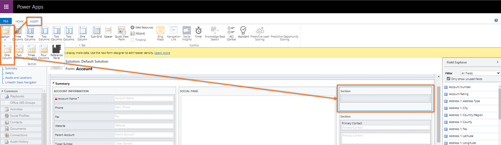
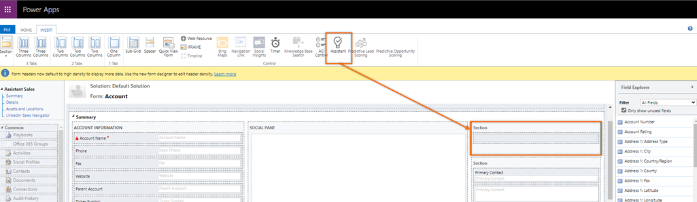
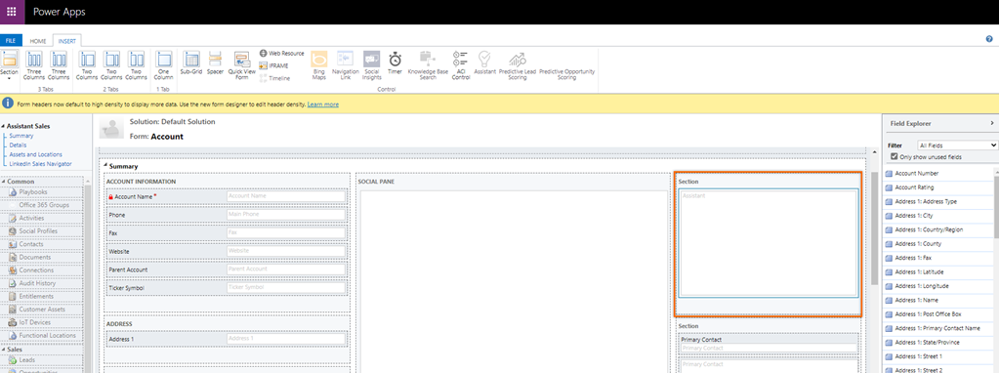

# Add the assistant widget to custom forms

By default, the assistant widget is available only in the out-of-the-box forms&mdash;contact, opportunity, lead, account, and case. If you're using customized forms, you can display the assistant widget on custom forms.

## License and role requirements

| Requirement type | You must have |  
|-----------------------|---------|
| **License** | Dynamics 365 Sales Premium or Dynamics 365 Sales Enterprise  More information: [Dynamics 365 Sales pricing](https://dynamics.microsoft.com/sales/pricing/) |
| **Security roles** | System Administrator   More information: [Predefined security roles for Sales](security-roles-for-sales.md)|

## Add the widget

>[!NOTE]
>- Adding the assistant widget is only supported in Unified Interface apps.
>- The assistant widget can't be added by using the new experience in Power Apps.

1. In the sales app, go to **Settings** > **Advanced Settings**.

    :::image type="content" source="media/advanced-settings-option.png" alt-text="Screenshot of the Advanced Settings option on the Settings menu.":::

1. Go to **Customization** > **Customizations** > **Customize the System**.

1. Under **Components**, expand *Entities*, and then the entity you want, and select **Forms**.

1. In the list of forms, select the form to which you want to add the assistant widget.

1. Go to the **Insert** tab and add a section with column to the form.

    > [!div class="mx-imgBorder"]
    > 

1. Select the added section and then on the tool bar, select **Assistant**.   

    > [!div class="mx-imgBorder"]
    > 

    The assistant widget is added to the section.

    > [!div class="mx-imgBorder"]
    > 

    >[!NOTE]
    >- When you add the widget to the form, the assistant icon in the tool bar becomes inactive and you can't add it to the same form.
    >- When you open the form and see that the assistant icon is inactive, specifies that the assistant widget is already added to the form. 

1. Save and publish the form.

[!INCLUDE [cant-find-option](../includes/cant-find-option.md)]

## Related information

[Configure the assistant](configure-assistant.md)      
[Guide customer communications with assistant](assistant.md)

