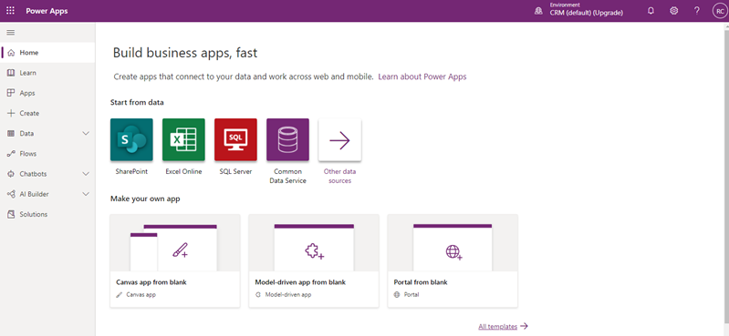
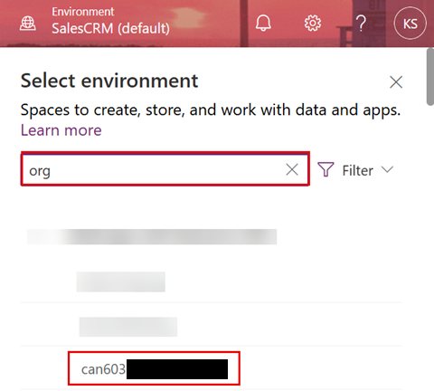
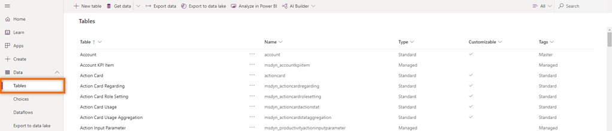
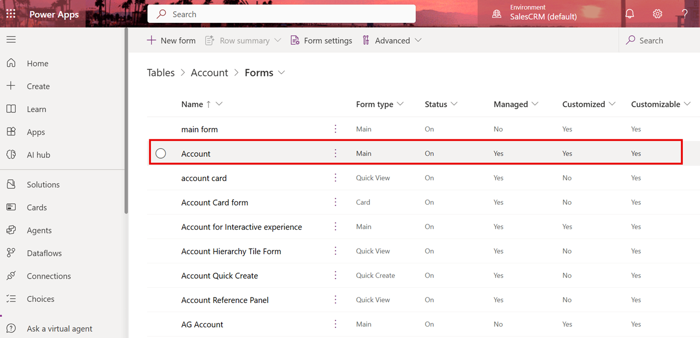
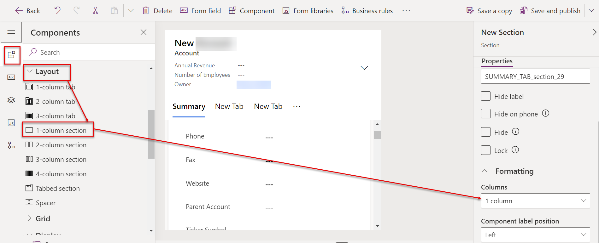
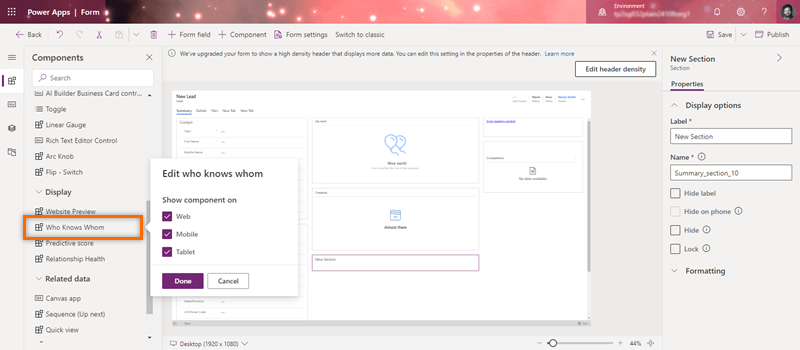
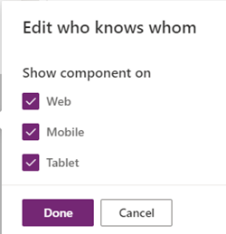
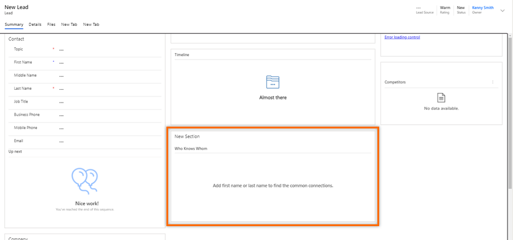

# Add Relationship intelligence widgets to custom forms

By default, the health score widget and who knows whom widget are available only in the out-of-the-box **Sales Insights** form. If you're using customized forms, you can display these widgets on your custom forms by manually adding them to your form.

## License and role requirements
| Requirement type | You must have |
|-----------------------|---------|
| **License** | Dynamics 365 Sales Premium  More information: [Dynamics 365 Sales pricing](https://dynamics.microsoft.com/sales/pricing/) |
| **Security roles** | System Administrator    More information: [Predefined security roles for Sales](security-roles-for-sales.md)|

## Add widgets to a custom form

To add the health score widget or who knows whom widget to your custom form, follow these steps:

> [!IMPORTANT]
> - Widgets are only supported in Unified Interface apps.
> - You can't use the legacy form designer to add the widgets to a form.

1. Sign in to the [Power Apps](https://make.powerapps.com/) portal.

    > [!div class="mx-imgBorder"]  
    > 

2. Search for and select your organization's environment.

    > [!div class="mx-imgBorder"]  
    > 

3. Select **Data** > **Tables**.

    The **Tables** page opens with the list of tables.

    > [!div class="mx-imgBorder"]  
    > 

4. Open the table, select the **Forms** tab, and then select a main form to add the widget to. In this example, the table **Lead** is selected and the main form **Lead** is selected.

    >[!NOTE]
    >If you're unable to view the table to which you want to add the widget, in the upper-right corner of the page, change the filters settings to **All**.

    > [!div class="mx-imgBorder"]  
    > 

5. In the form designer, select **Component**, and then from **Layout**, add a column to the form as a placeholder to add the widget.

    > [!div class="mx-imgBorder"]  
    > 

7. Depending on the widget you want to add, do one of the following actions:
    - To add the health score widget, select **Display** > **Relationship Health**.
    - To add the who knows whom widget, select **Display** > **Who Knows Whom**.    
        >[!NOTE]
        >Ensure that the added placeholder column is selected. If it isn't, the widget will be added at a random place in the form.   
    In this example, let's select the **Who Knows Whom** widget.
    > [!div class="mx-imgBorder"]  
    > 

8. In the pop-up window, select the components on which you want to display the widget, and select **Done**.

    > [!div class="mx-imgBorder"]  
    > 

    The widget is added to the form, as shown in the following image.

    > [!div class="mx-imgBorder"]  
    > 

    >[!NOTE]
    >To hide the **New section** label, go to the **Properties** tab of the **New Section** settings pane, and then select **Hide label**.

9. Save and publish the form.
    > [!NOTE]
    > If you'd like roles other than Salesperson and Sales Manager to access the who knows whom widget, [grant access to those roles](grant-access-wkw.md). 

[!INCLUDE[cant-find-option](../includes/cant-find-option.md)]
