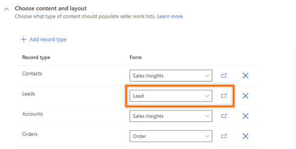
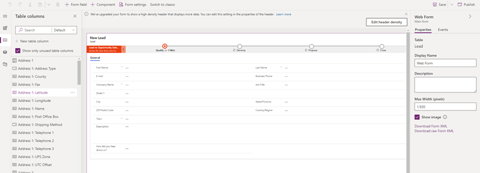
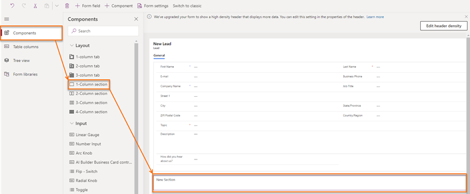
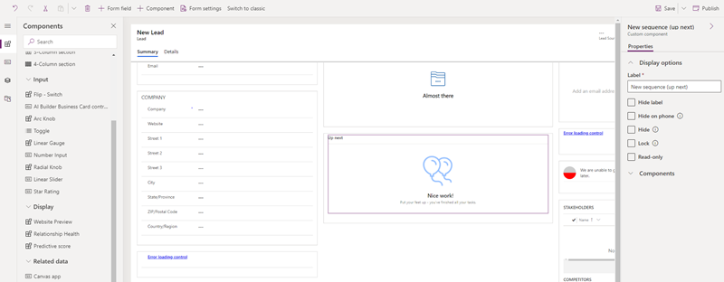

# Add the Up next widget to a custom form 

Display the Up next widget on your customized forms through sales accelerator configuration in Dynamics 365 Sales.

## License and role requirements
| Requirement type | You must have |
|-----------------------|---------|
| **License** | Dynamics 365 Sales Premium or Dynamics 365 Sales Enterprise  More information: [Dynamics 365 Sales pricing](https://dynamics.microsoft.com/sales/pricing/) |
| **Security roles** | System Administrator    More information: [Predefined security roles for Sales](security-roles-for-sales.md)|

## What is the Up next widget?

The **Up next** widget helps sellers to view and perform actions on activities on a record by not losing context or need to switch among multiple applications. The activities include phone call, email, or Teams meeting. The widget displays the current activity, upcoming activity, and completed activities. The activities are added to a record manually or by using a sequence:

- In a sequence, a sales manager creates activities and applies them to the record according to business requirements. The activities in the sequence are displayed in the **Up next** widget.    
- For manual activities, you or a sales manager can create an activity on the timeline. The activity is displayed in the **Up next** widget as a current, upcoming, or completed activity, depending on its due date. This activity is available to you and other sellers who have access to the record.

## Add the Up next widget

By default, the **Up next** widget is available only in the out-of-the-box Sales Insights, lead, and opportunity forms. If you're using customized forms, you can display the Up next widget on your custom forms by following these steps.

> [!NOTE]
> - You can add the **Up next** widget only to managed forms.
> - Adding the **Up next** widget is supported only in Unified Interface apps.

1. Sign in to the **Sales Hub** app.   
2. Go to **Change area** in the lower-left corner of the page, and select **Sales Insights settings**.   
3. Under **Sales accelerator**, select **Set up**.   
4. In the **Choose content and layout** section, select the custom form for which you want to add the Up next widget.  
    >[!div class="mx-imgBorder"]
    >   
    >[!NOTE]
    >Here we're using the custom lead form as an example to add the Up next widget for leads. For other record types, you can perform the steps described in the procedure with the custom form selector.
5. Select the open in new tab icon () and the form designer tab opens.   
    >[!div class="mx-imgBorder"]
    >   
6. In the form designer, select **Component**, and then from **Layout**, add a column to the form as a placeholder to add the widget.      
    >[!div class="mx-imgBorder"]
    >   
7. From the site map, select **Display** > **Sequence (Up next)**.   
    >[!NOTE]
    >Ensure that the added placeholder column is selected. If it isn't, the widget will be added at a random place in the form.   
8. In the **Edit sequence (Up next)** pop-up window, select **Done**.  
    The Up next widget is added to the form, as shown in the following image.   
    > [!div class="mx-imgBorder"]  
    >     
    >[!NOTE]
    >To hide the **New section** label, go to the **Properties** tab of the **New Section** settings pane, and then select **Hide label**.    
9. Save and publish the form.

[!INCLUDE[cant-find-option](../includes/cant-find-option.md)]

### See also

[Enable and configure sales accelerator](enable-configure-sales-accelerator.md)   
[Connect with customers through a record or the Up next widget](connect-with-customers.md)  
[Understand the Up next widget](understand-the-up-next-widget.md) 

[!INCLUDE[footer-include](../includes/footer-banner.md)]
