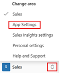
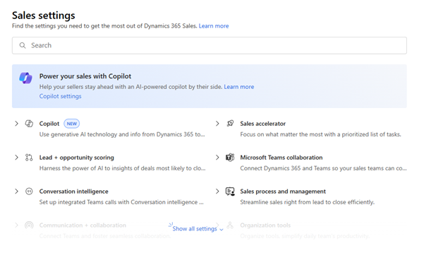
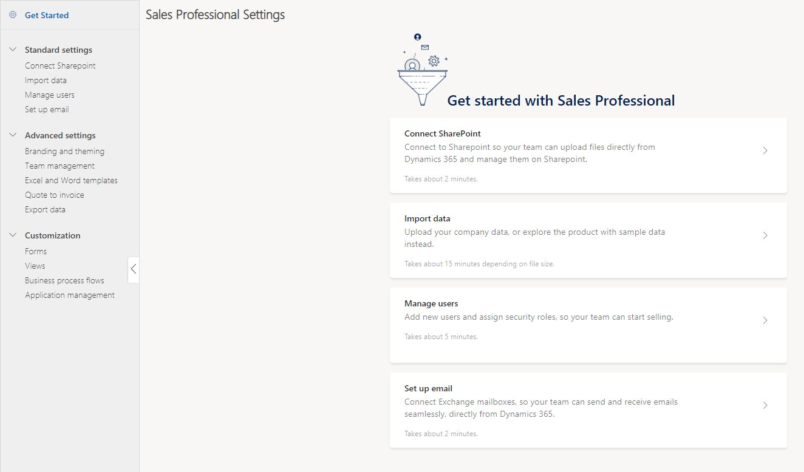

# Overview of admin settings  

Admin settings provide an organized and unified experience for administrators to easily configure the sales app from a single place.

## License and role requirements

| Requirement type | You must have | 
|-----------------------|---------|
| **License** | Dynamics 365 Sales Premium, Dynamics 365 Sales Enterprise, or Dynamics 365 Sales Professional  More information: [Dynamics 365 Sales pricing](https://dynamics.microsoft.com/sales/pricing/) |
| **Security roles** | System Administrator   More information: [Predefined security roles for Sales](security-roles-for-sales.md)|

## Access admin settings

System administrators in Dynamics 365 Sales are the users who have the System Administrator role or equivalent permissions assigned. Dynamics 365 Sales offers an organized and unified experience to administrators so that they can quickly and easily configure their sales app from a single place.

Depending on the Dynamics 365 Sales license you have, select one of the following tabs for specific information:  

# [Sales Premium and Sales Enterprise](#tab/SE)

## Sales app settings

The Sales app settings include settings for core sales areas such as lead, opportunity, and product management, productivity tools, Teams and LinkedIn integration, goals and forecasts, and so on. 

To open the app settings, select **Change area**  at the bottom of the site map, and then select **App Settings**.

The settings for different product areas are categorized as such.

> [!NOTE]
> These settings are also available in the legacy web client but have been consolidated in one place in the Sales Hub app for ease of use.  

> [!TIP]
> By default, this new unified settings experience is available only in the Sales Hub app. To learn how to enable this experience in custom applications, see **Leverage the unified settings experience in a custom sales application** in the [Simplified system configuration in Dynamics 365 Sales](https://cloudblogs.microsoft.com/dynamics365/it/2020/03/30/simplified-system-configuration-in-dynamics-365-sales/) blog.  

## Sales Insights settings

The Sales Insights settings include settings for standard and premium sales insights features such as, sales accelerator, email engagement, relationship intelligence, predictive scoring, sales accelerator, and so on.

To open the Sales Insights settings, select **Change area**  at the bottom of the site map, and then select **Sales Insights Settings**. More information: [Install and administer Sales Insights features](intro-admin-guide-sales-insights.md)

:::image type="content" source="media/sales-insights-settings.png" alt-text="Sales insights settings page." lightbox="media/sales-insights-settings.png":::

To configure and use the premium sales insights features, you must have a Dynamics 365 Sales Premium license. For more information, see [Dynamics 365 Sales pricing](https://dynamics.microsoft.com/sales/pricing/).

# [Sales Professional](#tab/SP)

Select **Sales Settings** from the site map to manage the admin settings in Sales Professional.

### Get started page

The **Get started** page provides an intuitive experience for setting up what's most important with a fewer clicks. With just one click, Microsoft Exchange and SharePoint are automatically configured for you, and your users are ready to send out emails or share documents. The quick setup also lets you quickly import data, so your users have it ready in the app to start their work. These settings can also be accessed from the **Standard settings** section.

> [!div class="mx-imgBorder"]
> 

> [!TIP]
> To learn how to use the site map to go to different areas of the app, see [Site map on the side](user-guide-learn-basics.md).

### Standard settings

The settings under **Standard settings** are the most commonly used settings in the app. You can find the settings for email, SharePoint, data import, and user management. The configurations are simple—you’ll be done with these in just a few clicks.

### Advanced settings

Use the **Advanced settings** section to configure the app, or to customize it to meet your organization’s requirements. You can find the settings for branding and theming, teams, and maintaining templates and more.

### Customization

If the Sales app does not entirely fit your business requirement, use the drag-and-drop designers to quickly make changes that reflect the specific information that your company needs. For example, change the pipeline phases to match your organization’s business flows, or add new fields to capture data relevant to your business—all of this without writing a single line of code. More information: [Customize business process flows](customize-business-process-flows.md)

> [!div class="mx-imgBorder"]
> 

---
[!INCLUDE [cant-find-option](../includes/cant-find-option.md)]

### See also

[Define lead qualification experience](define-lead-qualification-experience.md)  
[Enable customization of the Opportunity Close form](enable-opportunity-close-customization.md)  
[Set up enhanced email](set-up-enhanced-email.md)  
[Enable or disable saving of business card image](retain-business-card-image-after-scanning.md)  
[Enable or disable PDF generation from sales records](enable-pdf-generation-quote.md)

[!INCLUDE[footer-include](../includes/footer-banner.md)]
