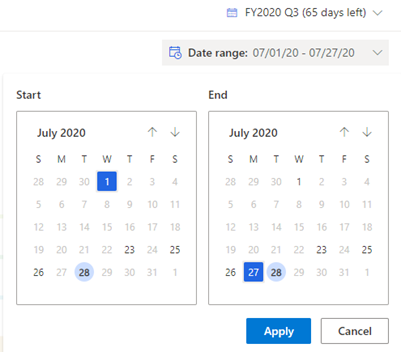

# Analyze deals flow between snapshots 

## Requirements
|  | |
|-----------------------|---------|
| **License** | Dynamics 365 Sales Premium  More information: [Dynamics 365 Sales pricing](https://dynamics.microsoft.com/sales/pricing/) |
| **Security Role** | Salesperson and above    See [Predefined security roles for Sales](security-roles-for-sales.md)|
|||

The **Flow** chart provides a visual representation of how the forecast changes between two moments in time. Managers can use flow charts to drill in to the specific deals that have contributed to the increase or decrease in forecast commitment, thus enabling them to follow up with their teams and coach their teams on how to improve their forecast accuracy.	

Review the following prerequisite before you start using deals flow analysis:	

- Verify that at least two snapshots have been created for the forecast. To learn more, see [Take snapshots automatically](manage-snapshots-forecast.md).	

**View and understand a deals flow**	

1. Sign in to the **Sales Hub** app and go to **Performance** > **Forecasts**.	

2. Select a forecast, and then choose a forecast period for the forecast.	

3. Select the **Flow** tab.	

   A sankey chart is displayed with a comparison between the two latest snapshots for the forecast. The order of forecast categories depends on how the forecast columns are arranged in the grid view.	

   > [!div class="mx-imgBorder"]	
   >  

4. To compare snapshots, choose **Start** and **End** dates from the calendar. 	

   > [!div class="mx-imgBorder"]	
   > 	
 	
   Select **Apply**. The chart is updated to display the deal flow.
   
   > [!div class="mx-imgBorder"]	
   >   

    The following categories in the deal flow are calculated based on the movement of deals. Let's understand them with an example scenario. Let's say your forecast is for a fiscal year with 4 quarters – starting from January-March(Q1), April-June(Q2), July-September(Q3), October-December(Q4). Let's compare the snapshots of July 1st and August 31st.

    | **Forecast Category** | **Description** | **Example** |
    |-------------------------|-------------------------|-------------------------|
    | Pushed out or Pulled in | These categories include opportunities that were moved during the snapshot period for the following reasons: <ul> <li>Opportunities that moved from one seller to another within the forecast hierarchy.</li> <li>Opportunities that moved from one forecast period to another within the forecast date range.</li> </ul> | **Ownership change:** Dustin Ochs and Amber Rodriguez are Sales Managers reporting into Kenny Smith. A few opportunities of Dustin were transferred to Amber in between the start date and end date snapshot. The transferred opportunities appear under the **Pushed out** category for Dustin and **Pulled in** category for Amber. However, there will be no change for Kenny as the movement is within the same hierarchy. **Date change:** A few opportunities of Kenny Smith that were estimated to close within Q3 as on July 1st have moved to Q4 as on August 31st. These opportunities are shown under the **Pushed out** category in the end date snapshot. |
    | New Deals | New opportunities that were added in between the snapshot start and end dates appear as New Deals in the Start date snapshot column. | Opportunities that were created between 1st July and 31st August. |
    | Removed` | Opportunities that have moved out of the forecast due to one of the following reasons: <ul> <li>Estimated close date of the opportunity has moved out of the forecast date range.</li> <li>Opportunity is deleted.</li> <li>Opportunity has moved out of the forecast hierarchy</li> </ul> | <ul> <li>Opportunities that were moved to the next fiscal year.</li> <li>Opportunities that have moved from Kenny Smith's org to Olivia Wilson's org.</li> </ul> |
5. To view the summary and flow of a forecast category:	

   - Hover over a forecast category in the stack to see a summary of the category, including the forecast category with snapshot date, the aggregated budget amount, and the number of opportunities that are influencing the aggregated amount. Also, the flow is highlighted to show how the opportunities are trending between the snapshots.	

   - This flow depends on how the status of the opportunity in a forecast category of the start date snapshot changed to the other forecast category in the end date snapshot. If there's no change in the status of the opportunity, the flow remains the same between forecast categories in the snapshots.	

6. To view underlying opportunities, select a forecast category. The opportunities are displayed in a grid with side-by-side comparison of how the granular data for each opportunity—such as owner, value, date, and forecast category—is changing in columns from start date to end date.	

   > [!div class="mx-imgBorder"]	
   > 	

   You can't edit the opportunities inline. However, in the **Action** column, select the navigate icon corresponding to the opportunity that you want to edit and the opportunity is opened in a browser tab. The saved changes won't affect the status of the opportunity in the snapshot, because the snapshots are taken at a moment in time by using frozen data.	

### Whose deals flow am I viewing?	

You can identify whether the selected flow is for a team or an individual by looking at the deals flow heading:	

-	If the heading name contains **Username (Group)**, you're looking at the deals flow of a user's team.	

-	If the heading name contains only **Username**, you're looking at the deals flow of an individual user.	

Seeing the deals flow of other users depends on the sales hierarchy defined for you. To learn more, see [Forecasts and sales hierarchy](/dynamics365/sales-enterprise/view-forecasts#forecasts-and-sales-hierarchy).	

### See also	

[Take snapshots automatically](manage-snapshots-forecast.md)   
[About premium forecasting](configure-premium-forecasting.md)

[!INCLUDE[footer-include](../includes/footer-banner.md)]
