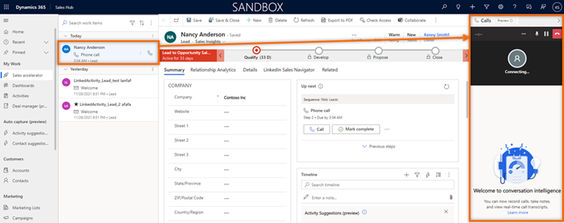

# Call using Microsoft Teams

> [!IMPORTANT]
> - Microsoft Teams dialer is a preview feature. [!INCLUDE[cc-preview-features-definition](../includes/cc-preview-features-definition.md)]
> - [!INCLUDE[cc-preview-features-expect-changes](../includes/cc-preview-features-expect-changes.md)]
> - [!INCLUDE[cc-preview-features-no-ms-support](../includes/cc-preview-features-no-ms-support.md)]

Microsoft Teams dialer helps you to be more productive and get work done effectively by calling customers directly from within Dynamics 365 Sales Hub app. 

## License and role requirements

| &nbsp; | &nbsp; |
|-----------------------|---------|
| **License** | Dynamics 365 Sales Enterprise or Dynamics 365 Sales Premium  More information: [Dynamics 365 Sales pricing](https://dynamics.microsoft.com/sales/pricing/) |
| **Security roles** | Salesperson and above   See [Predefined security roles for Sales](security-roles-for-sales.md)|
|||

>[!IMPORTANT]
>An administrator must configure the Microsoft Teams dialer in your organization to use. More information: [Configure Microsoft Teams dialer](configure-microsoft-teams-dialer.md). 

## Open Teams calls dialer

When you sign in to your organization, you can view the **Calls (preview)** dialer pane on the right of the page.   
Select the phone icon () on the top-right corner of the page to open the **Calls (preview)** and view the dial pad. 

> [!div class="mx-imgBorder"]
>      

## Make calls use Teams  

You can use Microsoft Teams to call a customer directly through the dial pad, a record, or a work item to make a call. 

>[!NOTE]
>Verify that a valid phone number is associated with the Dynamics 365 records or work item.  

**To dial a customer through a Dynamics 365 record** 

1.	Open a record. In this example, we’re opening a contact record.    
    In the **Business Phone** field, a phone number has been associated with the contact **Nancy Anderson**.  

    > [!div class="mx-imgBorder"]
    >     

2.	Select the phone icon () corresponding to the phone number and the call is established.   

    > [!div class="mx-imgBorder"]
    >      

**To dial a customer work list item**

1.	Go to **My Work** > **Sales accelerator**.    
    Your work list opens. You can see the phone call activities that are pending for the day. In this example, the phone call activity for **Nancy Anderson** is pending for the day.

    > [!div class="mx-imgBorder"]
    >     

2.	Select the phone icon () corresponding to the work item.    
    The Teams dialer opens, and the call is established.   

    >[!NOTE]
    >You can also use the **Call** option in the **Up next** widget to make the call.

    > [!div class="mx-imgBorder"]
    >     

## Call analysis

[Configure conversation intelligence](fre-setup-ci-sales-app.md) for real-time analysis of your call data with overview, summary, transcription, insights, and action items.

More information: [Get real-time call data through Teams call](get-real-time-call-data-through-teams-call.md)  

[!INCLUDE [cant-find-option](../includes/cant-find-option.md)]

### See also

[Configure Microsoft Teams dialer](configure-microsoft-teams-dialer.md)     
[Get real-time call data through Teams call](get-real-time-call-data-through-teams-call.md)   

[!INCLUDE[footer-include](../includes/footer-banner.md)]
