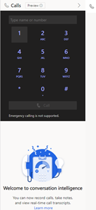
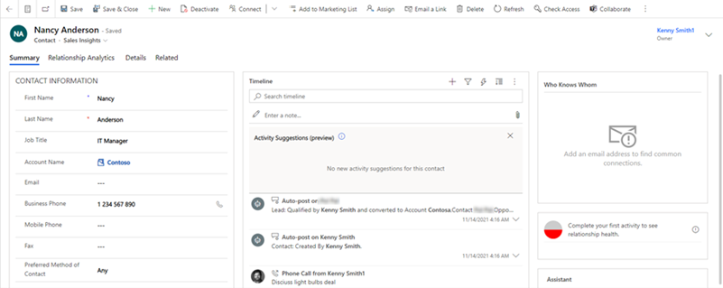
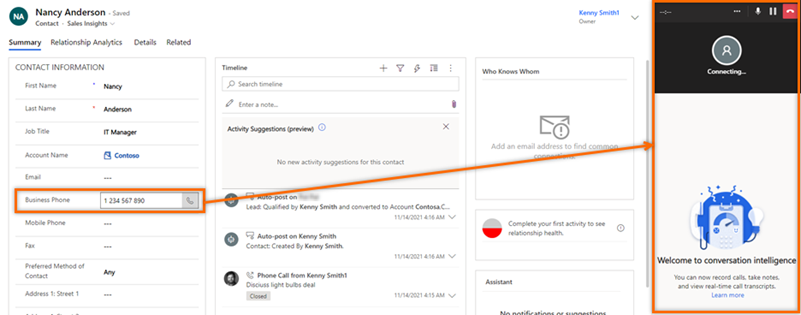
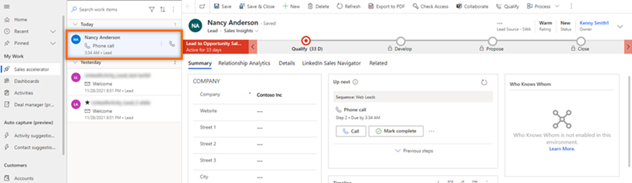
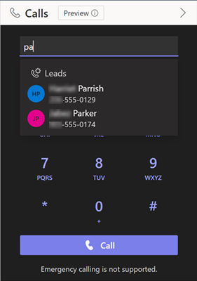
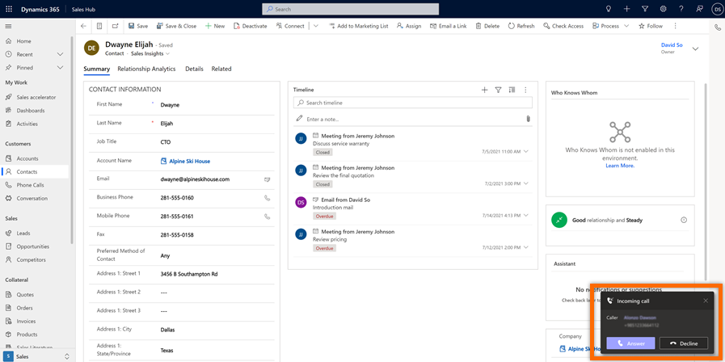

# Make and receive Teams calls in Dynamics 365

Microsoft Teams dialer helps you to be more productive and get work done effectively by calling customers directly from within the Dynamics 365 Sales Hub app. You can make and receive calls through the Teams dialer.

## License and role requirements

| Requirement type | You must have |
|-----------------------|---------|
| **License** | Dynamics 365 Sales Premium, Dynamics 365 Sales Enterprise, or Dynamics 365 Sales Professional More information: [Dynamics 365 Sales pricing](https://dynamics.microsoft.com/sales/pricing/) |
| **Security roles** | Any primary sales role, such as salesperson or sales manager More information: [Primary sales roles](security-roles-for-sales.md#primary-sales-roles)|

## Open Teams calls dialer

> [!NOTE]
> An administrator must configure the Microsoft Teams dialer in your organization for you to use it. More information: [Configure Microsoft Teams dialer](configure-microsoft-teams-dialer.md)

Sign in to your sales app and select the phone () icon in the upper-right corner of the page to open the **Calls** and view the dial pad.

> [!div class="mx-imgBorder"]
> 

> [!IMPORTANT]
> The dialer won't work if third-party cookies are blocked in the private or incognito window of your browser. To use the dialer, select the **Third-party cookie blocking** icon in your browser and select **Allow cookies**.

## Make calls with Teams

You can use Microsoft Teams to call a customer directly from the dialer, a record, or a work item in Dynamics 365.

> [!NOTE]
> Verify that a valid phone number is associated with the Dynamics 365 records or work item.

**To call a customer through a Dynamics 365 record** 

1. Open a record. In this example, we're opening a contact record.

    In the **Business Phone** field, a phone number has been associated with the contact **Anthony Pruitt**.

    > [!div class="mx-imgBorder"]
    > 

1. Select  corresponding to the phone number. The call is established.

    > [!div class="mx-imgBorder"]
    > 

1. (Optional) Select the ellipses (three-dots menu) in the dialer screen to change your microphone and speaker settings.

**To call a customer from a work list item**

1. Go to **My Work** > **Sales accelerator**.

    Your work list opens. You can see the phone call activities that are pending for the day. In this example, the phone call activity for **Nancy Anderson** is pending for the day.

    > [!div class="mx-imgBorder"]
    > 

1. Select  corresponding to the work item.

    The Teams dialer opens, and the call is established.

    > [!NOTE]
    > You can also use the **Call** option in the **Up next** widget to make the call.

**To call a customer manually**

1. Open the Teams dialer.
1. Enter the phone number of the customer, or search for the customer through dialer search box.

    > [!div class="mx-imgBorder"]
    > 

1. Select **Call**.

## Receive Teams calls in Dynamics 365

You can receive calls in Dynamics 365 Sales. When a call is received, a notification is displayed in the upper-right corner of the page, as shown in the following image:

> [!div class="mx-imgBorder"]
> 

The caller name is automatically displayed when the phone number is associated with a record. For example, Kenny Smith is a lead and has the mobile number +1 123 456 7890 associated with their record. When you receive a call from +1 123 456 7890, the name Kenny Smith is automatically displayed; you can select the name in the notification to open the record.

> [!NOTE]
> - If a phone number is associated with more than one record, the notification will display up to 3 records and will indicate more records exist with this phone number. Select the appropriate record.
> - If you receive a call while you're on another call, the inbound call notification will provide an option to either end the current call and accept the incoming call, or to reject the incoming call and continue with the current call.

To receive the call, select **Answer**. The Teams telephony panel opens and the call is connected.

A phone call activity is created and displayed on the timeline of the record. If the phone number is automatically resolved to a record, the **Call From** and **Regarding** fields of the phone call activity are automatically populated. If the received call isn't associated with any record, only a phone call activity is created. To associate the call with a record during the call, select the **Details** tab, and then select **Connect a record**.

## View missed calls in Dynamics 365

If you've missed answering a call, a notification is displayed in the in-app notification center in Dynamics 365. If you've answered the call from another app, such as Teams desktop, the call isn't considered as missed.

> [!NOTE]
> Your administrator must have enabled and [set up the in-app notifications](configure-microsoft-teams-dialer.md#configure-the-dialer) for you to view the missed calls.

To view the missed call notification, select the Notifications icon (bell icon) in the upper-right corner of the page.

## Transfer a Teams call (preview)

[!INCLUDE [preview-disclaimer](../includes/preview-disclaimer.md)]

You can transfer a customer's call to a colleague's Teams line or their phone number.

1. While you're on the call, select **More options** (**&hellip;**), and then select **Transfer (preview)**.

    :::image type="content" source="media/call-transfer-options.png" alt-text="Screenshot that shows the call transfer options, including Transfer (preview).":::

    The customer's call is put on hold.

1. On the dial pad, enter the name or phone number of your colleague.
1. (Optional) If you're calling the Teams line of your colleague, select **Ring back if there's no answer** to ensure a safe transfer. Otherwise, the call will be disconnected if it isn't answered. This option isn't available when you transfer to a phone number.
1. Follow one of these steps:

    - If the recipient is available, select **Transfer**.
    - If the recipient is unavailable, select **Cancel** and then **Resume** to go back to the customer.

    If you're transferring to a Teams line, the recipient receives a transfer notification that includes information about you and the customer. After you transfer the call, it's treated as a new call. In this case, no notes or recordings that you made during the original call are transferred to the recipient.

## Consult and transfer a Teams call (preview)

[!INCLUDE [preview-disclaimer](../includes/preview-disclaimer.md)]

You can consult a colleague before you transfer a customer's call to them. You can also consult a colleague and then answer the customer directly, without transferring the call.

1. While you're on the call, select **More options** (**&hellip;**), and then select **Consult then transfer (preview)**.

    :::image type="content" source="media/call-transfer-options.png" alt-text="Screenshot that shows the call transfer options, including Consult then transfer (preview).":::

    The customer is put on hold.

1. Enter the name or phone number of your colleague.
1. Follow one of the steps:

    - If the recipient is available, follow these steps:

        1. Select **Call**. The duration of the hold is displayed, so that you know how long the customer has been waiting.
        1. Consult your colleague.
        1. If your colleague is ready to take the call, select **Transfer**.

        If you're transferring to a Teams line, the recipient receives a transfer notification that includes information about you and the customer. After you transfer the call, it's treated as a new call. In this case, no notes or recordings that you made during the original call are transferred to the recipient.

    - If the recipient is unavailable, or if you want to answer the customer directly, select **Cancel** and then **Resume** to go back to the customer.

## Call analysis

[Configure conversation intelligence](fre-setup-ci-sales-app.md) for real-time analysis of your call data with overview, summary, transcription, insights, and action items. More information: [Get real-time call data through Teams call](get-real-time-call-data-through-teams-call.md)

[!INCLUDE [cant-find-option](../includes/cant-find-option.md)]

### See also

[Configure Microsoft Teams dialer](configure-microsoft-teams-dialer.md)  
[Get real-time call data through Teams call](get-real-time-call-data-through-teams-call.md)  

[!INCLUDE[footer-include](../includes/footer-banner.md)]
