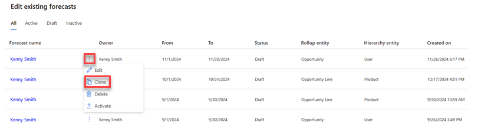

# Clone a forecast 

When you clone a forecast, you duplicate any configurations you made previously. You can work on this cloned forecast as a draft for a new forecast that better meets your needs. You retain the configurations you want, make edits to others, and create a new forecast that matches your requirements. After you make the changes, you can save and activate the cloned forecast.

## License and role requirements
| Requirement type | You must have |
|-----------------------|---------|
| **License** | Dynamics 365 Sales Premium or Dynamics 365 Sales Enterprise   More information: [Dynamics 365 Sales pricing](https://dynamics.microsoft.com/sales/pricing/) |
| **Security roles** | System Administrator or Forecast Manager   More information: [Predefined security roles for Sales](security-roles-for-sales.md)|

## To clone a forecast

1. Sign in to the Sales Hub app.

2. In the site map, select **Change area** , and then select **App Settings**.

3. Under **Performance management**, select **Forecast configuration**.    
    The forecast configuration page opens.

4. On the forecast that you want to clone, select **More options** , and then select **Clone**.   
    > [!div class="mx-imgBorder"]    
    >    

5. In the message that appears, select **OK**.

    > [!div class="mx-imgBorder"]    
    >     

    The clone of the selected forecast is opened in edit mode.

6. Edit the forecast to meet your needs, and then activate it.

[!INCLUDE[cant-find-option](../includes/cant-find-option.md)]

### See also

[Configure forecasts in your organization](configure-forecast.md)   

[!INCLUDE[footer-include](../includes/footer-banner.md)]
