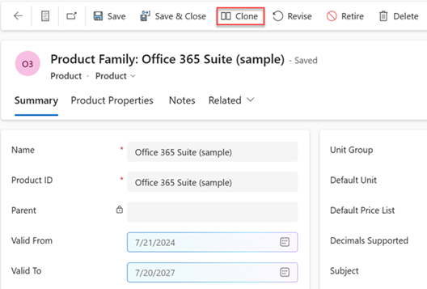
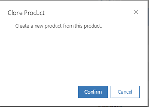

# Clone products (Sales Hub) 

Quickly create a copy of an existing product in Dynamics 365 Sales including all its details by cloning it.

## License and role requirements
| Requirement type | You must have |  
|-----------------------|---------|
| **License** | Dynamics 365 Sales Premium, Dynamics 365 Sales Enterprise, or Dynamics 365 Sales Professional   More information: [Dynamics 365 Sales pricing](https://dynamics.microsoft.com/sales/pricing/) |
| **Security roles** | Sales Manager, Sales Professional Manager, or Vice President of Sales   More information: [Predefined security roles for Sales](security-roles-for-sales.md)|

## Clone a product

When you're creating a new product, family or bundle, save time by cloning an existing one. Cloning creates a copy of the original record with all the details except for the name and ID. If the product, bundle, or family has any properties, they're also copied to the cloned record.  

> [!NOTE]
> Product families are only supported for Sales Enterprise and Sales Premium.  

**To clone a product, family, or bundle:**

1. Depending on the sales app that you're using, do one of the following:
 
    -  If you're using the Sales Hub app, 
        1. Select **Change area**  at the lower-left corner of the site map, and then select **App Settings**. 
        1. In the **Product Catalog** area, select **Families and Products**. 
   - If you're using the Sales Professional app,
       - Select **Products** from the site map.  
  
3. Select a product family, product, or bundle record that you want to clone, and on the command bar, select **Clone**. 

    > [!div class="mx-imgBorder"]
    > 

    A confirmation dialog box appears.
    
    

4. Select **Confirm**.
    
    A new product record will open with the same details as the original one except for the name and ID.  
  
    The new record is created under the same parent node as the original one.  

[!INCLUDE [cant-find-option](../includes/cant-find-option.md)]

### See Also  
 [Create a product](create-product-sales.md)   
 

[!INCLUDE[footer-include](../includes/footer-banner.md)]
