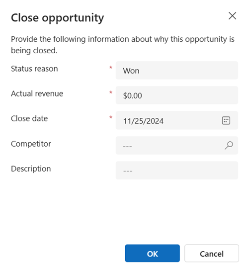

# Close opportunities as won or lost 

If your customer has accepted your proposal, congratulations! Whether your customer had accepted or declined your proposal, it's now time to close that opportunity.

## License and role requirements
| Requirement type | You must have |  
|-----------------------|---------|
| **License** | Dynamics 365 Sales Premium, Dynamics 365 Sales Enterprise, or Dynamics 365 Sales Professional  More information: [Dynamics 365 Sales pricing](https://dynamics.microsoft.com/sales/pricing/) |
| **Security roles** | Any primary sales role, such as salesperson or sales manager   More information: [Primary sales roles](security-roles-for-sales.md#primary-sales-roles)|

## Close an opportunity  

1. Select **Opportunities** in the Sales Hub sitemap. 
    
2. Open the opportunity you want to close.  
1. Select the **Quotes** tab and ensure that all the quotes are in **Closed** state. For instructions on how to close a quote, see [Close a quote](close-quote.md).
  
3. At the top of the **Opportunity** form, do one of the following:  

   - To close your opportunity as won, select **Close as Won**.  
 
   - To close your opportunity as lost, select **Close as Lost**.

      > [!div class="mx-imgBorder"]  
      > 

4. When you close the opportunity as **Won**, in the **Close Opportunity** dialog box, do the following, and select **OK**:

    - In **Actual Revenue**, Verify the amount, and make changes, if necessary.
    
    - In **Description**, enter details about what contributed to winning this opportunity. 

      > [!div class="mx-imgBorder"]  
      > 

    When you close the opportunity as **Lost**, in the **Close Opportunity** dialog box, do the following, and select **OK**:
  
    -  In **Competitor**, select a competitor you lost this opportunity to.
    
    -  In **Description**, add more details around why the opportunity was lost.

        > [!div class="mx-imgBorder"]  
        > 

    > [!IMPORTANT]
    > If your system administrator has enabled custom fields on the Opportunity Close form, you may be required to fill in data in other fields as defined by your organization. 

When you close an opportunity record, all the information that you enter is available in the associated Opportunity Close record. To see the associated Opportunity Close records, on the **Related** tab, select **Activities**. Then, on the **Activities** tab, open the **Closed Activity Associated View**. 

> [!NOTE]
> After you close an opportunity record, the forecast category of the opportunity is automatically updated to **Won** or **Lost** depending on your selection for the opportunity closure.

For information on how to resolve the common errors that you may see while closing an opportunity, see the [troubleshooting guide](troubleshooting.md).

## Reopen a closed opportunity

If you've closed an opportunity as lost, but would like to start discussions about a potential sale, you may want to reopen a closed opportunity.

1. Select **Opportunities** in the Sales Hub sitemap. 
   
2. To see all the closed opportunities, in the view selector, select the **Closed Opportunities** view.  

    > [!div class="mx-imgBorder"]  
    > 

3. Select the opportunity that you want to reopen, and on the command bar, select **Reopen Opportunity**. The reopened opportunities start appearing in the open opportunities list.

[!INCLUDE [cant-find-option](../includes/cant-find-option.md)]

### See also  
 [Nurture sales from lead to order](nurture-sales-from-lead-order-sales.md)    
 [Dynamics 365 Sales troubleshooting guide](troubleshooting.md)  
[Troubleshoot issues with opportunities](/troubleshoot/dynamics-365/sales/troubleshoot-opportunities-issues#opportunity-issues-and-resolution-for-salespeople)

[!INCLUDE[footer-include](../includes/footer-banner.md)]
