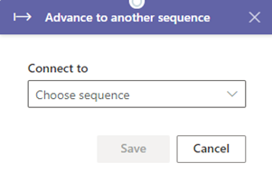
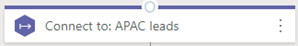
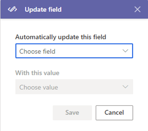
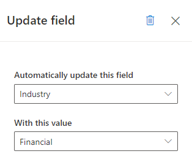

# Add command steps

Add steps to advance to other sequences and update fields in a sequence to display in the work list and Up next widget.

## License and role requirements
| Requirement type | You must have |
|-----------------------|---------|
| **License** | Dynamics 365 Sales Enterprise, Dynamics 365 Sales Premium, or [Microsoft Relationship Sales](https://dynamics.microsoft.com/en-in/sales/relationship-sales/)  More information: [Dynamics 365 Sales pricing](https://dynamics.microsoft.com/sales/pricing/) |
| **Security roles** | System Administrator or Sequence Manager    More information: [Predefined security roles for Sales](security-roles-for-sales.md)|

## Types of command steps

The following command steps are available in sequences: 

- [Advance to another sequence](#advance-to-another-sequence)
- [Update field](#update-field)

## Advance to another sequence    
Transfers the sequence control from the current sequence to the selected sequence. For example, you defined a sequence **S1** and attached a sequence **S2** after an initial activity of sending an introduction email. When **S1** is attached to a record and seller completes the initial task of sending an introduction email, the record starts displaying the activities defined in **S2**. The following are the considerations to use this activity:   
- A sequence can't start with this activity
- Other steps can't be added after this activity

To add the advance to another sequence activity step:

1. In the sequence designer page, select the **Add** (**+**) icon under a step.

2. On the **Add an action or other element** dialog box, under the **Commands** tab, select **Advance to another sequence**.    

    > [!div class="mx-imgBorder"]
    >         

3.	In the **Advance to another sequence** pane, from the **Connect to** list, choose a sequence to attach. The list consists of the sequences that are active and related to the record type.

    > [!div class="mx-imgBorder"]
    >   

4. Close the **Advance to another sequence** pane.    
    The activity step is added to the sequence.
  

## Update field

Creates a step that automatically updates a record by using a configured value for a field. When the activity is displayed to the seller in the record, the field automatically gets updated with the value you configured. The following types of fields are supported (including custom fields):
 
- Two options (for example, a **Do Not Email** field that contains the values **Allow** and **Do Not Allow**)    
- Option set (for example, a **Budget** field that contains the values **No Committed Budget**, **May Buy**, **Can Buy**, and **Will Buy**)

You can add this activity anywhere in the sequence. As soon as the previous activity is completed, the **Update field** activity is executed automatically and the sequence moves on to the next activity. To avoid executing the **Update field** step immediately after the previous activity is completed, add the [Set wait time](steps-sequence.md#set-wait-time) activity (described earlier in this topic) before the **Update field** activity. 

Sellers can see the activity on the timeline of the record. 

To add the update field activity step:

1. In the sequence designer page, select the **Add** (**+**) icon under a step.

2. On the **Add an action or other element** dialog box, under the **Commands** tab, select **Update field**.  

    > [!div class="mx-imgBorder"]
    >  

3.	In the **Update field** pane, under **Automatically update this field**, select a field. Under **With this value**, select a value to use to update the record automatically.
 
    > [!div class="mx-imgBorder"]
    >   

4. Close the **Update field** pane.    
    The activity step is added to the sequence.

[!INCLUDE[cant-find-option](../includes/cant-find-option.md)]

### See also

[Create and activate a sequence](create-and-activate-a-sequence.md)   
[Add steps to sequence](steps-sequence.md)   
[Add condition steps to sequences](adaptive-sequence.md)       
[Add LinkedIn activities to sequence](linkedin-activities-sequence.md)   
