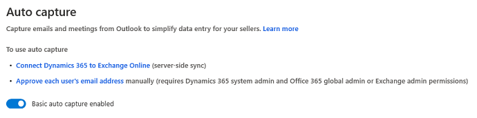

# Enable and configure auto capture 

Configure auto capture to help your sellers to get suggestions on relevant customer activities by capturing emails and meetings from the user's Exchange account that's in the same tenant as Dynamics 365.

## License and role requirements
| Requirement type | You must have |
|-----------------------|---------|
| **License** | Dynamics 365 Sales Premium or Dynamics 365 Sales Enterprise   More information: [Dynamics 365 Sales pricing](https://dynamics.microsoft.com/sales/pricing/) |
| **Security roles** | System Administrator    More information: [Predefined security roles for Sales](security-roles-for-sales.md)|

## Configure auto capture

When you enable auto capture, you help salespeople in your organization by suggesting relevant customer activities in Microsoft Dynamics 365 Sales by capturing emails and meetings from Outlook.

> [!IMPORTANT]
> By enabling this feature, you consent to share data about your customers' email activity with an external system. Data imported from external systems into Sales Insights are subject to the [Microsoft Privacy Statement](https://go.microsoft.com/fwlink/?linkid=2116778).

## How to enable auto capture

Enable auto capture by following these steps:

1.	[Review prerequisites for auto capture](#prerequisites-for-auto-capture).

2.	[Enable auto capture](#enable-auto-capture).

### Prerequisites for auto capture

Before you enable auto capture, perform the following tasks: 

-	Enable Sales Insights. To learn more, see [Enable and configure standard Sales Insights features](intro-admin-guide-sales-insights.md#enable-and-configure-standard-sales-insights-features).

- Use Exchange as the server and Outlook as the mail client. 
- Approve the email addresses of users to allow queries against their Exchange data (this requires tenant-level admin privileges). To learn more, see [Approve email](/dynamics365/customer-engagement/admin/connect-exchange-online#approve-email). 
-	Set up server-side synchronization. To learn more, see [Set up server-side synchronization of email, appointments, contacts, and tasks](/dynamics365/customer-engagement/admin/set-up-server-side-synchronization-of-email-appointments-contacts-and-tasks).

### Enable auto capture

1.	Sign in to the Dynamics 365 Sales Hub app, and go to **Change area** > **Sales Insights settings**.

2.	On the site map under **Productivity intelligence**, select **Auto capture**. 

3.	Turn on the **Enable basic auto capture** toggle.

> [!div class="mx-imgBorder"]
> 

> [!NOTE]
> For more information about auto capture and how it can help your users, see [Capture customer-related activities with auto capture](auto-capture.md).

[!INCLUDE[cant-find-option](../includes/cant-find-option.md)]

### See also

[Introduction to administering Sales Insights](intro-admin-guide-sales-insights.md)  
[Auto capture FAQs](faqs-sales-insights.md#auto-capture)

[!INCLUDE[footer-include](../includes/footer-banner.md)]

