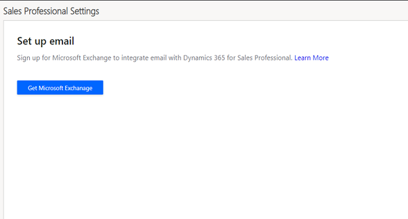

# Set up email by integrating with Exchange

To store email and other messaging records in Dynamics 365 Sales, you need to synchronize it with your email system. After you configure Exchange and approve mailboxes of users, they can email contacts from the Dynamics 365 records. For example, a seller can email a contact from an opportunity record and track the conversation in the opportunity timeline. This integration helps keep the conversations in context.

## License and role requirements
| Requirement type | You must have |
|-----------------------|---------|
| **License** | Dynamics 365 Sales Premium, Dynamics 365 Sales Enterprise, or Dynamics 365 Sales Professional  More information: [Dynamics 365 Sales pricing](https://dynamics.microsoft.com/sales/pricing/) |
| **Security roles** | Sales Manager, Sales Professional Manager, or Vice President of Sales    More information: [Predefined security roles for Sales](security-roles-for-sales.md)|

## What is server-side synchronization?

Dynamics 365 Sales uses server-side synchronization to synchronize your email system with Dynamics 365 Sales.

Using server-side synchronization makes messaging data available to a web browser, tablet, or smartphone that is running Dynamics 365 Sales.

Server-side synchronization provides direct Dynamics 365 Sales-to-email server synchronization. When you use Microsoft Exchange, you can synchronize email, contacts, tasks, and appointments.

Some features offered by server-side synchronization include the following: 

-  Email folder tracking. You can simply drag email to a folder to track it. Folder tracking works on any mobile device that supports Exchange, which
means you can track email from just about any device.

-  Support for Dynamics 365 App for Outlook. You can track incoming email with the new Dynamics 365 App for Outlook. Dynamics 365 App for Outlook works with Outlook on the web. So, all you need is a browser to track incoming email.

## Configure the integration

Depending on the license you have, select one of the following tabs for more information:

# [Sales Premium and Sales Enterprise](#tab/SE)

1. In the [Power Platform admin center](https://admin.powerplatform.microsoft.com/), select an environment. 

2. Follow the instructions in [Set up server-side synchronization of email, appointments, contacts, and tasks](/power-platform/admin/set-up-server-side-synchronization-of-email-appointments-contacts-and-tasks?context=/dynamics365/context/sales-context) to configure the integration.  

# [Sales Professional](#tab/SP)

### Prerequisite for Exchange integration

To configure Exchange, you must have:

-   Microsoft 365 subscription

-   Exchange Online subscription

> [!NOTE]
> Users who need to access the mailboxes in Dynamics 365 must have either Sales Professional Person or Sales Professional Manager security roles. For information about assigning security roles to users, go to [Manage users](manage-users.md#assign-a-security-role-to-a-user).  

For more information about managing subscriptions, go to [Manage Microsoft Dynamics 365 (online) instances](../admin/backup-restore-instances.md).

### Configure the integration in Sales Professional

1.  In the site map, select **Sales Settings**, and then under **Standard settings**, select **Set up email**.

2.  If your organization has an Exchange subscription, skip to step 5.

3.  If you don’t have a Microsoft 365 subscription, you’ll be prompted to purchase one. Select the link to purchase a Microsoft 365 subscription.

    > [!div class="mx-imgBorder"]
    > 

4.  After you purchase a subscription, go to **Set up email**. This time, Exchange is automatically detected and configured in the background.

    The following configuration happens in the background:

    -   The email server profile is set to Exchange Online (automatically created when a new Dynamics 365 instance is provisioned). The email server profile stores settings that are used by server-side synchronization to connect to an email server and process email for the associated mailboxes.

    -   Incoming email, outgoing email, appointments, contacts, and tasks are all set to use server-side synchronization.

    -   Existing user mailboxes that have valid Exchange licenses are automatically approved. Approval of mailboxes is required for the mailbox to process email. The incoming and outgoing email configuration of the selected mailboxes is tested, and mailboxes are then enabled for processing email.

        > [!Important]
        > User mailboxes are automatically approved and enabled only in the following cases:  
        > - The primary email of the user is the same as the User Principal Name (UPN) attribute of the user.  
        > - The user is associated with the Sales Professional Person or Sales Professional Manager security role.  

    -  For newly added users, you'll need to manually test and enable the mailboxes.  

    - Dynamics 365 App for Outlook is automatically enabled for all users.

5.  If users are already created in your organization, the mailboxes of the users who have Sales Professional Person or Sales Professional Manager security roles will appear in the **Mailboxes** list. 

6. The mailboxes will be in the **Not Run** state initially. Select **Approve and Test mailboxes** to test the mailboxes and approve them.  

    > [!div class="mx-imgBorder"]
    > 

       > [!Note]
       > If an error occurs in a mailbox, an alert is sent to the user of the mailbox. You can also see the alert when you open the mailbox record. The **Test Run Status** column is set to **Failure** for the mailbox. Select **Approve and test mailboxes** to test and approve the mailboxes.

[!INCLUDE [cant-find-option](../includes/cant-find-option.md)]

[!INCLUDE[footer-include](../includes/footer-banner.md)]
