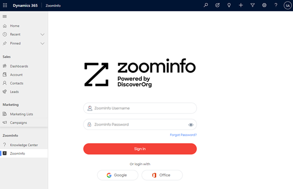

# Configure export preferences 

Use the export preference to choose which record types you want to export and limit the number of records to export in each record type.

## License and role requirements
| Requirement type | You must have |
|-----------------------|---------|
| **License** | Dynamics 365 Sales Premium or Dynamics 365 Sales Enterprise   More information: [Dynamics 365 Sales pricing](https://dynamics.microsoft.com/sales/pricing/) |
| **Security roles** | System Administrator   More information: [Predefined security roles for Sales](security-roles-for-sales.md)|

## To configure export preferences

As an administrator, you configure the export preference to choose which record types (accounts, contacts, and leads) to export and limit the number of records that you export in each record type. You can also enable the creation of new records, allow record duplicate creation, and update existing records for each record type.  

To configure export preferences. do the following steps:

1. [Review the prerequisites](#prerequisites)
2. [Enable email engagement](#configure-the-preferences)

## Prerequisites
Before you start, be sure you've met the following prerequisites:
-	The ZoomInfo app is installed on your Dynamics 365 Sales organization. More information: [Install ZoomInfo app](install-zoominfo-app.md).   
-	You have a license to use the ZoomInfo app.

## Configure the preferences 

1.	Open your Dynamics 365 Apps page and then open the ZoomInfo app.  

2.	On the left navigation pane, select **ZoomInfo** > **ZoomInfo**.   
    >[!NOTE]
    >The app might prompt you to enter credentials. Select either Google, Office, or enter your ZoomInfo credentials if you have an account with ZoomInfo.  

    > [!div class="mx-imgBorder"]
    > 
     
3.	On the top-right corner of the page, select **More** > **Admin Portal**.
4.	On the **Admin Portal** page, select **Dynamics Settings**.

    > [!div class="mx-imgBorder"]
    > 

5.	From the **Export** tab, select each record type (accounts, contacts, and leads) that you want your sales teams to be able to export to your Dynamics 365 Sales organization.     
    -	Enter the maximum number of records (up to 25) that a seller can export to your Dynamics 365 Sales organization.
    -	Enable the following options as required:
        >[!NOTE]
        >In this example, we're using the **Accounts** record type.
        
        -	**Create new Accounts**: To create an account in your Dynamics 365 Sales organization from ZoomInfo. 
        -	**Allow Account duplicate creation**: To create a duplicate account even if the same account exists in your Dynamics 365 Sales organization.
        -	**Update existing Accounts**: To update an existing account with the latest information from the ZoomInfo app.   

6.	Select **Save**.   

    The changes are saved and applied to the ZoomInfo app for your Dynamics 365 Sales organization.

[!INCLUDE[cant-find-option](../includes/cant-find-option.md)]

### See also

[Install ZoomInfo app](install-zoominfo-app.md)   

[!INCLUDE[footer-include](../includes/footer-banner.md)]
