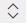

# Configure forecasts in your organization

Forecasting empowers your sales organization to make data-driven decisions and hit revenue targets consistently. By configuring forecasts based on your sales pipeline, you gain visibility into revenue projections, identify risks early, and enable your team to take corrective action before it's too late. For example, if a forecast shows your team is tracking 15% below target mid-quarter, managers can coach sellers on pipeline gaps or accelerate deals to close the gap—turning a potential miss into a win.

>[!IMPORTANT]
>- The forecasting feature is intended to help sales managers or supervisors enhance their team’s performance.
>- The forecasting feature isn't intended for use in making decisions that affect the employment of an employee or group of employees, including compensation, rewards, seniority, or other rights or entitlements.
>- Customers are solely responsible for using Dynamics 365, this feature, and any associated feature or service in compliance with all applicable laws, including laws relating to accessing individual employee analytics and monitoring, recording, and storing communications with users.
>- Customers should notify users that their communications with salespersons might be monitored, recorded, or stored and, obtain consent from users before using the feature with them (as required by applicable laws).
>- Customers are also encouraged to have a mechanism in place to inform their sales persons that their communications with users might be monitored, recorded, or stored.

[!INCLUDE [trial-cta-note](../includes/trial-cta-note.md)]

## How does forecasting help organizations?

Using forecasts helps your organization by allowing:

- Sellers to track performance against targets and identify pipeline risks that might jeopardize their ability to hit them.
- Managers to track individual sales performance against quotas to proactively provide coaching.
- Directors to forecast trends to anticipate departmental sales and reallocate resources if necessary.
- Organization leaders to project estimates to change the product strategy or provide updated projections to investors.

Forecasting isn't supported on Government Community Cloud (GCC) or mobile devices.

## Configure forecasting

You can configure forecasts based on revenue or quantity by defining the forecast type, hierarchy, access permissions, and grid columns. Once activated, your sales team can view revenue, quantity, and pipeline projections. If you don't configure a forecast, sellers see a default [out-of-the-box forecast](view-forecasts.md#out-of-the-box-forecast) for the current month—which can't be customized, deleted, or deactivated.

### Get started with sample forecast configuration

A ready-to-publish sample forecast configuration is available to you. Use the sample forecast to experiment and discover how forecasting works.  Learn how to tweak the parameters and filters to suit your organization's needs.  

**To view and activate the sample forecast configuration**

1. Go to **App Settings** > **Performance management** > **Forecast configuration**.
1. Select **Sample Forecast** to view the configuration details, including the columns, filters, and permissions.
    :::image type="content" source="./media/forecast-general-tab-configuration-section.svg" alt-text="Screenshot of the General step of the Forecast configuration page, with a preview of the selected hierarchy shown.":::

3. Review the users who have access to the forecast in the **General** step under the **Preview** section. By default, the displayed users will have access to view the forecast after activation.

4. To limit access to the forecast, go to the **Permissions** section of the **Sample Forecast** and select the appropriate security roles.

5. In the **Activate & add quotas** section, select **Activate forecast** to activate the sample forecast with the default configuration.  
    :::image type="content" source="media/activate-sample-forecast.png" alt-text="Screenshot of the three-dot menu for activating the sample forecast.":::
6. After the status turns **Active**, the forecast is available to users in the hierarchy and you can [view the forecast](view-forecasts.md).

After you activate your forecast, your next steps are:

- [Upload quota data using the provided Excel template](activate-upload-simple-columns-data-forecast.md).
- [View your forecast](view-forecasts.md) — review pipeline health and quota attainment
- [Share with your team](share-forecasts.md) — give colleagues access to view or adjust
- [Adjust forecast values](adjust-values-in-forecast.md) — account for insights not yet in opportunities

## Configure a forecast from scratch

1. In the Sales Hub app, select the Change area icon  in the lower-left corner, and then select **App Settings**.  

1. Under **Performance management**, select **Forecast configuration**.

1. Follow the steps to configure a forecast from scratch or use the [sample forecast configuration](#use-the-sample-forecast-configuration) to get started quickly.  

    1. [Select a template](./select-template-forecast.md).  

    1. [Define and schedule a forecast model](define-general-properties-scheduling-forecast.md).

    1. [Provide access permissions](provide-permissions-forecast.md).

    1. [Configure columns and layouts](choose-layout-and-columns-forecast.md).

    1. [Configure and manage drill-down entities](configure-manage-drill-downs.md).

    1. [Configure advanced settings](forecast-configure-advanced-settings.md).

    1. [Activate the forecast and upload data](activate-upload-simple-columns-data-forecast.md).

## Add forecast grid and configuration site map entries to custom app

When you create a custom model-driven app, you can choose a default solution to create a sitemap for the app. However, the list contains solutions that are based on entity forms only. The forecast options are based on URL custom control forms and do not appear in the solution list. You must manually add these options to the sitemap. After you add these options, users in your organization can see them on the app's sitemap.  
Use the following URLs to add the forecast site map to your custom app and perform the steps in [add site map entry to custom app](add-custom-site-map.md):

| Feature name           | URL                                                                                           |
|------------------------|-----------------------------------------------------------------------------------------------|
| Forecast grid          | `/main.aspx?pagetype=control&controlName=ForecastingControls.FieldControls.ForecastGridPage`  |
| Forecast configuration | `/main.aspx?pagetype=control&controlName=ForecastingControls.FieldControls.CCFForecastConfig` |  

[!INCLUDE [cant-find-option](../includes/cant-find-option.md)]

## Related information

[Blog: Tips for setting up sales forecasting in Dynamics 365 Sales](https://cloudblogs.microsoft.com/dynamics365/it/2020/11/23/tips-for-setting-up-sales-forecasting-in-dynamics-365-sales/)  
[System and application users who can push data to Dataverse](/power-platform/admin/system-application-users)  
[Project accurate revenue with sales forecasting](project-accurate-revenue-sales-forecasting.md)  
[View forecasts](view-forecasts.md)  
[About premium forecasting](/dynamics365/ai/sales/configure-premium-forecasting)
[msdyn_ForecastApi action](developer/reference/custom-actions/msdyn_ForecastApi.md)  
[Forecasting FAQs](faq-forecasting.md)

[!INCLUDE[footer-include](../includes/footer-banner.md)]
