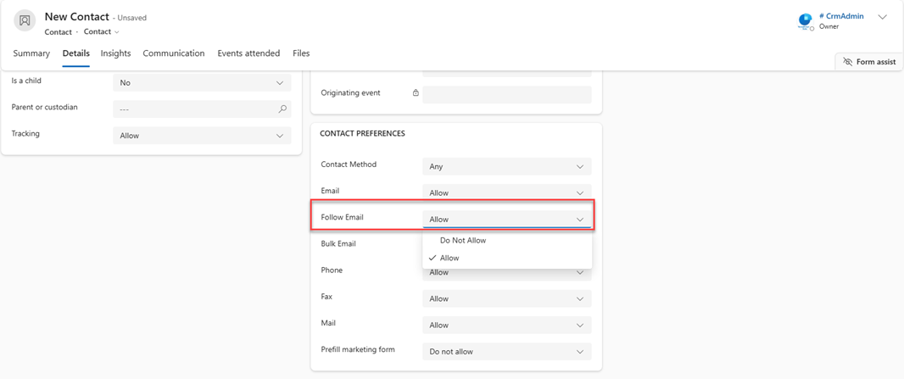

# Configure individuals' privacy and preferences

Configure the email following options for contact, lead, or account record to address your customers' privacy and security concerns. 

## License and role requirements

| Requirement type | You must have |  
|-----------------------|---------|
| **License** | Dynamics 365 Sales Premium or Dynamics 365 Sales Enterprise  More information: [Dynamics 365 Sales pricing](https://dynamics.microsoft.com/sales/pricing/) |
| **Security roles** | Any primary sales role, such as salesperson or sales manager   More information: [Primary sales roles](security-roles-for-sales.md#primary-sales-roles)|

## Configure privacy and preferences  

Some types of customers have special privacy or security concerns and may therefore request that you don't use any email following features when you communicate with them. You can easily disable these features for specific customers by setting email following options for their contact, lead, or account record. Email following is enabled by default for all records, so you must explicitly disable it when needed.  
  
To enable or disable following for any contact, account, or lead:  
  
1.  Open the contact, account, or lead record you want to work with.  
  
2.  Go to the **Details** tab, under the **CONTACT PREFERENCES** section, find the **Follow Email** setting.  
  
      
  
3.  Select the value shown for **Follow Email** to toggle the setting between **Do Not Allow** and **Allow**, as needed.  
  
4.  Select **Save** to save your setting.  
  
Anytime you compose an email that includes one or more recipients that don't allow following, the controls for enabling the various follow features are shown as disabled on the email authoring page. When following features are turned off, the message won't include a web beacon (clear GIF), all files are attached directly rather than linked, and no links will redirect through Dynamics 365 Sales. But you can still schedule delivery, and may still see template and delivery-time recommendations.  
  
To view the tracking preferences for all of the recipients of a message, select the **View Recipients' Preferences** link shown above the body text. A pop-up window opens, showing the name and follow preference for each recipient. From here you can open any contact, account, or lead record by selecting their name in the list.  

[!INCLUDE [cant-find-option](../includes/cant-find-option.md)]

### See also

[Enable email engagement](configure-email-engagement.md)  
[View message interactions with email engagement](email-engagement.md)  
[Create and send email message](create-send-email-message.md)   
[Understand email history](understand-email-history.md)    
