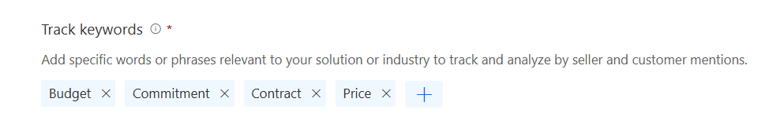

# Configure conversation content  

Configure conversation content such as, keywords and competitors to track in conversation intelligence in Dynamics 365 Sales organization.

## License and role requirements

| Requirement type | You must have |
|-----------------------|---------|
| **License** | Dynamics 365 Sales Premium or Dynamics 365 Sales Enterprise  More information: [Dynamics 365 Sales pricing](https://dynamics.microsoft.com/sales/pricing/) |
| **Security roles** | System Administrator or Sales Manager    More information: [Predefined security roles for Sales](security-roles-for-sales.md)|

## Add keywords and competitors  

Configure tracked keywords and competitors that are relevant to you and your organization so you can track them in calls. Whenever the defined keywords or competitors are mentioned in a call, conversation intelligence will gather the data and display it appropriately on the dashboard.  

>[!NOTE]
>- As a sales manager, you can define tracked keywords and competitors that are specific to your team. That is, you want to track these keywords and competitors only for your team member calls.  
>- The changes you made apply only to your team. They don't impact the administrator-defined settings for your organization.    

1. Review the prerequisites. To learn more, see [Prerequisites to configure conversation intelligence](prereq-sales-insights-app.md).

1. Sign in to the [Conversation intelligence app](https://sales.ai.dynamics.com/).

1.	Select the **Settings** icon in the upper-right corner of the page and then select **Settings**.  
    > [!div class="mx-imgBorder"]
    >   
2.	On the **Settings** page, select **Conversation content**.     
1. On the **Tracked keywords** section, enter a keyword in **Add a keyword** and then press **Enter**.  
    > [!div class="mx-imgBorder"]
    >    
4.	Repeat **step 2** to add other keywords.  
5.	In the **Competitors** section, enter a competitor's name in **Add a competitor** and then press **Enter**.   
    > [!div class="mx-imgBorder"]
    >     
6.	Repeat **step 4** to add other competitors' names.  
7.	Select **Save**.

[!INCLUDE[cant-find-option](../includes/cant-find-option.md)]

### See also

[Administer conversation intelligence](./intro-admin-guide-sales-insights.md)   
[Prerequisites to configure conversation intelligence](prereq-sales-insights-app.md)

[!INCLUDE[footer-include](../includes/footer-banner.md)]
