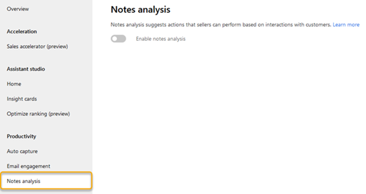
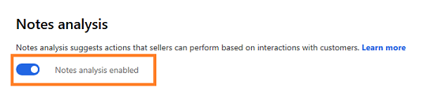

# Configure notes analysis 

To help users with intelligent suggestions when they enter an activity in the timeline&mdash;such as an appointment, email, phone call, task, note, post, or any custom activities&mdash;enable notes analysis.

## License and role requirements
| Requirement type | You must have |
|-----------------------|---------|
| **License** | Dynamics 365 Sales Premium  More information: [Dynamics 365 Sales pricing](https://dynamics.microsoft.com/sales/pricing/) |
| **Security roles** | System Administrator    More information: [Predefined security roles for Sales](security-roles-for-sales.md)|

## To configure notes analysis 

1. Verify that premium Sales Insights features are enabled. More information: [Install and configure premium Sales Insights features](intro-admin-guide-sales-insights.md#install-and-configure-premium-sales-insights-features)

2.	Go to **Change area** in the lower-left corner of the page, and select **Sales Insights settings**.

    > [!div class="mx-imgBorder"]
    > 

3.  On the site map under **Productivity intelligence**, select **Notes analysis**.

    > [!div class="mx-imgBorder"]
    > 

4. Turn on the **Notes analysis** toggle.

    > [!div class="mx-imgBorder"]
    > 

[!INCLUDE[cant-find-option](../includes/cant-find-option.md)]

### See also

[How notes analysis assists you with intelligent suggestion](notes-analysis.md)  
[Install and configure premium Sales Insights features](intro-admin-guide-sales-insights.md#install-and-configure-premium-sales-insights-features)  
[Notes analysis FAQs](faqs-sales-insights.md#notes-analysis)

[!INCLUDE[footer-include](../includes/footer-banner.md)]
