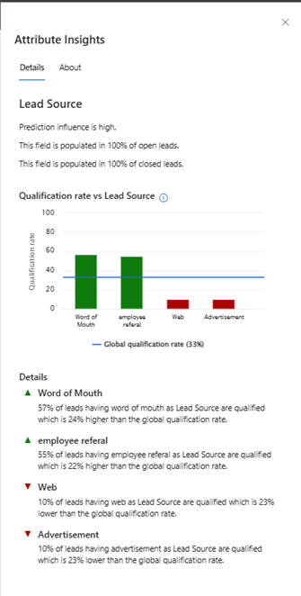
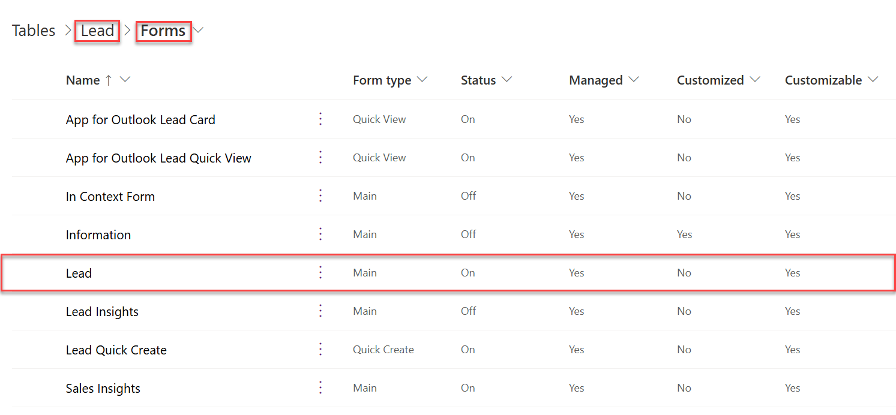

# Configure predictive lead scoring

Configure predictive lead scoring to help sellers prioritize leads based on scores and achieve higher lead qualification rates.

## License and role requirements

| Requirement type | You must have |
|-----------------------|---------|
| **License** | Dynamics 365 Sales Premium or Dynamics 365 Sales Enterprise**  More information: [Dynamics 365 Sales pricing](https://dynamics.microsoft.com/sales/pricing/) |
| **Security roles** | System Administrator    More information: [Predefined security roles for Sales](security-roles-for-sales.md)|

** Enable predictive lead scoring through quick setup (with the Dynamics 365 Sales Enterprise license). In this case, you'll get 1,500 scored records per month. For more information on enabling predictive scoring, see [Lead and opportunity scoring](digital-selling-scoring.md).

## What is predictive lead scoring?

Predictive lead scoring uses a predictive machine learning model to calculate a score for all open leads. The score helps salespeople prioritize leads, achieve higher lead qualification rates, and reduce the time it takes to qualify a lead. When you first create a scoring model, historical data collection is initiated and stored in the data lake for analysis. 

> [!NOTE]
> If your Dynamics 365 Sales subscription expires or your org gets deleted, the historical data will be deleted after 30 days of the event.

Using this score, you can:

- Identify quality leads and convert them into opportunities.
- Spend time on leads that have low scores, and convert them into possible opportunities.

For example, say you have two leads&mdash;Lead A and Lead B&mdash;in your pipeline. The lead scoring model applies a score of 80 for Lead A and 50 for Lead B. By looking at the score, you can predict that Lead A has a greater chance of being converted into an opportunity, and you can engage it. Also, you can further analyze why the score of Lead B is low by looking at the top reasons that influence the score and deciding whether to improve this score.

The following image shows an example of a lead scoring widget.

> [!div class="mx-imgBorder"]
> 

> [!IMPORTANT]
> - If you're using predictive lead scoring that pertains to a version prior to 2020 release wave 2 for Dynamics 365, delete the model. Otherwise, the previous version of the model will be applied on all leads in your organization, and the newly generated models won't have any effect on the leads. More information: [Delete a model](#delete-a-model)
> 
> 
> - From 2020 release wave 2 for Dynamics 365, the application writes the lead scoring-related data to the **msdyn_predictivescore** table and has stopped writing to the lead table. This table is common for both lead and opportunity scoring. More information: [Entity reference](entity-reference.md)

You can add custom fields to generate an accurate model for predictive lead scoring. The custom fields can be specific to your organization so that you can decide the impact of the outcome.

## Prerequisites

Verify that you meet the following requirement before adding predictive lead scoring models for your organization:

- A minimum of 40 qualified and 40 disqualified leads created and closed in the past 3 months to 2 years. You can configure the timeframe in the **Train with leads from the past** field. More information: [First-run setup experience](#first-run-setup-experience)

   > [!NOTE]
   > These numbers represent the minimum requirement. The more leads you can include to train the model, the better the prediction results will be.

- Verify that advanced Sales Insights features are enabled. More information: [Install and configure premium Sales Insights features](intro-admin-guide-sales-insights.md#install-and-configure-premium-sales-insights-features)

## Understand the configuration page

Before we configure the predictive lead scoring, let's understand the configuration summary page. When a model is generated and published, the configuration summary page is displayed as shown in the following image.

> [!div class="mx-imgBorder"]
> 

The configuration page is organized into the following sections:

- [Select a model](#select-a-model)
- [Actions you can perform on the model](#actions-you-can-perform-on-the-model)
- [Version details](#version-details)
- [Lead score grading](#lead-score-grading)
- [MultiModel](#multimodel)

### Select a model

In the upper-left corner of the page, you can use the **Select model** dropdown list to choose the model you want to view, edit, or delete. The list consists of both published and unpublished models.

> [!div class="mx-imgBorder"]
> 

### Actions you can perform on the model

In the upper-right corner of the page, you can choose from actions that you can perform on the model.

> [!div class="mx-imgBorder"]
> 

- **Publish**: When you publish a model in your organization, users in your organization can see the My Open Leads Scored system view and the Lead score widget on lead forms. After you publish, this button appears dimmed and will be available only after you retrain or edit the model.
- **Edit model**: You can update or add fields that affect the prediction accuracy score. This is useful when you want to modify fields to consider or include a unique business process. More information: [Edit and retrain a model](#edit-and-retrain-a-model)
- **Revert version**: You can return the model to its previous version when the retrained model isn't satisfactory or doesn't meet an acceptable level of your organization's requirements. This action is only available when you've retrained the model but haven't published it yet.
- **Delete model**: You can delete models that aren't required in your organization. This option is displayed for published models. More information: [Delete a model](#delete-a-model)

### Version details

The parameters displayed in this section show information about the status and performance of the model.

> [!div class="mx-imgBorder"]
> 

| Parameter | Description |
|-----------|-------------|
| Version trained on | Displays a date that lets you know when the model was last trained. |
| Status | Displays whether the model is active or inactive. |
| Attributes used | Displays the number of attributes used from the available list to train the model. If you're not satisfied with the outcome of the trained model, you can select **Retrain with recommended fields** to retrain the model with the standard (out-of-the-box) attributes. If the parameter displays **Edited** next to the number of attributes used, this specifies that the attributes used are custom-selected. |
| Model performance | Displays information about the model's accuracy and projected performance based on the data available and selected to train the model. **Note**: The range of the accuracy score is defined based on the area under the curve (AUC) classification measurements. - **Ready to publish** specifies that the model accuracy is above the range, and you can expect that the model will perform well. - **OK to publish** specifies that the model accuracy is within range, and you can expect that the model might perform reasonably well. - **Not ready to publish** specifies that the model accuracy is below the range, and you can expect that the model will perform poorly. |
| Business process flow | Displays the business process flow that's applied on the leads that are scored by this model. |
| Filter column and filter values | When multiple models are used, this selection defines which column and which values within that column correspond to the leads that this specific model should score. |
| State option set | Displays the option set that's used to qualify and disqualify leads in this model. |
| Retrain automatically | Allows you to set the model to be retrained automatically. More information: [Automatic retraining](#automatic-retraining) |
| Most influential fields | Displays the top five attributes that most affect the outcome of the prediction accuracy score. |

### Lead score grading

When a model is published, the leads that are in your organization's pipeline are graded according to the range defined in this section. Each lead in the pipeline is graded A, B, C, or D, according to the lead score. Leads in the top score range are graded A while leads within the lowest score range are graded D. 

> [!div class="mx-imgBorder"]
> 

You can configure the range for the grading according to your organizational requirements. When you change the lead score range for a grade, the maximum range value for the adjacent grade changes automatically in accordance with the change in the minimum value. For example, when you change the minimum range value score for **Grade A** to 51, the maximum lead score range for **Grade B** changes to 50.

### MultiModel

In the lower-left corner of the page, you can use **Add model** to generate a new model to represent a line of business that might use different leads than your first model. The **Add model** command will be disabled as soon as you reach the maximum limit of 10 models (both published and unpublished). More information: [Add a model](#add-a-model)

> [!div class="mx-imgBorder"]
> 

## First-run setup experience

When the predictive lead scoring configuration section is opened for the first time in your organization and no models have been trained on the installation of Sales Insights, you must add the model.

However, if your organization has enough leads in the past 24 months that match the default configurations, a model is generated by default. A pop-up window is displayed with the prediction accuracy score and top five fields that are influencing the score. Based on your organization's requirements, you can publish the model, or you can edit and then publish the model.

If you're using custom attributes for lead generation, you can generate the model by configuring the parameters with your custom attributes.

 1. Before you configure the model, review the [prerequisites](#prerequisites).

 1. Go to **Change area** in the lower-left corner of the page, and select **Sales Insights settings**.

    > [!div class="mx-imgBorder"]
    > 

 1. On the site map under **Predictive models**, select **Lead scoring**.

     The **Predictive lead scoring** configuration page is displayed.

    > [!div class="mx-imgBorder"]
    > 

 1. In the **New model name** box, enter a name that contains alphanumeric characters. Underscores are allowed, but not spaces or other special characters.

     By default, the name is **LeadScoring_**<***YYYYMMDD***><***Time***> (for example, **LeadScoring_202009181410**). The date and time are based on Coordinated Universal Time (UTC).

 1. In the **Business process flow** list, select a flow that's relevant for the leads that you're generating the model for.
    The list displays all the business process flows that are defined for leads in your organization.  

    > [!NOTE]
    > - Custom business process flows that are not enabled for change tracking are disabled for selection in the list. To enable change tracking for such entities, see [Enable change tracking to control data synchronization](/power-platform/admin/enable-change-tracking-control-data-synchronization).
    > - When you generate the model, custom business processes will be automatically enabled to sync the data to Data Lake Storage for analytics.
 1. In the **State option set** list, select the option set in which the status of the leads is defined, and then select the corresponding qualified and disqualified values in the **Qualified value** and **Disqualified value** lists, respectively. 

     Leads are marked as:

    - **Qualified** when they've met certain criteria that denotes that they're ready to purchase a product or service from a business. 
    - **Disqualified** when the criteria aren't met. 

     The out-of-the-box **Status** state option set contains the qualified and disqualified values as **Qualified** and **Disqualified**, respectively. You can also select your custom option set that's relevant to your business.

 1. Select **Filter column** and **Filter values** to define the leads for which the model must score.   

     With multiple models, each model can be directed to score a specific set of leads based on the line of business they belong to, or based on other criteria. The filter column is the column that holds the value that distinguishes which leads the model should score. These selections determine which column and which values within that column correspond to the leads that this model will score.

    > [!NOTE]
    > To filter based on multiple columns, create a calculated field with the required columns and then select the calculated field in the Filter column field. More information: [Define calculated columns to automate calculations](/powerapps/maker/data-platform/define-calculated-fields)
 1. Choose a time period from the **Train with leads from the past** list. The default duration is 2 years.   

    > [!NOTE]
    > You must have a minimum of 40 qualified and 40 disqualified leads that were created and closed during the selected period. For example, if you select 6 months, the model considers leads that were created in the past 6 months to verify whether the minimum lead requirement is met.

     The model considers closed leads from the selected period and uses that to score the open leads from past 2 years.  

    If you don't have the minimum closed leads in the chosen time period, the **Get started** option will be disabled. Choose another time period that has enough closed leads to train the model.  

 1. Select **Get started**.

     The application starts generating a model, and a notification is displayed. The application uses the standard attributes to generate the model.

    > [!div class="mx-imgBorder"]
    > 

    > [!NOTE]
    > If there aren't enough leads to generate the model, an error message is displayed. Review and edit the configurations, and try generating the model again.

    After the model is trained, a pop-up message is displayed.
    :::image type="content" source="media/pls-model-ready.png" alt-text="A screenshot of the pop-up message that appears after the model is ready":::

1. (Recommended) If you want the application to automatically retrain the model after every 15 days, select **Retrain automatically**.

1. Perform one of the following actions:

    - **Publish the model**: If your model is ready to publish, select **Publish**. The model is applied to leads that match the criteria specified in the model configuration. Users can see the lead scoring in their views under the Lead score column and a widget in the lead form. More information: [Convert leads into opportunities](../sales/work-predictive-lead-scoring.md)
    - **Verify accuracy**: To verify the model's accuracy, select **View Details** and then select the **Performance** tab. For more information, see [View the accuracy and performance of a predictive scoring model](scoring-model-accuracy.md). 
    - **View attributes**: To view the attributes used by the model, select **View Details** and then select **Edit model**. 

## Add a model

In organizations that have different lines of business, you might need different models to score the corresponding leads. To accomplish this, you can add and publish multiple models that are specific to each line of business in your organization. To ensure that these models are accurate for your organization, you can choose custom attributes (fields) to be used to generate the lead score for a model. 

1. Go to the predictive lead scoring configuration summary page.
1. In the lower-left corner of the page, select **Add model**.

   > [!div class="mx-imgBorder"]
   > 

   > [!NOTE]
   > If you already have 10 models (both published and unpublished), the **Add model** option is disabled. Delete the models that are no longer required in your organization. More information: [Delete a model](#delete-a-model)

   > [!div class="mx-imgBorder"]
   >  

1. Perform steps 4 through 11 in [First-run setup experience](#first-run-setup-experience), earlier in this topic, to add and train the model. 

## Edit and retrain a model

It's time to retrain a model when its prediction accuracy score doesn't meet your organization's standards, or the model simply gets old. Retraining generally increases the prediction accuracy score. The application uses the latest data (leads) from your organization to train the model so that it can provide more accurate scores for your users.

> [!NOTE]
> For better prediction accuracy scoring, retrain a model after the data in your organization is refreshed.

You can retrain the model [automatically](#automatic-retraining) or [manually](#manual-retraining). Both methods are described in the following sections.

### Automatic retraining

Automatic retraining allows the application to retrain a model automatically once every 15 days. This can allow the model to learn from historical data and improve its prediction accuracy over time. Depending on the model's accuracy, the application makes an informed decision whether to publish or ignore the retrained model.

To retrain a model automatically, go to the predictive lead scoring configuration page and select **Retrain automatically**. By default, this option is enabled when a model is published. Here are the scenarios where the application automatically publishes the model:

- When the accuracy of the retrained model is equal to or greater than 95 percent of the accuracy of the active model.
- When the current model is more than three months old.

> [!NOTE]
> A retrained model might not be published if the accuracy of the model isn't maintained to the standards of the application. If this occurs, the existing user-published model will be retained.

### Manual retraining

#### Edit the model

1. On the predictive lead scoring page, open the model and ensure that **Retrain automatically** is turned off.
1. Select **Edit model**.
1. On the **Edit model** page, select attributes—including custom attributes—from the lead entity and its related entities (contact and account) to train the model.

   > [!NOTE]
   > To use intelligent fields, go to the following section, [Select intelligent fields](#select-intelligent-fields).

   > [!div class="mx-imgBorder"]
   > 

   > [!NOTE]
   > The scoring model doesn't support the following types of attributes:
   > 
   > - Attributes on custom entities
   > 
   > 
   > - Date and time&ndash;related attributes
   > 
   > 
   > - System-generated attributes such as leadscore, leadgrade, version number, entity image, exchange rate, and predictive score ID
1. (Optional) Scroll to the right of the attributes list and turn on **Ignore empty values**.
   
   By default, empty values in the attribute are included for training the model. If you notice that empty values are acting as detractors or are producing false positives, turn on **Ignore empty values**.

    :::image type="content" source="media/ignore-empty-values.png" alt-text="A screenshot of Ignore empty values option in the attributes list.":::

   > [!NOTE]
   > - The **Ignore empty values** option is disabled for the following type of attributes:
       > - Attributes that are automatically validated for empty values (such as firstname_validation_engineered).
       > - Attributes that affect the score based on whether the value exists or not (such as, zip code or business phone).
   > - When you turn on **Ignore empty values** for an attribute, the scoring widget will indicate that the score is calculated after excluding blank values.
   
1. Select **Retrain model**.  
    A pop-up message is displayed if you've modified the grade ranges. When the model is retrained, the grade ranges may change as well.  

    :::image type="content" source="media/grade-reset.png" alt-text="Pop-up message to confirm the grade reset ":::
1. Confirm whether you want to reset the ranges to the new values or use the previously set range. For example, if you have agreed upon a fixed grade range for your entire organization, select **No, keep previous ranges**.

    After the model is trained, a pop-up message is displayed.  
    
    :::image type="content" source="media/pls-model-ready.png" alt-text="A screenshot of the pop-up message that appears after the model is ready":::
1. (Recommended) If you want the application to automatically retrain the model after every 15 days, select **Retrain automatically**.

1. Perform one of the following actions:

    - **Publish the model**: If your model is ready to publish, select **Publish**. The model is applied to leads that match the criteria specified in the model configuration. Users can see the lead scoring in their views under the Lead score column and a widget in the lead form. More information: [Convert leads into opportunities](../sales/work-predictive-lead-scoring.md)

    - **Verify accuracy**: To verify the model's accuracy, select **View Details** and then select the **Performance** tab. For more information, see [View the accuracy and performance of a predictive scoring model](scoring-model-accuracy.md). 
    - **View attributes**: To view the attributes used by the model, select **View Details** and then select **Edit model**. 

#### Select intelligent fields

Intelligent fields help the model to better understand records and distinguish between score improvers and harmers. For example, the model can now distinguish between business email and personal email by identifying and grouping email types through data that's available in the application and intelligence that has been added to the model. Some groups might include business domain email (such as abc@microsoft.com) or personal domain email. Through this identification, the model can generate detailed insights about how the groups of fields affect predictive scores.

Select the link in the **Prediction influence** column to view insights about the field, such as its qualification rate and the most influential reasons—both positive and negative—for that rate. More information: [View attribute insights](#view-attribute-insights)

The following fields are supported: **Email domain validation (Email)**, **First name validation (First name)**, and **Last name validation (Last name)**. The model always gives preference to:

- Emails that are part of a business domain.
- First and last names that contain alphanumeric characters and not special characters.

By default, intelligent fields are considered while training a model by using out-of-the-box values. If the outcome of the intelligent fields is satisfactory, the model includes the fields to train; otherwise, the fields are ignored. However, even if the outcome is unsatisfactory, you can still choose to include the intelligent fields to train the model if necessary.

> [!NOTE]
> The fields that are displayed in intelligent fields won't be available in the lead entity or its related entities, contact and account.

[Edit the model](#manual-retraining) as described in the previous section to choose the intelligent fields that you want your model to use. The following image illustrates how you can select intelligent fields.

> [!div class="mx-imgBorder"]
> 

## View attribute insights

On the **Attribute Insights** pane, you can view detailed information about an attribute, such as its qualification rate and the most important reasons&mdash;both positive and negative&mdash;for that rate. This information provides insights on the performance of each attribute that influences the prediction score. Based on these insights, you can analyze and understand:

- Why certain attributes carry more prediction influence than others.
- How the attribute values compare to the attribute global qualification rate.
- How the model harnesses your data to drive predictive scores.

Additionally, you can connect the attribute value's relative impact on the score to the data input behaviors of your sellers and how that might affect the accuracy of the predictive score.

The insights displayed on the **Attribute Insights** pane are based on your organization's lead data and how it correlates to qualified outcomes. For example, when a lead has an attribute value that correlates with a qualification rate above the attribute's global qualification rate, the predictive score of that lead increases. When the qualification rate for a lead is below that of the attribute's average, the predictive score decreases.

The following image shows an example of the **Attribute Insights** pane for the **Lead Source** attribute.

> [!div class="mx-imgBorder"]
> 

Typically, the **Attribute Insights** pane is divided into the following sections:

- A summary of the status of the prediction influence, how many times the attribute is populated in open and closed leads, and the reason the attribute isn't automatically selected to create the model.
- A graph that illustrates how each value of the attribute contributes to the qualification rate. In this example, you can see that the lead score values **Blank**, **Word of Mouth**, and **Employee referral** perform better than the average, and **Advertisement** and **Web** perform below the average. The average is represented by a blue line and calculated based on the following formula:

    `Global qualification rate` = {`Total number of leads qualified in your organization`/(`Total number of qualified + disqualified leads through this attribute`)} &times; 100   

    Hover over each bar to view the summary of the value, such as the qualification rate and the number of open and closed leads. The qualification rate for a value of the attribute is calculated based on the following formula:

     `Qualification rate for a value of the attribute` = (`Total number of leads qualified with the given value in the attribute`/`Total number of closed leads with that value in the attribute`) &times; 100    

     For example, if leads with high budget have a 42 percent qualification rate, the formula is:

     (`Total number of leads with high budget that are qualified)/(Total number of leads with high budget that are closed`) &times; 100 = 42  

   > [!NOTE]
   > These calculations are based on the data at the time the model is trained, and might not represent the current snapshot of data. Also, the past two years of data are considered and if the model has filters, the calculations are done after the data is filtered.
- A **Details** section that provides reasons for why the values are trending as they are in the graph at that point in time. If there isn't enough data for attributes from related entities, the application won't display the insights.
- The **About** tab provides more information about the attribute insights.

> [!NOTE]
> The insights for the attributes are updated when the model is retrained, either manually or automatically. For models that were created before March 2021, data for attribute insights won't be available. We suggest that you retrain&mdash;or enable the option to automatically retrain&mdash;the model to view the attribute insights.

**To view the Attribute Insights pane**

1. Go to the predictive lead scoring configuration page, and select **Edit model**.
1. On the **Edit fields** page, select the attribute for which you want to view insights, either from **Primary entity** or **Related entities**. The **Attribute Insights** pane is displayed on the right side of the page. 

## Delete a model

You can delete a model when it's no longer required in your organization. You can only have 10 models&mdash;both published and unpublished&mdash;simultaneously.

1. Go to the predictive lead scoring configuration page.
1. Select a model from the **Select model** list, and then select **Delete model**. In this example, we've selected the model **LeadScoring_202009181011**.

   > [!NOTE]
   > You can't delete a model if the **Retrain automatically** option is enabled. Disable the option first.

   > [!div class="mx-imgBorder"]
   > 

1. In the confirmation message that appears, select **Delete**.

The model is deleted from your organization.

## Manage duplicate models

When you create multiple models, it’s important to configure them so that they are not scoring the same leads. In the case of duplicate models, it’s difficult to identify which model scored the lead. Duplicate models are automatically identified when you create or edit models. A conflict message is displayed when the configuration is a duplicate of existing models.  

To remove the duplicate models, use one of the following methods depending on the action you’re performing:

- [Create model](#create-model)
- [Published model](#published-model)

### Create model

When you select **Get started**, a conflict message is displayed stating that the model you’re creating has conflicts with other models in the list. The following image shows an example of the message:

> [!div class="mx-imgBorder"]
> 

- Select **No, Go back** and change the filter column and values to ensure that the model is scoring unique leads. For more information, see step 7 in [First-run setup experience](#first-run-setup-experience).
   -Or-
- Proceed to create a duplicate model, which might cause conflicts in identifying the leads that are being scored by this model.

### Published model

When you open a published model, a note displays above the version details section with the list of models that the current model is a duplicate of. The following image shows an example of the message:

> [!div class="mx-imgBorder"]
> 

1. Select **Delete model** to delete the current model from the application.
1. [Create the model](#add-a-model) with different filter column and filter values to score a lead.

## Add the lead scoring widget to a form

By default, the predictive lead scoring widget is available only in the out-of-the-box **Sales Insights** form. If you're using customized forms for leads, you can display the predictive lead scoring widget on your custom forms by following these steps.

> [!IMPORTANT]
> - Adding lead scoring widgets is only supported in Unified Interface apps.
> - You can't use the legacy form designer to add a lead scoring widget to a form.

1. Sign in to the [Power Apps](https://make.powerapps.com/) portal.

   > [!div class="mx-imgBorder"]  
   > 
1. Search for and select your organization's environment.

   > [!div class="mx-imgBorder"]  
   > 

1. Select **Data** > **Tables**.

    The **Tables** page opens with the list of tables.

   > [!div class="mx-imgBorder"]  
   > 

1. Open the table, select the **Forms** tab, and then select a main form to add the widget to. In this example, the table **Lead** is selected and the main form **Lead** is selected.

   > [!NOTE]
   > If you're unable to view the table to which you want to add the widget, in the upper-right corner of the page, change the filters settings to **All**.

   > [!div class="mx-imgBorder"]  
   > 

1. In the form designer, select **Component**, and then from **Layout**, add a column to the form as a placeholder to add the widget.

   > [!div class="mx-imgBorder"]  
   > 

1. From the site map, select **Display** > **Predictive score**.

   > [!NOTE]
   > Ensure that the added placeholder column is selected. If it isn't, the widget will be added at a random place in the form.

   > [!div class="mx-imgBorder"]  
   > 

1. In the **Edit predictive score** pop-up window, select **Done**.

   > [!div class="mx-imgBorder"]  
   > 

    The predictive score widget is added to the form, as shown in the following image.

   > [!div class="mx-imgBorder"]  
   > 

   > [!NOTE]
   > To hide the **New section** label, go to the **Properties** tab of the **New Section** settings pane, and then select **Hide label**.
1. Save and publish the form.

[!INCLUDE[cant-find-option](../includes/cant-find-option.md)]

### See also

[Prioritize leads through scores](../sales/work-predictive-lead-scoring.md)  
[Install and configure premium Sales Insights features](intro-admin-guide-sales-insights.md#install-and-configure-premium-sales-insights-features)  
[Predictive lead/opportunity scoring FAQs](faqs-sales-insights.md#predictive-leadopportunity-scoring)

[!INCLUDE[footer-include](../includes/footer-banner.md)]
