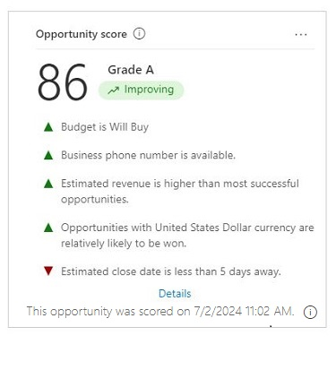
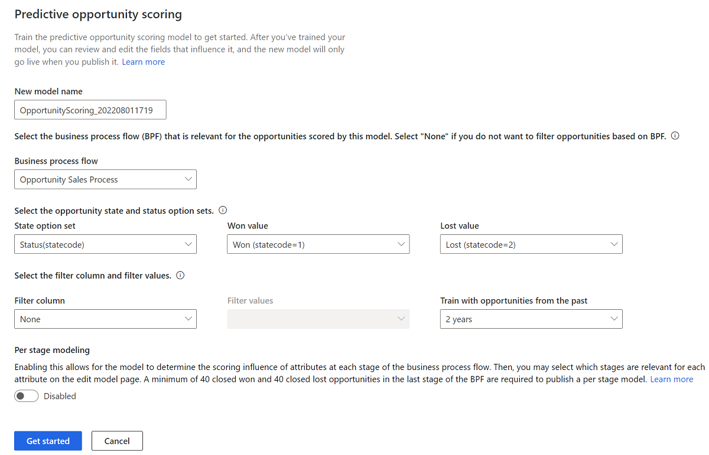

# Configure predictive opportunity scoring 

Configure predictive opportunity scoring to help sellers prioritize opportunities based on scores and achieve higher opportunity qualification rates.

## License and role requirements

| Requirement type | You must have |
|-----------------------|---------|
| **License** | Dynamics 365 Sales Premium or Dynamics 365 Sales Enterprise** More information: [Dynamics 365 Sales pricing](https://dynamics.microsoft.com/sales/pricing/) |
| **Security roles** | System Administrator    More information: [Predefined security roles for Sales](security-roles-for-sales.md)|

** Enable predictive opportunity scoring through quick setup (with the Dynamics 365 Sales Enterprise license). In this case, you'll get 1,500 scored records per month. To enable predictive opportunity scoring through quick setup, go to [Lead and opportunity scoring](digital-selling-scoring.md).

## What is predictive opportunity scoring?

Predictive opportunity scoring uses a predictive machine learning model to calculate a score for all open opportunities based on historical data. The score helps salespeople prioritize opportunities, achieve higher opportunity qualification rates, and reduce the time that it takes to qualify an opportunity. When you first create a scoring model, historical data collection is initiated and stored in the data lake for analysis. 

> [!NOTE]
> If your Dynamics 365 Sales subscription expires or your org gets deleted, the historical data will be deleted after 30 days of the event.

For example, say you have two opportunities&mdash;Opportunity A and Opportunity B&mdash;in your pipeline. The opportunity scoring model applies a score of 75 for Opportunity A and 55 for Opportunity B. By looking at the score, you can predict that Opportunity A has more chances of being converted into a won deal, and you can engage it. Also, you can further analyze why the score of Opportunity B is low by looking at the top reasons that are influencing the score and deciding how to improve this score.

The following image is an example of an opportunity scoring widget.

> [!div class="mx-imgBorder"]
> 

>[!IMPORTANT]
>- If you're using predictive opportunity scoring that pertains to a version prior to 2020 release wave 2 for Dynamics 365, delete the model. Otherwise, the previous version of the model will be applied on all opportunities in your organization, and the newly generated models won't have any effect on the opportunities. More information: [Delete a model](pos-duplicate-models.md#delete-a-model)
>- From 2020 release wave 2 for Dynamics 365, the application writes the opportunity scoring-related data to the **msdyn_predictivescore** entity and has stopped writing to the opportunity entity. This entity is common for both lead and opportunity scoring. More information: [Entity reference](entity-reference.md)

## Prerequisites

Verify that you meet the following requirements before adding predictive opportunity scoring models for your organization:

- Verify that advanced Sales Insights features are enabled. More information: [Install and configure premium Sales Insights features](intro-admin-guide-sales-insights.md#install-and-configure-premium-sales-insights-features) 
 
- You need to have enough opportunities to train the model based on past data. Choose a time period between 3 months to 2 years to meet one of the following requirements:
    - A minimum of 40 won and 40 lost opportunities that were created and closed during the selected time period.
    
    - A minimum of 40 closed opportunities in the last stage of the business process during the selected time period, if you want to define a [per stage model](#what-is-a-per-stage-model).
  >[!NOTE]
  >- The numbers represent the minimum requirement. The more opportunities you can include to train the model, the better the prediction results will be.
  >- The system takes about 4 hours to sync the data with the data lake. So, if you've recently closed opportunities, they won't be considered by the model immediately.

## What is a per stage model?

A per stage model calculates the influence of attributes at each stage of the business process flow based on past data. For example, you can see how the estimated close date has an influence across different stages of the opportunity. You can then review and decide which stages are relevant for each attribute according to your organization's standards and improve the model accuracy. By default, per stage modeling is disabled. 

> [!NOTE]
> You can enable per stage modeling only when you're [adding a scoring model](#create-and-add-a-scoring-model) and not later.  

When per stage modeling is disabled, the model uses only the attributes that had a higher influence on opportunities that were closed as won. For example, if majority of the won deals had a business phone associated, the model may give a higher score to opportunities that have an associated business phone.

## Create and add a scoring model

A scoring model defines the criteria for choosing the opportunities for training and scoring. If your organization follows different sales practices across different regions or business units, you can create multiple models and define unique training sets for each of them.

**To create and add a scoring model:**

1. Go to **Change area** in the lower-left corner of the Sales Hub app, and select **Sales Insights settings**.

1. On the site map under **Predictive models**, select **Opportunity scoring**.  
  
   When you open this page for the first time, you'll see one of following screens depending on whether your organization has enough opportunities in the past 24 months that match the minimum requirements:

   - If there are enough opportunities, a model is generated by default. You'll see a popup message with the prediction accuracy score and top five fields that are influencing the score. You can verify the model accuracy and publish it or edit and retrain the model.  
   
   - If there aren't enough opportunities, you'll see a configuration page for adding a new model.
   - If you've already created a model and want to create another model for a different data set, scroll down to the bottom of the page and select **Add Model**. 
      > [!NOTE]
      > The **Add model** command will be disabled when you reach the maximum limit of 10 models (both published and unpublished).

   The **Predictive opportunity scoring** configuration page is displayed.

    > [!div class="mx-imgBorder"]
    > 

    The following steps describe how to add a new model.

4. In the **New model name** box, enter a name that contains alphanumeric characters. Underscores are allowed, but not spaces or other special characters.

    By default, the name is selected as **OpportunityScoring_**<***YYYYMMDD***><***Time***> (for example, **OpportunityScoring_202009181410**). The date and time are based on Coordinated Universal Time (UTC).

5. In the Business process flow list, select a flow that's relevant for the opportunities that you're generating the model for. The list displays all the business process flows that are defined for the opportunities in your organization. Selecting a business process flow is mandatory if you want to enable [per stage modeling](#what-is-a-per-stage-model).

    > [!NOTE]
    > - To display custom business process flows in the list, enable **Change Tracking** for the business process flow entity. More information: [Enable change tracking to control data synchronization](/power-platform/admin/enable-change-tracking-control-data-synchronization)
    > - When you generate the model, custom business processes will be automatically enabled to sync the data to Data Lake Storage for analytics.

6. In the **State option set** list, select the option set in which the status of the opportunities is defined, and then select the corresponding won and lost values in the **Won value** and **Lost value** lists, respectively.

    The out-of-the-box **Status** state option set contains the won and lost values as **Won** and **Lost**, respectively. You can also select your custom option set that's relevant to your business.

7. Select **Filter column** and **Filter values** to define the opportunities that the model must score.  

    If you want to score a specific set of opportunities based on the line of business they belong to, or based on other criteria, use the filter criteria to distinguish the opportunities the model must score. 

    >[!NOTE]
    >To filter based on multiple columns, create a calculated field with the required columns and then select the calculated field in the Filter column field. More information: [Define calculated columns to automate calculations](/powerapps/maker/data-platform/define-calculated-fields)
   
8. Choose time period from the **Train with opportunities from the past** list. The default duration is 2 years.  

    > [!NOTE]
    > You must have a minimum of 40 won and 40 lost opportunities that were created and closed during the selected period. For example, if you select 6 months, the model considers opportunities that were created in the past 6 months to verify whether the minimum opportunity requirement is met.  
   
    The model considers closed opportunities from the selected period and uses that to score the open opportunities from past 2 years.  

   If you don't have the minimum closed opportunities in the chosen time period, the **Get started** option will be disabled. Choose another time period that has enough closed opportunities to train the model.  

9. (Optional) Turn on **Per stage modeling** to select the attributes that the model must consider for each business process stage.  

    :::image type="content" source="media/enable-per-stage-modelling.png" alt-text="Screenshot of the Add model page with the Per stage modeling option.":::

    > [!NOTE]
    > If the **Per stage modeling** option is disabled, ensure that you've selected a valid business process in the **Business process flow** field.  
    
 1. Select **Get started**.

    The application starts generating a model, and a notification is displayed. The application uses standard attributes to generate the model. You can [edit the model](pls-edit-and-retrain-model.md) later to include custom attributes.

    > [!div class="mx-imgBorder"]
    > 

    > [!NOTE]
    > If there aren't enough opportunities to generate the model, an error message is displayed. Review and edit the configurations, and try generating the model again.

    After the model is trained, a pop-up message is displayed.  
    
    :::image type="content" source="media/pls-model-ready.png" alt-text="A screenshot of the pop-up message that appears after the model is trained":::

1. If you want the application to automatically retrain the model after every 15 days, select **Retrain automatically**.  

1. Perform one of the following actions: 

    - If you're ready to publish, select **Publish**. The model is applied to opportunities that match the criteria specified in the model configuration. Users can see the opportunity scoring in their views under the **Opportunity score** column and a widget in the opportunity form. More information: [Prioritize opportunities through scores](work-predictive-opportunity-scoring.md)
    
    - If you want to verify the model's accuracy, select **View Details** and then select the **Performance** tab. More information: [View the accuracy and performance of a predictive scoring model](scoring-model-accuracy.md)

[!INCLUDE[cant-find-option](../includes/cant-find-option.md)]

### See also

[Prioritize opportunities through scores](../sales/work-predictive-opportunity-scoring.md)  
[Install and configure premium Sales Insights features](intro-admin-guide-sales-insights.md#install-and-configure-premium-sales-insights-features)  
[Predictive lead/opportunity scoring FAQs](faqs-sales-insights.md#predictive-leadopportunity-scoring)

[!INCLUDE[footer-include](../includes/footer-banner.md)]
