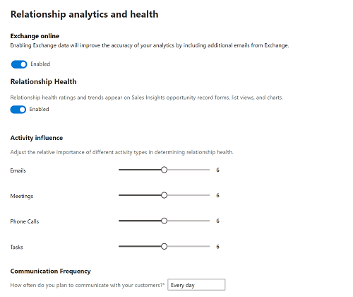
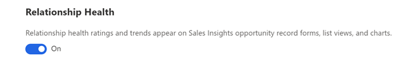
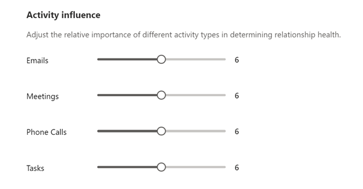
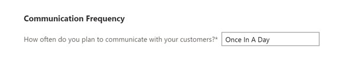
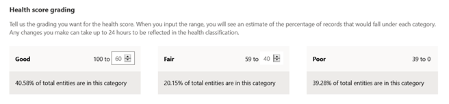

# Configure relationship analytics and health 

Relationship analytics provides a graphical representation of KPIs and activity histories of any contact, opportunity, lead, or account. It uses data from Dynamics 365 and Exchange Online (if configured) to create more accurate and complete relationship information.

## License and role requirements

| &nbsp; | &nbsp; |
|-----------------------|---------|
| **License** | Dynamics 365 Sales Premium  More information: [Dynamics 365 Sales pricing](https://dynamics.microsoft.com/sales/pricing/) |
| **Security Role** | System Administrator    See [Predefined security roles for Sales](security-roles-for-sales.md)|
|||

>[!IMPORTANT]
>This feature is intended to help sellers or sales managers enhance their team’s performance. This feature is not intended for use in making, and should not be used to make, decisions that affect the employment of an employee or group of employees, including compensation, rewards, seniority, or other rights or entitlements. Customers are solely responsible for using Dynamics 365, this feature, and any associated feature or service in compliance with all applicable laws, including laws relating to accessing individual employee analytics and monitoring, recording, and storing communications with end users. This also includes adequately notifying end users that their communications with sales persons may be monitored, recorded, or stored and, as required by applicable laws, obtaining consent from end users before using the feature with them. Customers are also encouraged to have a mechanism in place to inform their sales persons that their communications with end users may be monitored, recorded, or stored.

## Enable relationship analytics and health 

1. In the Sales Hub app, go to **Change area** in the lower-left corner of the page, and select **Sales Insights settings**. 
   
3. Under **Relationship insights**, select **Analytics and health**.   

    > [!NOTE]
    > If you don't see the **Analytics and health** menu, verify whether the advanced Sales Insights features are enabled. To learn more, see [Install and configure premium Sales Insights features](intro-admin-guide-sales-insights.md#install-and-configure-premium-sales-insights-features). 
    
1. Turn on the toggle to enable relationship analytics for your organization.

1. Select **Include exchange data for computing KPIs and health** ​to collect data from Exchange Online and improve the accuracy of the calculated KPIs and analytics.
    > [!NOTE]
    > This step requires that your Office 365 administrator provides consent for using Office 365 data. If the consent is not yet provided, a message displays the type of consent required. Work with your Office 365 administrator to get the consent. More information: [Provide consent for collecting data from Office 365](provide-consent-office365.md).  

    > [!div class="mx-imgBorder"]
    >   
 
    
6. To show the relationship health score in opportunities, views, and charts, set the **Relationship health** toggle to **On**.    

    > [!NOTE]
    > You can disable the option if you don't wish to display the score in opportunities, views, and charts. However, disabling the option does not affect the process of gathering the relevant health data.   
    
    > [!div class="mx-imgBorder"]
    >  
    
7. Under Activity influence, adjust the importance of activities of different types as they contribute to the relationship health score.  
 
    > [!div class="mx-imgBorder"]
    > 
    
      Businesses place different emphasis on the type of communication used with customers. The activities include, Emails, Meetings, Phone calls, and Tasks. 
  
    
8. From the **Communication frequency** list, select the expected frequency of communication between the sellers and customers .     

    Businesses have varying sales cycles and different expected levels of communications with customers. A longer expected communications frequency reduces the expectation of more recent frequent communications in the health score. A shorter expected communications frequency increases the expectation of more recent frequent communications in the health score. 
    
    > [!div class="mx-imgBorder"]
    >     
    
9.  Under **Health score grading**, set health scores to grade opportunities.  

    When health score is calculated, the opportunities in your organization's pipeline are graded according to the range defined in this section. Each opportunity in the pipeline is graded as Good, Fair, or Poor, according to the health score. Opportunities in the top score range are graded as Good while records within the lowest score range are graded as Poor.  
    
    You can configure the range for the grading according to your organizational requirements. When you change the health score range for a grade, the maximum range value for the adjacent grade changes automatically in accordance with the change in the minimum value. For example, when you change the minimum range value score for Good to 60, the maximum lead score range for Fair changes to 59.    
    
    After setting the values, the initial grading of opportunities can take up to 24 hours.
    
    > [!div class="mx-imgBorder"]
    >     
    
10. Select **Save**.   

    Relationship analytics is ready to use in your organization.  

[!INCLUDE[cant-find-option](../includes/cant-find-option.md)]

### See also

[Use relationship analytics to gather KPIs](../sales/relationship-analytics.md)  
[Add Relationship intelligence widgets to custom forms](add-ri-widgets-to-custom-form.md) 
[GDPR for Sales Insights](embedded-intelligence-gdpr.md)  
[View and export KPI data (GDPR)](view-export-KPI-data-gdpr.md)  

[!INCLUDE[footer-include](../includes/footer-banner.md)]
