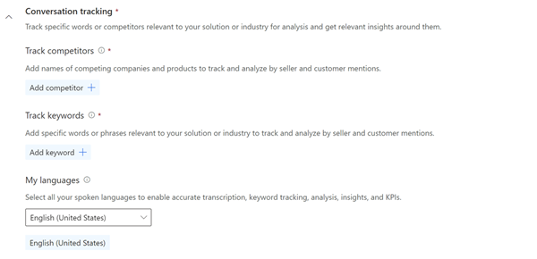
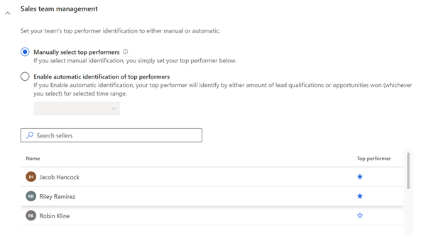
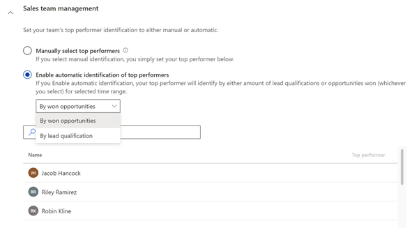

# Configure sales team&ndash;level settings 

As a sales manager, you can configure conversation intelligence to match your team's specific requirements. The following settings are available:

- Conversation trackers (keywords and competitors)
- Available languages
- Selection of top performers 

More information: [Configure and view your team page](configure-view-your-team-page.md)

## License and role requirements

| Requirement type | You must have |
|-----------------------|---------|
| **License** | Dynamics 365 Sales Premium or Dynamics 365 Sales Enterprise  More information: [Dynamics 365 Sales pricing](https://dynamics.microsoft.com/sales/pricing/) |
| **Security roles** | Sales Manager    More information: [Predefined security roles for Sales](security-roles-for-sales.md)|

## To configure sales team&ndash;level settings 

1. Sign in to the Dynamics 365 Sales Hub app with the sales manager security role.

2. Select the **change area**  in the lower-left corner of the page, and then select **Personal settings**.  

    > [!div class="mx-imgBorder"]
    >    

3. On the site map, under **Productivity**, select **Conversation intelligence**. The conversation intelligence home page opens.

    > [!div class="mx-imgBorder"]
    >    

4. On the home page, select **Get started**. The conversation intelligence configuration page opens.

    > [!div class="mx-imgBorder"]
    >    

5. Under the **Conversation tracking** section, add the keywords and competitors that you want to track during your sales team's calls. Also, you can reduce the language list provided by the organizational admin to the languages that the sellers on your team use during their calls with customers.    

    > [!NOTE]
    > This is a local setting that will be applied only to your sales team. You can update these keywords, competitors, and languages later if you need. More information: [Configure conversation content](configure-keywords-competitors.md)

    > [!div class="mx-imgBorder"]
    >     

6. In the **Sales team management** section, configure the top performers.
    You can view the names of the team members whose calls are analyzed in conversation intelligence and select the sellers who are top performers.
    It's possible to choose the top performers manually, or let the application automatically select them. Select one of the following options:   
 
    - **Manually select top performers**: Choose top performers from the list of sellers. In the **Top performer** column, select the star next to your top seller. The seller is added to the top performers list, where the seller's data will be compared to other sellers.
 
      > [!div class="mx-imgBorder"]
      >     

    - **Enable automatic identification of top performers**: The application automatically selects the top performers based on the number of opportunities they won or the leads they qualified. When you select this option, you choose whether to rank performers **by won opportunities** or **by lead qualification**.

       > [!div class="mx-imgBorder"]
       > 

Conversation intelligence is now configured and ready for use in your sales organization for your sales team.

[!INCLUDE[cant-find-option](../includes/cant-find-option.md)]

### See also

[Introduction to administering conversation intelligence](intro-admin-guide-sales-insights.md#administer-conversation-intelligence)  
[First-run set up in sales app](fre-setup-ci-sales-app.md)

[!INCLUDE[footer-include](../includes/footer-banner.md)]    
