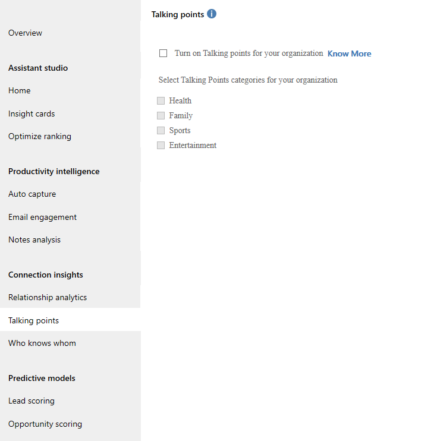
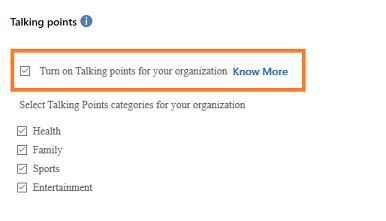

# Configure talking points 

> [!IMPORTANT]
> Talking points will be deprecated from August 2022. After the feature is deprecated, sellers will stop getting talking point suggestions on the contact's page. We recommend that you integrate LinkedIn Sales Navigator with Dynamics 365 Sales to help your sellers get suggestions based on their contact's LinkedIn activities. For more information on what you get with the integration, see [View and work with LinkedIn Sales Navigator controls on forms](../linkedin/view-sales-navigator-forms.md) and for instructions on how to integrate, see [Integrate LinkedIn Sales Navigator solutions for Dynamics 365 Sales](../linkedin/integrate-sales-navigator.md). 

The talking points feature helps users in your organization to quickly establish communications with customers.

## License and role requirements
| Requirement type | You must have |
|-----------------------|---------|
| **License** | Dynamics 365 Sales Premium  More information: [Dynamics 365 Sales pricing](https://dynamics.microsoft.com/sales/pricing/) |
| **Security roles** | System Administrator    More information: [Predefined security roles for Sales](security-roles-for-sales.md)|

## To configure talking points

1. Verify that advanced Sales Insights features are enabled. To learn more, see [Install and configure premium Sales Insights features](intro-admin-guide-sales-insights.md#install-and-configure-premium-sales-insights-features). 

2.	Go to **Change area** and select **Sales Insights settings**.

    > [!div class="mx-imgBorder"]
    > 

3.  On the sitemap, select **Talking points** under **Connection insights**.

    > [!div class="mx-imgBorder"]
    > 

4. Select **Turn on Talking points for your organization**.

    The categories are automatically selected.

    > [!div class="mx-imgBorder"]
    > 
        
    > [!NOTE]
    > You can select only the categories that meet your organizational requirements.

5. Select **Save**. 

    The talking points feature is configured and ready to use in your organization.

[!INCLUDE[cant-find-option](../includes/cant-find-option.md)]

### See also

[Know conversation starters for your customers](../sales/talking-points.md)  
[Install and configure premium Sales Insights features](intro-admin-guide-sales-insights.md#install-and-configure-premium-sales-insights-features)  
[Talking points FAQs](faqs-sales-insights.md#talking-points)

[!INCLUDE[footer-include](../includes/footer-banner.md)]
