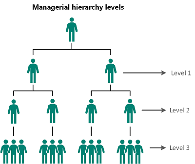
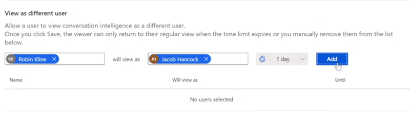
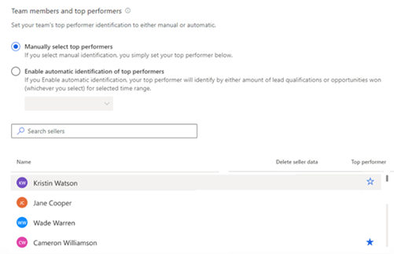
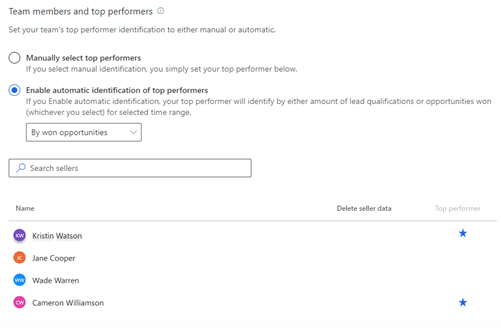
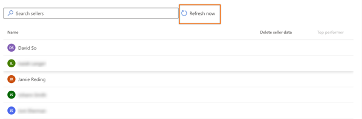

# Configure and view team page  

Configure and view your team page with information on levels of hierarchy, top performers, and delete seller data.

## License and role requirements

| Requirement type | You must have |
|-----------------------|---------|
| **License** | Dynamics 365 Sales Premium or Dynamics 365 Sales Enterprise  More information: [Dynamics 365 Sales pricing](https://dynamics.microsoft.com/sales/pricing/) |
| **Security roles** | System Administrator or Sales Manager    More information: [Predefined security roles for Sales](security-roles-for-sales.md)|

## What can I configure

As an administrator, you can:  

- Configure the levels of hierarchy that you can view.  
- Configure a user to impersonate another to view information.  
- Select the top performers in your hierarchy.  
- Delete seller data.

As a sales manager, you can:  

- View the list of employees who are part of your hierarchy.  

- Select the top performers in your hierarchy.

## Open your team settings page

> [!NOTE]
> Review the prerequisites. To learn more, see [Prerequisites to configure conversation intelligence](prereq-sales-insights-app.md).

1.	Sign in to the [Conversation intelligence app](https://sales.ai.dynamics.com/)
  
2.	Select the **Settings** icon on the top-right of the page and then select **Settings**.  
    > [!div class="mx-imgBorder"]
    >   
3.	On the **Settings** page, select **Your team**.  
    Your team page opens and you can perform the following tasks:  
        - [Configure hierarchy levels](#configure-hierarchy-levels)  
        - [Configure users to view as another user](#configure-users-to-view-as-another-user)  
        - [Choose top performers](#choose-top-performers)  
        - [Delete seller data](#delete-seller-data)  

## Configure hierarchy levels    

1.	Choose the hierarchy level from the **Call data visibility** list to display team members for managers. You can choose up to a maximum of three levels. To learn more, see [understand hierarchy levels](#understand-hierarchy-levels).  

    A list of team members is displayed under **Team members and top performers**. The list consists of team members who report to the manager in Dynamics 365 and Azure Active Directory (AD), including those members who don't have access to conversation intelligence.   
    The application automatically updates the list every 24 hours and displays the current active team members in the manager's hierarchy.  
    > [!div class="mx-imgBorder"]
    >     

2.	Save the configuration.  

### Understand the hierarchy levels

Let’s look at the example to understand hierarchy levels:   
The matrix explains which data you’ll view as a sales manager for different hierarchy levels.    
> [!div class="mx-imgBorder"]  
>    

| Managerial level	| View user hierarchy |
|-------------------|---------------------|
| Level 1 | Choose this option to get insights on your direct team members. |
| Level 2 | Choose this option to get insights on both your direct team members and their direct team members. |
| Level 3 | Choose this option to get insights on level 1, level 2, and level 3’s team members. |

> [!NOTE]
> Conversation intelligence supports up to three levels of hierarchy. To learn more about hierarchy, see [Set up Manager and Position hierarchies](/power-platform/admin/hierarchy-security#set-up-manager-and-position-hierarchies).

## Configure users to view as another user

As an administrator, you can configure sales managers or sellers to impersonate another user in the organization to view information they wouldn't normally have access to. For example, you can:

- Provide a view of the sales team for sales managers from level 4 and above.
- Provide access to non–managerial executives to dashboards for conversation intelligence enablement or compliance workflows. 
- Provide visibility to non–direct managers into the sales team's dashboards.

For example, Robert Kline is a sales enablement manager who doesn't have access to the conversation intelligence dashboard of Jacob Hancock's team. When Robert is given access to view the dashboard as Jacob, Robert can access the information he requires in the conversation intelligence application by impersonating Jacob.

1. [Open your team settings page](#open-your-team-settings-page).

1. In the **View as different user (preview)** section, select **Add user**.

    > [!div class="mx-imgBorder"]
    > 

2. Enter the name of the user who wants to view the information. In this example, we're selecting the name **Robert Kline**.

3. Corresponding to the selected user name (**Robert Kline**), enter the other user name for whom the information is to be viewed. In this example, we're selecting the name, **Jacob Hancock**.

4. Select the time limit during which **Robert Kline** can view the information for **Jacob Hancock**'s sales team.  

    > [!div class="mx-imgBorder"]
    >    

5. Select **Add**.
    A row is added to the list.

6. Repeat steps 1 through 5 for any users you want to give the ability to view as other users.  

7. After adding the users, select **Save**. 

The users can impersonate the corresponding selected users and view information in conversation intelligence. 

> [!NOTE]
> The users return to their regular views when the time limit expires or when you manually remove them from the list.

## Choose top performers    

The top performers who are selected here are compared against other sellers in your team to project how the other sellers are performing based on best practices conversational style KPIs. Those sellers are displayed with relevant data on the home page in [What characterizes top sellers?](../sales/dynamics365-sales-insights-app-home-page.md#what-characterizes-top-sellers).  

1. Under **Team members and top performers**, you can choose the top performers manually or let the application choose automatically. Select an option as necessary.  

    - **Manually select top performers**: Allows you to manually choose the top performers from the list of sellers. Under the **Top performer** column, select the star icon corresponding to a seller.          
        > [!div class="mx-imgBorder"]
        >   
    - **Enable automatic identification of top performers**: Allows the application to automatically select the top performers based on the number of leads they qualified or opportunities they won. When you select to automatically select top performers, the drop-down list is enabled to choose **by won opportunities** or **by lead qualification**. Choose an option appropriate.     
        > [!div class="mx-imgBorder"]
        >   
        >[!NOTE]
        >when choose to select top performers automatically, conversation intelligence identify the top performers based on the KPIs you stated and they are updated by the relevant time range that is selected in the application.  
        >  

2.	Save the configuration. 

## Delete seller data 

You can delete seller’s data when a seller isn't reporting to you, moved to another team, leaving your organization, or seller requests to delete data. This data includes the seller’s statistics and call history.  

1. Hover over the seller's name for who you want to delete the data. Under the **Delete sellers data** column, select **Delete data**.  
    > [!div class="mx-imgBorder"]
    >   
    The selected seller data is deleted from conversation intelligence.  

2.	Save the configuration.     

## View your team   

As a sales manager, when you open the **Your team** page in settings, you can view the list of team members within your hierarchy, regardless of whether they have conversation intelligence licenses or not. Team members in the displayed list are based on Dynamics 365 and Azure AD.     
The list is updated every 24 hours to display the current active sellers in the manager's hierarchy. Also, you can select **Refresh now** to refresh the list right away and view any changes.    

> [!div class="mx-imgBorder"]
> 

> [!NOTE]
> To view this page, sales managers must have a manager hierarchy defined under them, with sellers or individuals added to the hierarchy. Currently, only administrators can change levels of hierarchy. For sales managers to change it, they should contact an administrator to change the hierarchy on their behalf. More information: [Configure hierarchy levels](#configure-hierarchy-levels).

[!INCLUDE[cant-find-option](../includes/cant-find-option.md)]

### See also

[Prerequisites to configure conversation intelligence](prereq-sales-insights-app.md)      
[Improve seller coaching and sales potential with conversation intelligence](dynamics365-sales-insights-app.md)

[!INCLUDE[footer-include](../includes/footer-banner.md)]
