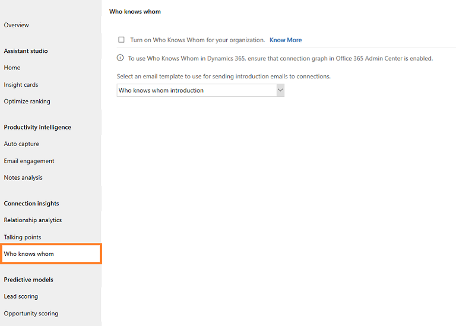
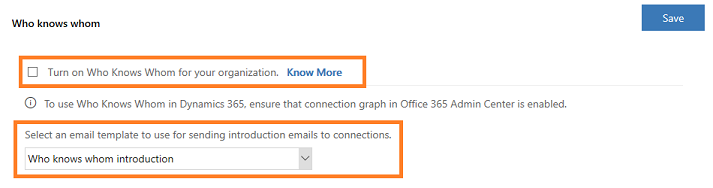
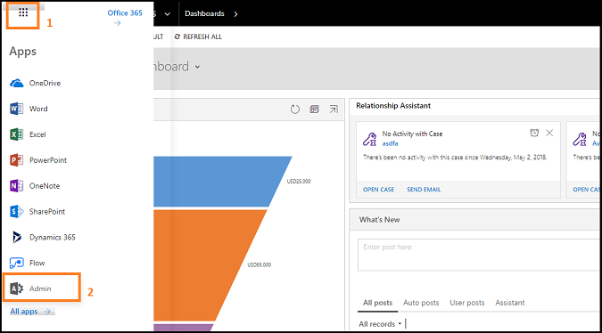
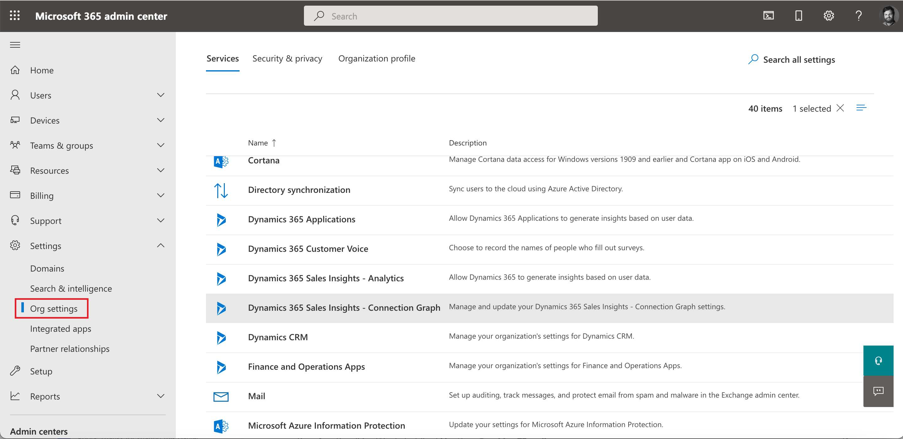

# Configure who knows whom 

Who knows whom helps users to quickly identify colleagues within their organization who can introduce them to leads or contacts.

>[!NOTE]
>- To know in which region the Who knows whom feature is available, see [In which region are the features available?](faqs-sales-insights.md#in-which-region-are-the-features-available).
>- For Office 365 data, you organization's data location must be in one of the following locations and not in your region-specific datacenter location:
>    - Global Geography 1 – EMEA (Austria, Finland, France, Ireland, Netherlands)
>    - Global Geography 2 – Asia Pacific (Hong Kong, Japan, Malaysia, Singapore, South Korea).
>    - Global Geography 3 – Americas (Brazil, Chile, United States).    
> To learn more on data center locations, see [Data Center Locations](/microsoft-365/enterprise/o365-data-locations?view=o365-worldwide#data-center-locations&preserve-view=true).

## License and role requirements

| &nbsp; | &nbsp; |
|-----------------------|---------|
| **License** | Dynamics 365 Sales Premium  More information: [Dynamics 365 Sales pricing](https://dynamics.microsoft.com/sales/pricing/) |
| **Security Role** | System Administrator    See [Predefined security roles for Sales](security-roles-for-sales.md)|
|||

## To configure who knows whom

1.	Go to **Change area** in the lower-left corner of the page, and select **Sales Insights settings**.

    > [!div class="mx-imgBorder"]
    > 

3.  On the site map, under **Relationship insights**, select **Who knows whom**.

    > [!div class="mx-imgBorder"]
    > 

    >[!NOTE]
    >If you don’t see the option, verify that the Sales Insights add-in is installed in your organization. More information: [Install and configure premium Sales Insights features](intro-admin-guide-sales-insights.md#install-and-configure-premium-sales-insights-features) 

4. On the **Who knows whom** section, select **Turn on Who Knows Whom for your organization**.

    > [!div class="mx-imgBorder"]
    > 

5. Optionally, you can select an email template according to your organizational requirements. By default, the who knows whom introduction emails template is selected.

6. Select **Save**.

The who knows whom feature is configured and ready to use in your organization.

After you've enabled the who knows whom feature, enable **Dynamics 365 Sales Insights – Connection Graph** from the Microsoft 365 admin center as the Microsoft 365 admin. This allows Dynamics 365 Sales to collect the communication and collaboration details of users from Exchange server.

## Enable the connection graph

> [!NOTE]
> Contact your Microsoft 365 administrator to enable the Sales Insights connection graph if you don't have sufficient privileges to enable it.

To configure the Sales Insights connection graph, follow these steps:

1. Go to the **Admin** center.

    > [!div class="mx-imgBorder"]
    > 

2. Select **Settings** > **Services & add-ins** > **Dynamics 365 Sales Insights – Connection Graph**.

    > [!div class="mx-imgBorder"]
    > 

3.  Read the description carefully and then select the **Enable Dynamics 365 Sales Insights - Connection Graph for your entire organization**‎ option.

    > [!div class="mx-imgBorder"]
    > 

4. (Optional) If you don't want to collect information about a group of users in your organization, add their group ID in the text box. 

5. Select **Save**.

>[!NOTE]
> To opt out of the connection graph, see [Opt out of the connection graph](who-knows-whom.md#opt-out-of-the-connection-graph)

## Add the who knows whom widget to a form

By default, the who knows whom widget is available only in the out-of-the-box **Sales Insights** form. If you're using customized forms for leads and contacts, you can display the who knows whom widget on your custom forms by following these steps.

> [!IMPORTANT]
> - Adding the who knows whom widget is only supported in Unified Interface apps.
> - You can't use the legacy form designer to add a who knows whom widget to a form.

1. Sign in to the [Power Apps](https://make.powerapps.com/) portal.

    > [!div class="mx-imgBorder"]  
    > 

2. Search for and select your organization's environment.

    > [!div class="mx-imgBorder"]  
    > 

3. Select **Data** > **Tables**.

    The **Tables** page opens with the list of tables.

    > [!div class="mx-imgBorder"]  
    > 

4. Open the table, select the **Forms** tab, and then select a main form to add the widget to. In this example, the table **Lead** is selected and the main form **Lead** is selected.

    >[!NOTE]
    >If you're unable to view the table to which you want to add the widget, in the upper-right corner of the page, change the filters settings to **All**.

    > [!div class="mx-imgBorder"]  
    > 

5. In the form designer, select **Component**, and then from **Layout**, add a column to the form as a placeholder to add the widget.

    > [!div class="mx-imgBorder"]  
    > 

6. From the site map, select **Display** > **Who Knows Whom**.

    >[!NOTE]
    >Ensure that the added placeholder column is selected. If it isn't, the widget will be added at a random place in the form. 

    > [!div class="mx-imgBorder"]  
    > 

8. In the **Edit who knows whom** pop-up window, select **Done**.

    > [!div class="mx-imgBorder"]  
    > 

    The who knows whom widget is added to the form, as shown in the following image.

    > [!div class="mx-imgBorder"]  
    > 

    >[!NOTE]
    >To hide the **New section** label, go to the **Properties** tab of the **New Section** settings pane, and then select **Hide label**.

9. Save and publish the form.

[!INCLUDE[cant-find-option](../includes/cant-find-option.md)]

### See also

[Get introduced to a lead](../sales/who-knows-whom.md)  
[Install and configure premium Sales Insights features](intro-admin-guide-sales-insights.md#install-and-configure-premium-sales-insights-features)

[!INCLUDE[footer-include](../includes/footer-banner.md)]
