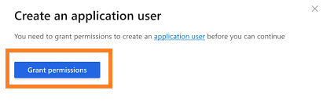

# Connect conversation intelligence to an environment  

The **Data sources** section helps you to disconnect or connect an environment with conversation intelligence. If you have multiple environments in your organization and want to activate another environment to display data in the application, use this section. 

> [!NOTE]
> Throughout this article, environment refers to a [Power Platform environment with a Dataverse database](/power-platform/admin/create-environment#create-an-environment-with-a-database) that hosts Dynamics 365 Sales.

At a time, you can have only one active environment that is connected to the application. When you activate an environment, the existing environment will automatically deactivate, and the new environment’s data will be displayed on the application. Also, you must add tracked keywords and competitors as well as provide permission to access the data to the added environment.

As an administrator, you must configure the environment to connect to conversation intelligence.

## License and role requirements

| Requirement type | You must have |
|-----------------------|---------|
| **License** | Dynamics 365 Sales Premium or Dynamics 365 Sales Enterprise  More information: [Dynamics 365 Sales pricing](https://dynamics.microsoft.com/sales/pricing/) |
| **Security roles** | System Administrator    More information: [Predefined security roles for Sales](security-roles-for-sales.md)|

## To connect to an environment 

1.	Review the prerequisites. To learn more, see [Prerequisites to configure conversation intelligence](prereq-sales-insights-app.md).

2.	Sign in to the [Conversation intelligence app](https://sales.ai.dynamics.com/). 

3.	Select the **Settings** icon on the top-right of the page and then select **Settings**.

    > [!div class="mx-imgBorder"]
    > 

4.	On the **Settings** page, select **Data source**. 
 
5.	In the **Dynamics 365 environment** section, select **Add an environment**.

    > [!div class="mx-imgBorder"]
    > 
 
6.	In the **Connect your data** dialog box, select the Power Platform environment that hosts Dynamics 365 Sales, to connect with the application.

    > [!div class="mx-imgBorder"]
    > 

    The application now detects your environment.

7.	In the **Terms and conditions** dialog box, accept the terms and conditions, and select **Agree and continue**.

    > [!div class="mx-imgBorder"]
    > 
 
    The application takes few minutes to connect your data with the application, and a progress dialog box is displayed.

    > [!div class="mx-imgBorder"]
    > 
 
8.	In the **Create an application user** dialog box, select **Grant permissions** to create an application user.

    > [!div class="mx-imgBorder"]
    > 
 
    > [!NOTE]
    > If you have already added this environment, the step to grant permissions for the application to access the data will be skipped.

9.	In the **Connect your call data** dialog box, enter the **Storage connection string** and **Container name**, and then select **Connect**. To learn more on how to get the **Storage connection string** and **Container name** values, see [Create a call recording repository in Azure](create-azure-repo.md).

    > [!div class="mx-imgBorder"]
    > 
 
10.	In the **Keyword and competitor tracking** dialog box, add the keywords and competitors that you want to track on calls. You can update these keywords and trackers later when your organization requires a change. To learn more, see [Configure keywords and competitors to track](configure-keywords-competitors.md).

    > [!div class="mx-imgBorder"]
    > 
    
   > [!NOTE]
   > You can skip adding the keywords and competitors and add them later, when required.

11.	Select **Finish** to complete the setup of the **Conversation intelligence** application for your organization. The status message will be displayed on the top of the page.

    > [!div class="mx-imgBorder"]
    > 
  
Now, your conversation intelligence is ready with the data of the added environment.

[!INCLUDE[cant-find-option](../includes/cant-find-option.md)]

### See also

[Introduction to administer conversation intelligence](intro-admin-guide-sales-insights.md#administer-conversation-intelligence)

[Prerequisites to configure conversation intelligence](prereq-sales-insights-app.md)

[!INCLUDE[footer-include](../includes/footer-banner.md)]
