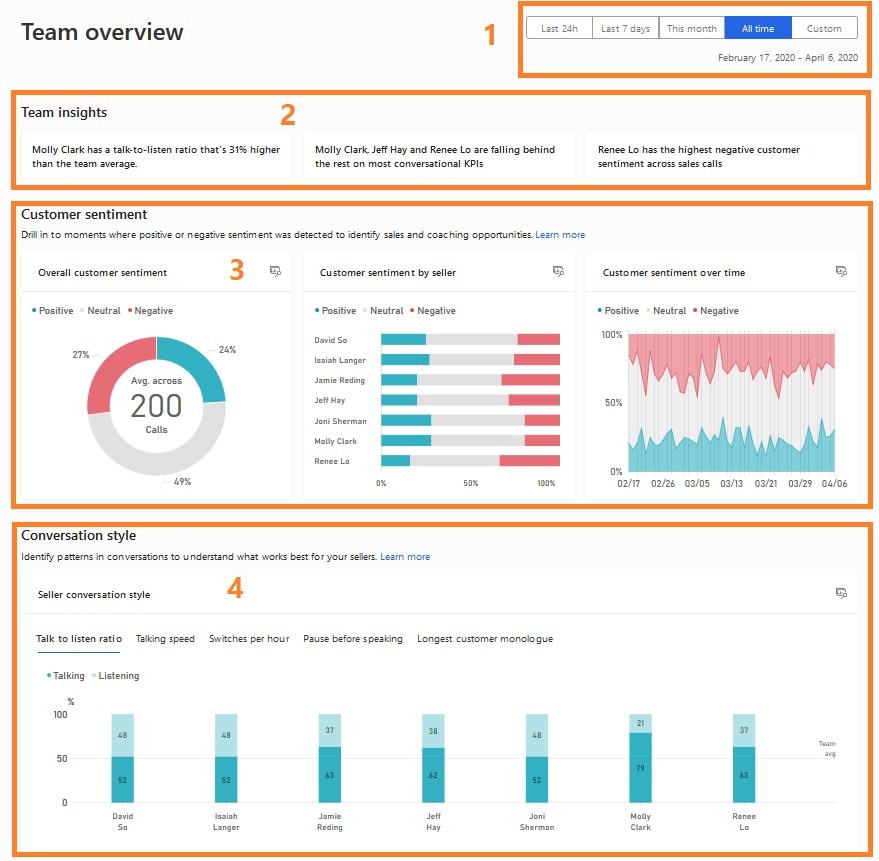

# Analyze behavior of your team on customer calls 

Sales calls are critical to your business success. The **Team overview** page in conversation intelligence helps sales managers identify coaching opportunities, improve team performance, and increase sales wins by analyzing call behavior and customer sentiment patterns.

## Understand your team's performance

Sign in to the [Conversation intelligence app](https://sales.ai.dynamics.com/), and select **Team Overview** to access key insights that help you recognize top performers and identify coaching opportunities. Select the time filter to analyze data for a specific period, such as the last 7 days, last 30 days, or last 90 days. 

> [!div class="mx-imgBorder"]
> 

### Team insights

The **Team insights** section displays what’s happening in your team and the latest trends. You can view insights such as  sellers who are scoring high in customer satisfaction and sellers who might need coaching based on the customer sentiments they are generating and keywords that are trending.

**How this helps**: By analyzing team insights, you can recognize sellers who are excelling in customer interactions and those who may benefit from additional training or support to improve their performance.

### Customer sentiment

 - **Overall customer sentiment:** Specifies the customer sentiment in percentage—positive, negative, or neutral.
 - **Customer sentiment over time:** Displays how the three customer sentiments (positive, negative, and neutral) are spanning across the specified timeframe.
 - **Customer sentiment by sales rep:** Specifies how each of your sales reps contributed toward generating the overall customer sentiment. Also, shows which sales rep have the highest or lowest contributions.

**How this helps**: Understanding customer sentiment can help you identify patterns in customer interactions and provide targeted coaching to improve customer satisfaction and sales outcomes.

### Conversation style

 - **Talk to listen ratio:** Specifies the average listen and talk ratio of sales reps in conversations with customers.
 - **Talking speed:** Displays the average number of words used per minute by sales reps.
 - **Switches per hour:** Displays the average switches between a sales rep and customer in a conversation, meaning the number of times the conversation switched from one person to another. This KPI is a sign of engagement during conversations.
 - **Pause before speaking:** Displays how many milliseconds the sales rep paused before responding to customer queries; this KPI is a signal of patience by the sales rep.
 - **Longest customer monologue:** Displays the longest length of speech without a break by the customer with a sales rep in seconds; this KPI is a signal that sales reps are asking good questions and showing understanding of customer needs.
 
**How this helps**: Analyzing conversation style can help you identify areas where sales reps can improve their communication skills, such as active listening, pacing, and engagement techniques, to foster better customer relationships and drive sales success.

[!INCLUDE[cant-find-option](../includes/cant-find-option.md)]

## Related information

[Overview of conversation intelligence](dynamics365-sales-insights-app.md)  
[First-run set up experience](fre-setup-sales-insight-app.md)  
[Connect conversation intelligence to an environment](connect-dynamics365-sales-environment.md)  
[View agent insights in Dynamics 365 Customer Service](../customer-service/implement/intraday-insights-dashboard.md#agent-insights)  

[!INCLUDE[footer-include](../includes/footer-banner.md)]
