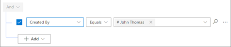
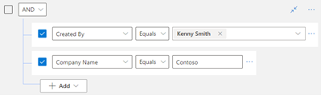
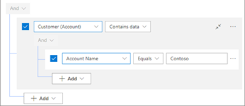
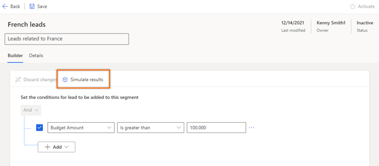
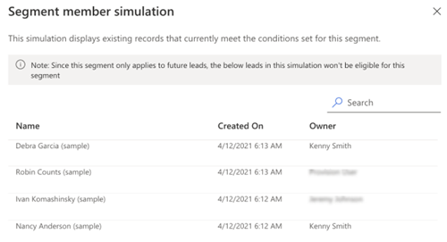
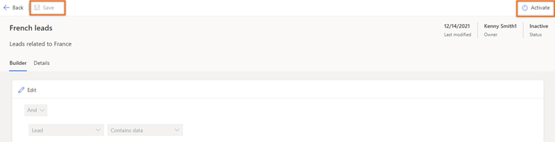

# Create and activate segments in sales accelerator

As a sequence manager, you create segments (groups of records) by defining different conditions for each segment. After a segment is activated, any record that satisfies the conditions that are defined for the segment becomes a member of the segment. A sequence that is connected to the segment is then automatically connected to records in the segment. You don't have to manually connect the sequence to a new record when it's created in Dynamics 365 Sales.

> [!NOTE]
> - Only active records are assigned to segments. For example, when a lead is qualified, it becomes a read-only record and creates a new opportunity record. This lead isn't considered for segmentation, because it's now read-only and is no longer active.
> - You can have a maximum of 250 active segments in an organization at any time. To increase the limit for active segments, contact Microsoft Support for help.
> - You can have a maximum of 10 active assignment rules to a segment at any time. Although you can create additional assignment rules within the segment, only 10 can be active at any time. To increase the limit, contact Microsoft Support for assistance. 

## License and role requirements

| Requirement type | You must have |
|-----------------------|---------|
| **License** | Dynamics 365 Sales Premium or Dynamics 365 Sales Enterprise More information: [Dynamics 365 Sales pricing](https://dynamics.microsoft.com/sales/pricing/) |
| **Security roles** | System Administrator or Sequence Manager More information: [Predefined security roles for Sales](security-roles-for-sales.md)|

<!--markdownlint-disable MD036-->
## Create and activate a segment
<!--markdownlint-enable MD036-->

1. Sign in to your Dynamics 365 Sales Hub app.
1. In the lower-left corner of the page, go to **Change area**, and select **Sales Insights settings**.
1. Under **Sales accelerator**, select **Segments**.
1. On the **Segments** page, in the **Record type** list, select a record type.

    By default, the lead and opportunity record types are available. The list also includes all the record types that you've selected in the [Choose content and layout](enable-configure-sales-accelerator.md#choose-content-and-layout) section of the sales accelerator configuration.

1. Select **New segment**.
1. In the **Create a segment for \<*record type*\>** dialog box, enter a name and description for the segment. In the **Priority** field, enter a priority.

    Set a priority for every segment. Records that meet the criteria for multiple segments are assigned to the segment that has the highest priority. You can change the priority of a segment at any time. By default, the priority is set to the priority of the last segment that was created. The default, out-of-box segment always has the lowest priority.

1. Select **Next**.

    The segment condition builder page opens.

    :::image type="content" source="media/sa-segment-condition-builder-home-page.png" alt-text="Screenshot of the segment condition builder page.":::

1. (Optional) To allow records from another segment to move to this segment, turn on **Allow records to be moved from other segments to this one**. The application validates the records for conditions that are defined in this segment and moves the records accordingly, although the records are connected to a different segment. When they are moved, the records are connected to the sequence from this segment. However, the assignment rules aren't changed. To apply the current assignment rule to the moved records, select the **Update seller assignment as well** checkbox.

    :::image type="content" source="media/sa-segment-allow-records-to-move.png" alt-text="Screenshot that shows the option for allowing records to move to this segment and apply the current assignment rules.":::

1. On the **Builder** tab, under **And**, select **Add**. Use the following options to define the conditions that are used to evaluate records:

    - **Add row**: Add conditions that define when the segment should be applied. In the following example, the row specifies that the segment should be applied to leads that are created by the user John Thomas.

        1. In the first column, select an attribute in the list. (For example, select *Created by*.)
        1. In the second column, select an operator in the list. (For example, select *Equals*.)
        1. In the third column, enter a value to filter by. (For example, enter *John Thomas*.)

        > [!div class="mx-imgBorder"]
        > 

        You can create more conditions to further filter the leads that the segment should be applied to.

    - **Add group**: Add multiple conditions as a group if you want to filter leads by using more than one field.

        1. In the list in the upper-left corner, select **And** or **Or** to group the conditions.

            If you select **And**, the segment is applied only to leads that meet all the conditions in the group. If you select **Or**, the segment is applied to leads that meet any condition in the group. For example, to apply the segment to leads that are created by Kenny Smith *and* that have the company name Contoso, select **And**.

            > [!div class="mx-imgBorder"]
            > 

        1. Define the conditions to add to the group.

            > [!div class="mx-imgBorder"]
            > 

        You can create multiple groups and further filter the leads based on the conditions that are defined in the groups.

    - **Add related entity**: Add a condition that is based on the attributes of related entities.

        1. In the **Related Entity** list in the upper left, select an attribute. 
        1. In the list to the right, select either **Contains data** or **Does not contain data**.
        1. Define the condition.

        > [!div class="mx-imgBorder"]
        > 

    > [!NOTE]
    > You can have a maximum of 10 conditions in a segment at any time. This number includes conditions that are defined with groups and related entities. The condition limit is added to optimize the runtime experience for segments and therefore ensure faster execution and improved efficiency. If you exceed the limit, a message informs you that the limit has been reached and the segment can't be saved. [Learn about best practices for adding conditions](#recommendations-for-adding-conditions) section.
    >
    > To increase the limit for conditions in segments, contact Microsoft Support for help.

1. When you've finished defining the conditions for the segment, select **Simulate results** to verify that they work as intended.

    > [!div class="mx-imgBorder"]
    > 

    A list of records that satisfy the conditions that you defined for the segment is shown.

    > [!NOTE]
    > - The records in the list are only simulated results. They might not be records that the segment can actually be applied to.
    > - To activate the segment, select **Activate**.

    > [!div class="mx-imgBorder"]
    > 

1. Select **Save** and then **Activate**.

    > [!div class="mx-imgBorder"]
    > 

    A confirmation message box opens.

1. Select **Activate**.

The segment is activated. You can now connect it to a sequence or a record.

> [!NOTE]
> As of the 9.3 release, all segments that are related to a primary entity (such as lead or opportunity) run every time that you update the attributes of the primary entity that are added to the conditions.

## Recommendations for adding conditions

You can have a maximum of 10 conditions in segments at any given time. However, you can optimize the conditions by following these recommendations, which help improve the runtime efficiency of segments.

- **Distribute the segments**: Create multiple segments that have proper distribution of conditions. You can then connect those segments to the same sequence or a different sequence and similar or different assignment rules. This approach helps improve the performance of connecting sequences and assignment rules.
- **Create rollup attributes**: Use rollup attributes to prevent performance issues when you use conditions that involve related entities. This approach helps avoid the performance overhead of conditions that involve related entities that have many-to-many relationships, one-to-many relationships, or nested related entities. [Learn more about how to define rollup columns that aggregate values.](/power-apps/maker/data-platform/define-rollup-fields)
- **Use expression builder only**: Always use the expression builder in the user interface (UI) to define or update the segments. Don't update segments through Dataverse. Otherwise, unexpected behavior can occur that affects the records that are related to the segment and the subsequent automations, such as connecting sequences and assignment rules.

<table>
<tr><td>

> [!div class="nextstepaction"]
> [Next step: Connect a segment to a sequence](connect-a-segment-to-sequence.md)
</td></tr>
</table>

[!INCLUDE[cant-find-option](../includes/cant-find-option.md)]

### See also

[Manage segments](manage-segments.md)  
[View details of a segment](view-details-segment.md)

[!INCLUDE[footer-include](../includes/footer-banner.md)]
