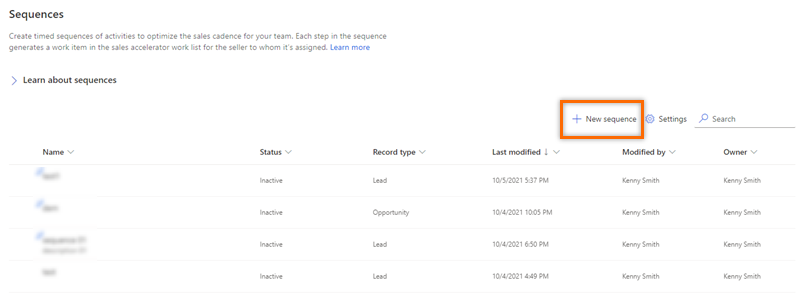
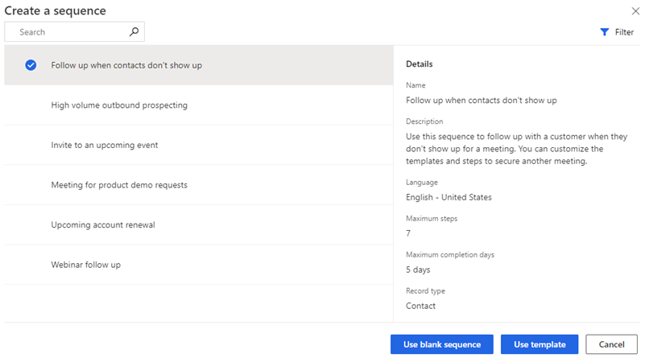
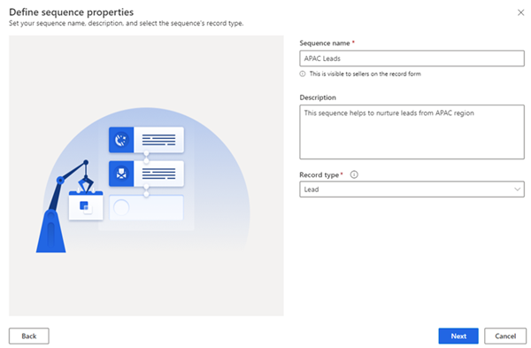
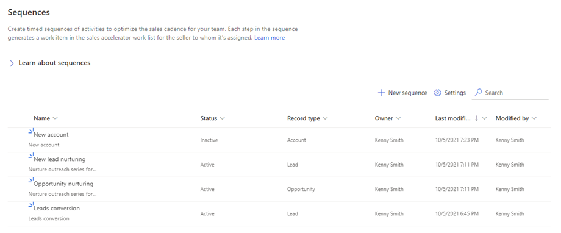

# Create and activate a sequence 

Every organization has its own selling processes for sellers to follow. A sequence helps sellers overcome any inconsistencies in training or lack of documentation as they progress through the sales journey. When you create a sequence, you define the activities you want your sellers to perform&mdash;and the order to perform them in&mdash;as they handle records. This lets sellers concentrate on selling and gives them a better understanding of what to do next.

## License and role requirements
| Requirement type | You must have |
|-----------------------|---------|
| **License** | Dynamics 365 Sales Premium or Dynamics 365 Sales Enterprise  More information: [Dynamics 365 Sales pricing](https://dynamics.microsoft.com/sales/pricing/) |
| **Security roles** | System Administrator or Sequence Manager    More information: [Predefined security roles for Sales](security-roles-for-sales.md)|

## To create and activate a sequence

1. Sign in to your sales app, and in the lower-left corner of the page, go to **Change area** > **Sales Insights settings**.
2. Under **Sales accelerator**, select **Sequence**.  
3. On the **Sequences** page, select **New sequence**.   
    > [!div class="mx-imgBorder"]
    >    

4. In the **Create a sequence** dialog, select one of the following options to create the sequence:  

    - **Use template**: Use the templates to quickly set up sequences. Sequence templates provide a set of activities to guide sellers with the next best action to take to achieve a task, such as getting introduced to a lead and winning the deal. More information: [Sequence templates](sequence-templates.md)  
    
    - **Use blank sequence**: Use a blank sequence to create a sequence from scratch.   
        
    > [!div class="mx-imgBorder"]
    >      

5. In the **Define sequence properties** dialog, enter the following information.

    | Parameter | Description |
    |-----------|-------------|
    | Sequence name | The name of the sequence. |
    | Description | A description of the sequence. (Optional) |
    | Entity | The entity type for which you want to apply this sequence. By default, the Lead entity type is selected. |   

    > [!div class="mx-imgBorder"]
    >    

6. Select **Next**.     
    The sequence designer page opens.

    > [!div class="mx-imgBorder"]
    >    

    By default, the **Sequence start here** step is added to sequence as the first step.  

7. After the **Sequence start here** step, select the **Add** icon (**+**) and configure the sequence steps.
    
    For a sequence, the steps are categorized into the following four groups:
    - **Steps**: The step in a sequence is an engagement task that a seller performs for sales outreach such as, email, phone call, and task. More information: [Add steps to sequence](steps-sequence.md)
    - **Conditions**: The condition step in a sequence determines the next course of action that the sequence will take after the condition is either met or not, based on the completed activity. More information: [Add the conditions steps](adaptive-sequence.md)
    - **Commands**: The command step in a sequence determines the next course of action according to the value given in the field or the stage of a business process. More information: [Add command steps to sequences](command-sequence.md)  
    - **LinkedIn**: The LinkedIn activity step in a sequence allows sellers to diversify their day-to-day activities by including the social selling functions. You can use LinkedIn's vast network with recommended actions that your sellers can take to build deeper connections. More information: [Add LinkedIn activities to sequence](linkedin-activities-sequence.md)
       
8. Select the **Add** icon, and then repeat step 7 for all the activities that you want to add to the sequence.
9. Save and activate the sequence.   
    >[!NOTE]
    >You can have up to 250 active sequences at a time in your organization.        
11. Select **Yes** in the confirmation message that appears.   
    > [!NOTE]
    > An error might occur if you've added **Set wait time** as the last activity of the sequence. You must delete this last **Set wait time** activity, and then save and activate the sequence.       

The sequence is activated and listed in the sequence designer home page. 

> [!NOTE]
> On the sequence home page, you can do the following tasks:
> - Sort and filter the records based on the column options. Expand the column header, and then select the sort and filter options that are available.
> - Reorder the columns by dragging them to the location you want in the grid.
> - Search is available only on the name and description of the sequence.
   
> [!div class="mx-imgBorder"]
>     

Next, you connect the active sequence to lead or opportunity records. More information: [Connect a sequence to records](connect-a-sequence-to-records.md)

## Exit a sequence during the flow

By enabling the option to exit a sequence, you disconnect the sequence from its records when the criteria is met. For example, if the flow includes an email reply from the customer, the record will be disconnected from the sequence.

**Prerequisites**

Review the following requirements before you enable the **Exit the sequence** option:

- At least one email activity step is created in the sequence. 
- The sequence must be in inactive or revision state.
- [Configure the email engagement feature](configure-email-engagement.md) in your organization before you start using this option for the email activity.

**To configure the exit sequence criteria**

1.	Open the sequence, and then select **Options**.

    > [!div class="mx-imgBorder"]
    > 

2.	On the **Sequence Options** pane, turn on the **Exit a sequence** toggle to exit a sequence when a customer replies to any email in the sequence.  

    > [!div class="mx-imgBorder"]
    > 

3.	Select **Save**.

[!INCLUDE[cant-find-option](../includes/cant-find-option.md)]

### See also

[Create and manage sequences](create-manage-sequences.md)     
[Add steps to sequence](steps-sequence.md)  
[Manage tags for sequences](manage-tags-for-sequences.md)     
[Migrate sequences from one environment to another](migrate-sequence.md)

[!INCLUDE[footer-include](../includes/footer-banner.md)]
